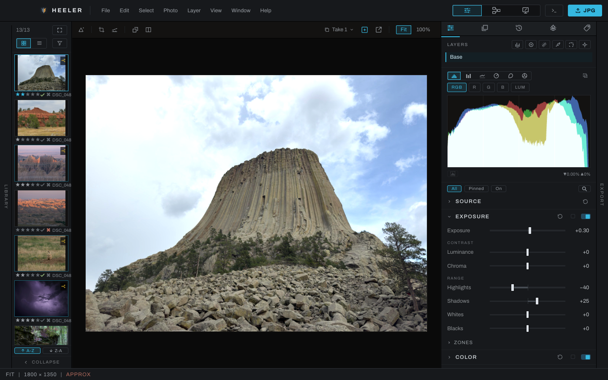
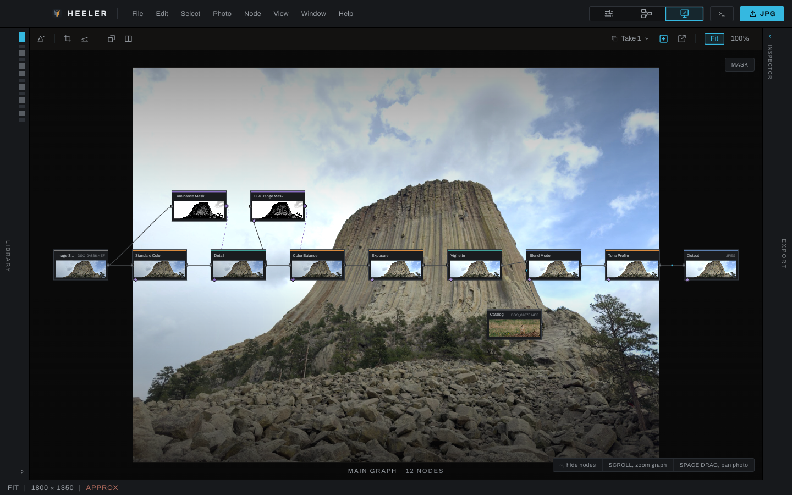
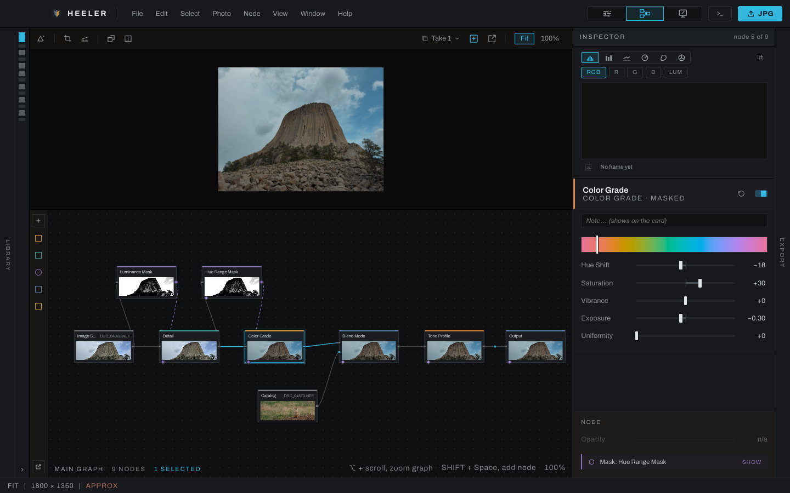
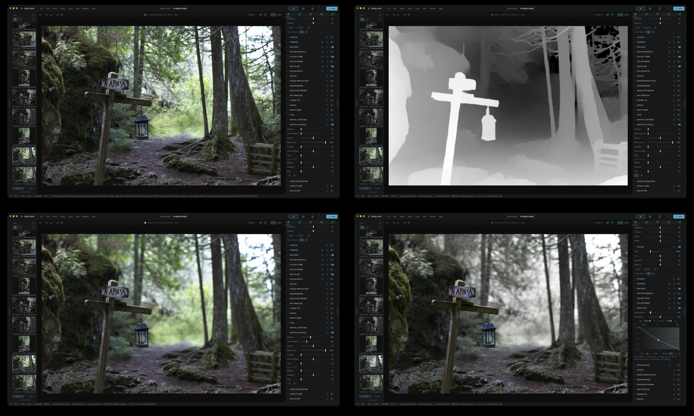
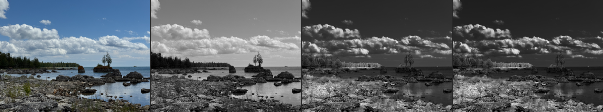
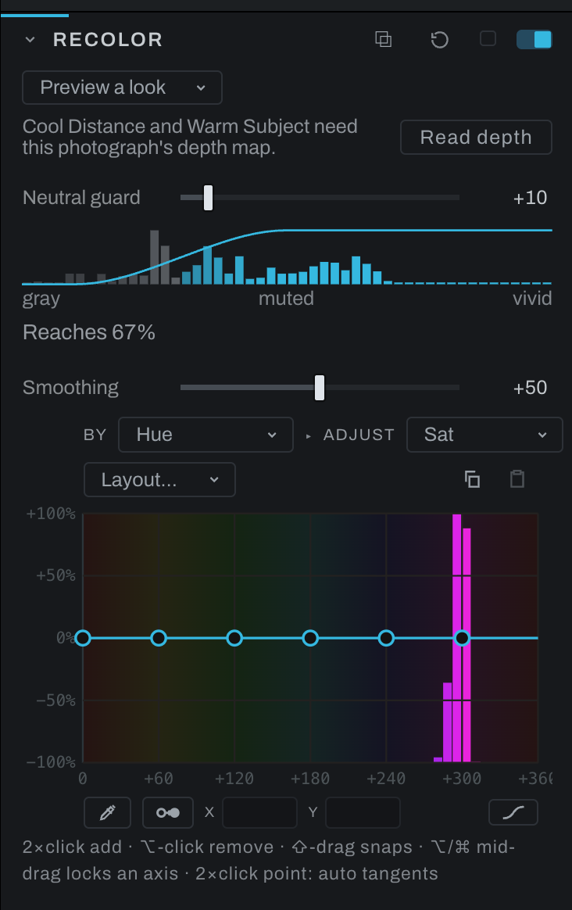
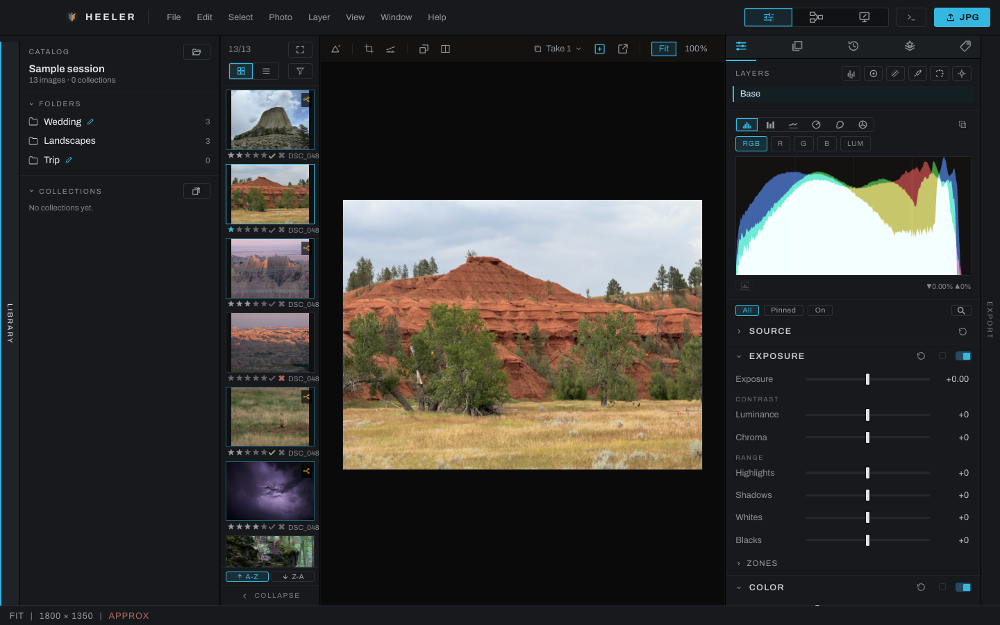

# Heeler

**A RAW photo editor built on a node graph, with tools that understand the depth of the scene.**

Heeler is free and open source, for macOS, Windows and Linux, made by Vagabond Burro LLC.
[Download it](https://github.com/vagabond-burro/heeler/releases) · [www.heeler.app](https://www.heeler.app) · [User guide](docs/user-guide/README.md) · [Support it on Ko-fi](https://ko-fi.com/vagabondburro)

Two ways to work on the same photograph. Develop is the linear workflow: sliders, top to bottom, the way you expect.



Underneath, every section you touch is a node. The Canvas shows the graph under the hood, drawn over the photograph, and lets you build on it: here a Luminance Mask keeps Detail to the bright rock, a Hue Range Mask keeps Color Balance to the sky, and a second photograph is screened in from the catalog:



## Not another copy of the editor you already know

Most photo editors give you a stack of sliders over a black box: you can move them, but you never see what they do, and you can only do what the sliders were built for. Heeler starts from a different place.

### The sliders are a graph you can open

Every edit in Heeler is a node, from the RAW decode to the export. The Develop panel looks the way you expect, but behind it sits the processing graph, and you can open it at any time: see exactly what runs, in what order, and rewire it. Add a node anywhere, route a mask into any adjustment, blend in a second photograph, split a picture into channels and treat each one differently, or save a piece of the graph as a recipe you reuse.

Recipes like Sharpening and Skin Softening are not sealed effects: they are groups of ordinary nodes you can open and change. Start with sliders, and move to the graph the day you want more control.



### It knows how far away everything is

Heeler can estimate a depth map for any photograph, with a model that runs on your own computer, and its tools use it:

- **Depth Lighting** relights a scene after the shot with a rig of lights you place on it: lamps, a sun at any elevation, and dark lights that cast shadows of their own color, all landing by the scene's relief.
- **Fog** places atmosphere through the scene by depth, thickening into the distance, not laid over everything.
- **Depth of Field** blurs by distance, with aperture and blade shape, instead of a flat background blur.
- **Every adjustment layer** can be limited by depth, so a grade reaches only the far hills or only the foreground.



[Editing with depth](docs/depth-editing.md) shows how each of these is set up, with more examples: a sun added to Devils Tower, fog through the badlands, depth of field on a landscape.

Rendering from a 3D package? Heeler reads OpenEXR render passes: a Z or mist pass becomes the depth map, exact to the pixel, and object passes become masks.

### Black and white from the film and the filter

The black and white treatment works the way a darkroom does: a film stock's curve, a Wratten filter in front of it (8 to 58, as a transmission curve), a second filter for the far end of the depth map, and true infrared stocks and filters, where foliage glows and skies go dark. The Zone System is built in: place a shadow on Zone III, then develop for the highlights.



### Color tools that route, not just push

**Recolor** is a channel-routing color equalizer: it routes one color component into another with curves, including a curve that reads the depth map. **Relight** reshapes the light across the tonal range with an edge-aware curve. **Color Sets** pick a range of color off the photograph and grade it on its own, and **Color Checker** calibrates the camera from a photographed chart.



### Many photographs into one, at any size

Merge brackets to HDR, average a sequence into a long exposure, remove anything that moved with a median, or build light and star trails, from a handful of frames to thousands, merged in the background while you keep working. Stitch panoramas. Every merge stays an editable recipe, and Bake to Image freezes any result into a new DNG beside the originals.

### Scriptable, and private

A built-in Python console and a local scripting API drive the whole app, and a headless batch mode runs scripts with no window at all. The machine learning models behind the smart tools (depth, subject and sky selection, denoising) are optional downloads that run on your machine. Your photographs never leave it, and there is no account, no subscription and no cloud.

### And everything else you would expect

Full RAW decoding for most cameras and phone RAW files, exposure, white balance, curves, levels, color wheels, sharpening and noise reduction, lens corrections, a Finish layer stack for retouching and compositing, a library with collections, ratings and keywords, Takes for alternate versions of an edit, local-network sharing with live proofing, and export to JPEG, WebP, PNG, TIFF, EXR and DNG.



## Open source

Heeler is open source under the [Mozilla Public License 2.0](LICENSE).
Every feature is in every build, with no license key and no paid tier.
In plain terms, and without replacing the license itself:

- You may use, copy, modify and distribute Heeler, including in a larger
  work of your own under terms you choose.
- If you distribute a modified version of Heeler's own files, those files
  stay under the MPL and their source must be available.
- The license grants no rights to the Heeler name or logo: a modified
  version you distribute must not be called Heeler. See [NOTICE](NOTICE).

Separately licensed components keep their own terms (see below), and the
machine learning models Heeler downloads keep theirs.

Heeler is free. If you want to support its development, you can
[buy it a coffee on Ko-fi](https://ko-fi.com/vagabondburro).

## Contributions

Pull requests are welcome when they show that the tests pass:
`python3 scripts/test.py` run on macOS, Windows and Linux, with the output in
the pull request, and tests for the change itself. A pull request
without the test runs is closed without being read.
[CONTRIBUTING.md](CONTRIBUTING.md) has the details. Suggestions are
given freely, without a promise of payment or adoption. For support or
a bug report, write to support@heeler.app.

## Building

You need Rust stable (via rustup) and Node 18 or newer with npm. On
Windows and Linux x64, NASM on PATH as well.

```
cd apps/heeler-app
npm install
npx tauri dev
```

`python3 scripts/test.py` runs every test suite. Signed installers are
made with `python3 scripts/dist.py`. Developer build instructions cover
platform prerequisites and signing.

## Layout

- `apps/heeler-app`: the desktop app, a Tauri shell (`src-tauri`) around
  a React interface (`src`).
- `crates/`: the engine and its parts: RAW decoding, image I/O, the node
  graph, the GPU path, the catalog, stitching and the on-device models.
- The user guide ships inside the app.
- Developer documentation covers building and design specifications.
- `scripts/`: building, testing and releasing.
- `tools/python`: the Python client for Heeler's scripting interface.
- `examples/`: example scripts for the console and batch mode.
- `presets/` and `controllers/`: shareable looks and hardware
  controller profiles.
- `latest.json`: the update manifest the app and the website read from
  `main`; each release rewrites it.
- `third_party/`: vendored code and data under their own licenses.

## Third-party software

Heeler includes LibRaw, used under the CDDL-1.0
([third_party/LibRaw-0.22.2](third_party/LibRaw-0.22.2)), and the Lensfun
lens database, under CC-BY-SA 3.0
([third_party/lensfun-db](third_party/lensfun-db)). Every bundled
component and its license is listed in the bundled user guide's
Third-Party Notices page. The JPEG XL test payload under
`crates/heeler-io/tests/fixtures/review-jxl` is separately licensed under
CC BY 4.0, with its attribution and original source recorded beside it.
Downloaded models retain their own licenses and are not covered by the
MPL.

Copyright (c) 2026 Vagabond Burro LLC. See [NOTICE](NOTICE).
