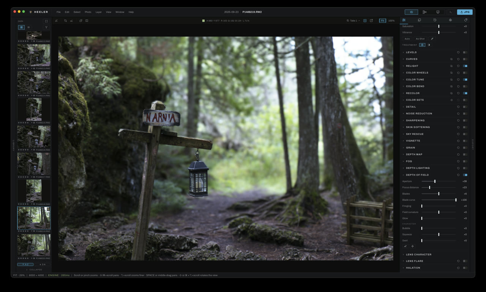
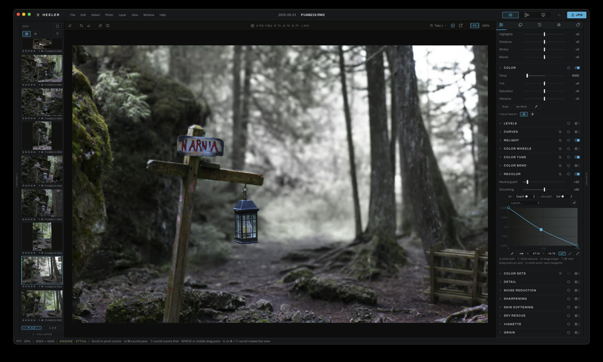
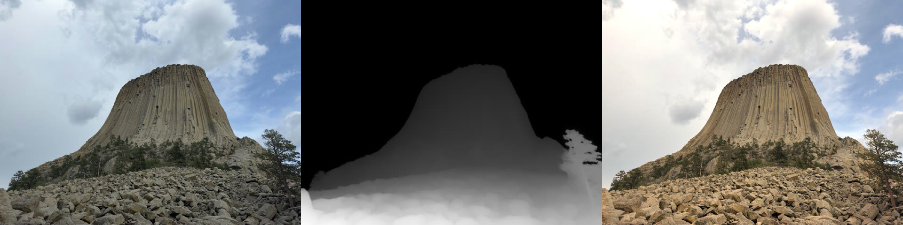
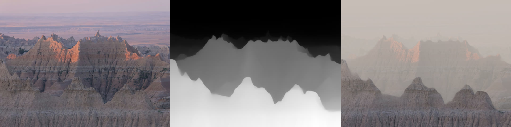
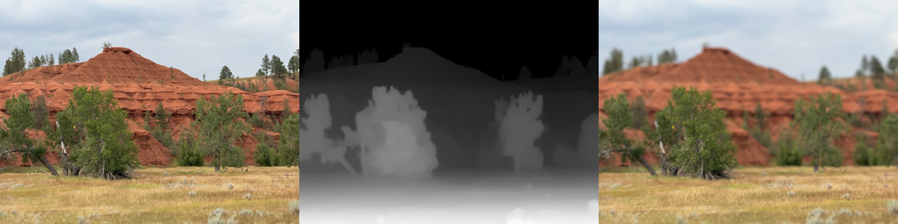

# Editing with depth

Heeler estimates a depth map for a photograph with a model that runs on your own computer, and its depth tools read it: Depth of Field, Fog, Depth Lighting, Recolor's depth row, and the Depth mask on any adjustment layer. This page shows what that looks like on real photographs, and how each scene is set up. The [user guide](user-guide/adjustments/README.md) covers every control in full.

## The depth map comes first

Every depth tool reads the same map, made the first time one of them asks for it. It lives in the **Depth Map** section, above the tools that use it, so a change there reaches all of them at once.

1. Turn on **View depth** (the eye on any depth section). The photograph shows as its depth map: white near, black far.
2. Raise **Edges** until the rim around your subject is gone. It snaps the depth's edges onto the photograph's.
3. Raise **Flatten** until flat surfaces (walls, sky, skin) stop rippling.
4. If the subject needs finer edges, raise **Detail** from 518 px to 700 or 1036, then **Recompute**.

A render from a 3D package can skip the estimate: an OpenEXR with a Z or mist pass gives the depth map exactly, through **From file**.

## One photograph, four ways


The photograph, its depth map, then two edits that only a depth map makes possible, each made in Heeler with the settings below (the screenshots show the panels as they were).

### Refocus after the shot



1. Open **Depth of Field**.
2. Use the focus picker on the sign, or set **Focus distance** by hand: here 23, the sign's plane.
3. **Aperture** 39. The blur grows with distance from the focus plane, so the rock right behind the sign softens less than the forest beyond it.
4. **Blades** 6 and **Blade curve** 100 shape the out-of-focus highlights; **Bubble**, **Squeeze** and **Swirl** under Character give them a particular lens's look.

### Grade the foreground and the distance apart



1. Open **Recolor**. With a depth map read, its **Preview a look** menu offers **Cool Distance** and **Warm Subject** as starting points.
2. Or build it by hand, as this one is: in the routing grid, **BY** Depth and **ADJUST** Sat. The curve's axis runs from NEAR to FAR.
3. Three points: +100% at the nearest depth (0), about -15% at the middle (47), and -100% at the farthest (100). The sign and lantern gain color, the trees behind lose nearly all of it. **Neutral guard** 10 and **Smoothing** 50 stay at their defaults.
4. The **Picker** places points from the photograph: hover to see the ghost at that depth, click to drop a point there.

The same edit works on an adjustment layer for any tool, not only Recolor: **Layer > New Adjustment Layer…**, switch on the layer's **Depth mask**, and drag **Black** up so the far depths take nothing, or turn on **Invert depth** to grade only the distance.

## The tools, step by step

Each figure is the photograph, its depth map, and the result, rendered by Heeler's own engine with the settings listed. The depth map for each was made at Edges 50, Flatten 25, Detail 518 px.

### Depth Lighting: a sun after the fact



Depth Lighting shades the scene by its relief, so the light lands on the columns and the boulders by their shape, not as a flat wash.

1. Open **Depth Lighting** and add a light in the **Light rig**. A directional light is a sun.
2. Drag its target on the photograph to the right of the tower, so it shines from the right.
3. **Elevation** 15 for a low sun that rakes across the columns; **Strength** 100; **Color** a warm orange (#ffc27a).
4. Section: **Relief** 45 to bring out the columns' shape, **Ambient** 50 so the unlit side does not collapse.

A **point light** is a lamp in the scene: place it on the photograph, set its **Depth** (or **From scene** to read it from the photo), and its ring sets **Reach**. A negative **Strength** makes a dark light, a shadow you place.

### Fog through the distance



1. Open **Fog**. Set **Start distance** first: 10 keeps the nearest ridges clear.
2. Then **Density** 70 and **Falloff** 55, so the fog builds ridge by ridge rather than all at once.
3. **Fog brightness** 78, **Fog hue** 25 and **Fog color** 18 for a warm evening haze.
4. Add **Texture** only once the depth transition looks right.

### Depth of Field on a landscape



1. Open **Depth of Field** and put the focus on the cottonwoods: **Focus distance** 35.
2. **Aperture** 70. The hill behind and the grass in front both fall off, each by its own distance from the trees.

## Rendering these yourself

The three figures above come from `apps/heeler-app/src-tauri/examples/readme_depth.rs`, which runs the depth model and the real ops on the demo photographs:

```
cargo run -p heeler-desktop --example readme_depth -- apps/heeler-app/src/demo-photos <vision folder> <out dir>
```

`<vision folder>` is the `vision` folder in Heeler's app data, where the depth model is installed.
