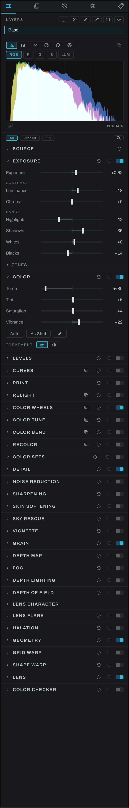
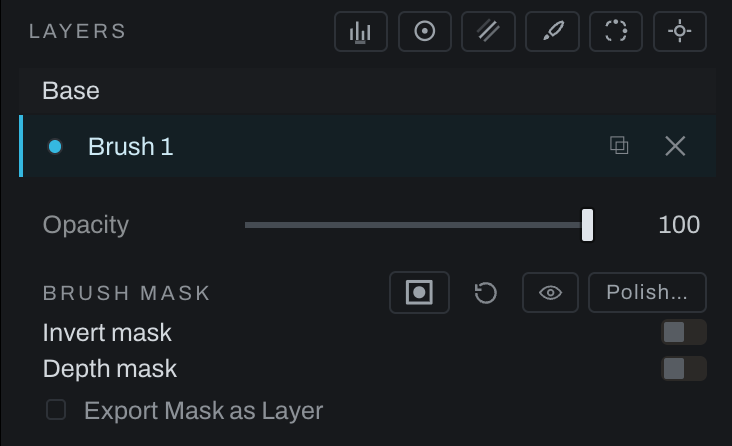

# Adjustments tab

Adjustments is the Develop stage. It builds a nondestructive processing chain for the active photograph. The same operations appear as nodes in Graph.

## Sections

Alphabetical here, which is the order the guide's sidebar takes from this list. The panel itself keeps workflow order, source to geometry, top to bottom.

- [Black and White](black-and-white.md)
- [Color](color.md)
- [Color Bend](color-bend.md)
- [Color Checker](color-checker.md)
- [Color Tune](color-tune.md)
- [Color Wheels](color-wheels.md)
- [Curves](curves.md)
- [Depth Lighting](depth-lighting.md)
- [Depth Map](depth-map.md)
- [Depth of Field](depth-of-field.md)
- [Detail](detail.md)
- [Exposure](exposure.md)
- [Fog](fog.md)
- [Geometry](geometry.md)
- [Grain](grain.md)
- [Grid Warp](grid-warp.md)
- [Halation](halation.md)
- [Lens](lens.md)
- [Lens Character](lens-character.md)
- [Lens Flare](depth-lighting.md#lens-flare)
- [Levels](levels.md)
- [Noise Reduction](noise-reduction.md)
- [Print](print.md)
- [Recolor](recolor.md)
- [Relight](relight.md)
- [Shape Warp](shape-warp.md)
- [Sharpening](sharpening.md)
- [Skin Softening](skin-softening.md)
- [Sky Rescue](sky-rescue.md)
- [Source](source.md)
- [Vignette](vignette.md)

## Section gestures

Click a section title or its chevron to open or fold it. Option-click (Alt-click on Windows) sends every entry in the section list the same way, including entries hidden by All / Pinned / On filtering. Option-Shift-click (Alt+Shift-click on Windows) narrows that action to sections with the same on/off state as the clicked section. Cmd-click (Ctrl-click on Windows) pins or unpins it without folding it.

**View > Expand All Sections** and **View > Collapse All Sections** provide the same bulk opening and folding. Find a Control finds both commands, and **Preferences > Hotkeys** can assign them keys. Folding, opening and pinning are layout changes, never undo steps between edits. Color Sets and Lens Character keep their separate companion-panel folds.

## Pinning and filtering

The panel lists sections in workflow order, with pinned sections first. Right-click a section's header and choose **Pin to top** to keep it in a **PINNED** group at the top of the panel, in the order you pinned; a small pin mark sits after the title, and **Unpin** from the same menu takes it back. Pins are a preference, so they follow you across photographs and launches.

Above the sections, chips choose what the panel lists: **All** (every section, the pinned ones first), **Pinned** (only the sections you pinned), and **On** (only the sections switched on for this photograph, which needs no setup). The choice is remembered between launches. Color Sets follows Recolor and Lens Character follows Depth of Field, so they appear with their host section.

## Hiding sections

**Preferences > Interface > Adjustment sections**, a sub tab under Interface, lists every section the panel can show, each with two toggles that show their own state: an eye for whether the section is listed, and a pin for the pinned group, the same pin the header's right-click sets. A hidden section leaves the panel in every view, leaves the keyboard walk and Find a Control, and stays gone across photographs and launches. It changes nothing in the graph: a photograph that has the section switched on keeps rendering it, and its node is still there in the Graph workspace. While anything is hidden the panel's filter row shows a count, such as **2 hidden**, and clicking it opens the list; **Reset** at the foot of the list puts every section back. Source has no switch and cannot be hidden.

## Overrides inside a link

When the open photograph is [linked](../menus.md#photo) to others, right-click a section header and choose **Override for this photo**. An overridden section is this photograph's own in both directions: another photograph's edits to it never land here, and edits made to it here never travel to the others, while everything else in the link keeps flowing. The whole section wears a dotted orange outline. Right-click a single dial for the same at the dial's size, and the dial wears the outline. **Remove override** from the same menu. Overrides belong to the photograph and are saved with its edits.

## Scopes

The panel above the sections shows the scopes: histogram, RGB parade, waveform, vectorscope, chromaticity, and the harmony wheel, with a channel row for the histogram and a pop-out button for a larger window. The readout under the plot names what is under the cursor, and the arrows at the right report the share of the frame clipped to pure black and pure white.

The button at the readout's left, a small histogram wrapped in a marquee rectangle, scopes them to the current selection: with it on, every scope reads the selected region only, and the readout says so. It waits disabled until a selection exists; any selection works, drawn or smart. Turn it off to read the whole frame again.

### Reading the histogram as ink

The histogram can show the photograph as cyan, magenta and yellow ink instead of red, green and blue light, the way [Curves](curves.md#rgb-and-cmy) does. It is a way of looking: nothing about the photograph changes.

**Option-click** (Alt-click on Windows and Linux) the **RGB** chip of the histogram's channel row to turn it into **CMY**, **C**, **M**, **Y** and **LUM**, and Option-click **CMY** to go back. With the chip focused, Option+Enter or Option+Space does the same (Alt on Windows and Linux). C shows the red channel as ink, M the green and Y the blue, each flipped left to right so the axis runs from 0% ink (paper) at the left to 100% ink at the right, the way the CMY curves read. **CMY** draws all three inks together: where cyan and magenta overlap it reads blue, cyan and yellow green, magenta and yellow red, and where all three agree it reads white. The readout gives the ink, for example `ink 34% · C 1.20% · M 0.80% · Y 2.05%`. **LUM** is the luminosity histogram on the light axis in both views. Picking C and going back to RGB leaves R picked.

The clipping figures mean the same in both views: ▼ is the share at pure black and ▲ the share at pure white. On the CMY view, where black sits at the right as 100% ink, ▲ comes first so each figure is on the side of the plot its pixels are on. The choice is remembered and shared by the panel and the pop-out window.

## Section switches and targets

An off switch bypasses the section while keeping its values. Only Exposure and Color are on for a fresh photograph; every other section is off and adds its nodes the first time it is switched on or a control is changed, so an untouched photograph's graph holds five nodes and nothing else. Switching a section on counts as an edit, marks the photograph edited, and can be undone. A section's switch reads on only when one of its nodes is in the graph and live.

A small **Export** checkbox sits beside the switch of every section but Source, the same box a Finish layer's row has, whether the photograph uses the section yet or not. Ticked, the picture as it leaves the section writes into every TIFF or EXR export as a layer of its own, named after the section; Depth Map's writes the depth map. Ticking a section you have not used yet builds its nodes, switched off, so the picture does not change (Depth Map's switches on, since it leaves the picture alone and computes the map). The [export chapter](../export.md#export-layers) has the details.

With an adjustment layer selected, the box on a section that edits the layer belongs to that layer: ticked, the export carries the picture as that section leaves it on that layer, with the layer's edit applied through its mask, named for both, such as `Sky Exposure`. Each layer has its own boxes, apart from the ones on Base; a renamed layer renames its exports, removing the layer removes them, and a duplicated layer starts with its boxes clear. To export the layer's mask itself, use **Export Mask as Layer** under its Depth mask.

Most sections can target a selected adjustment layer, and an icon in the section header says which: two stacked sheets for a section that edits the layer, a globe for one that applies to the whole photograph. Sharpening, Skin Softening, Relight, Color Tune and Recolor all follow a layer's mask. Noise Reduction and Sky Rescue are recipes built from several nodes and remain whole-photograph operations.

## Auto, reset, and pickers

Where present, **Auto** analyzes the active photograph and sets that section. Reset controls return the section to neutral values; the Tone Profile resets to the shipped look. Eyedropper and pick controls move work into the image viewport; the active pick is labeled there. Every slider and choice says what it does in the status bar when the pointer rests on it, the Source dials included.

## Curves and graphical controls

Graphical editors use direct manipulation. Drag points or bands to shape the result. Channel chips select which component is edited. For standard curves, `Cmd` (`Ctrl` on Windows)-click removes a non-endpoint point. Pickers can sample the photograph and place or select the relevant tone or color.

## Local adjustments

Use **Layer > New Adjustment Layer…** to create a masked Develop adjustment. Range, radial, linear, brush, selection, smart, and object masks limit the adjustment (an object mask reads the objects a render named in its own OpenEXR, by name or by clicking them). These are different from Finish adjustment layers: Develop layers live in the adjustment chain; Finish adjustment layers are stacked with pixel and fill layers.

Each adjustment layer's row carries a dot that switches the layer off and on. Off bypasses the layer's exposure and every tool behind it while its mask and settings stay, so the row dims and the photograph reads as if the layer were not there; the next click brings it back exactly as it was. A slider moved while the layer is off lands and waits rather than switching one node back on.

**Opacity**, at the top of the active layer's block above its mask, sets how much of the layer's edit comes through, from 0 to 100 percent. It works on top of the mask: at 50 the layer gives half its effect wherever the mask lets it through, and half of that where the mask is half on, for every section that edits that layer, not only its Exposure. At 0 the layer changes nothing while its mask and settings stay. Fit, 1:1 and the export agree. The Show mask eye still shows the mask itself, not the mask scaled by the opacity, so you can judge where the layer reaches separately from how strongly. Opacity travels with the layer: Duplicate, Takes, Copy and Paste Edits, linked photographs, undo (one step per drag) and the saved edits all carry it, and a layer from before this version reads 100. The same slider sits on the layer's node in the graph inspector, where the node's Opacity row used to say n/a.

A range mask's panel shows a histogram of the photograph along whichever axis the picker targets, luma or hue, with the mask's window over it. The picker row is an eyedropper, the three sample modes Set, Widen and Narrow, and the two targets, all as icons with their names in the status line.

Every mask carries a **Depth mask** block under Invert mask. Switched on, the layer's mask is multiplied by the photograph's depth map read as the eye shows it: white, the nearest point, takes the layer's full effect, black, the farthest, takes none, and the grays in between take their share. A range layer with Depth on therefore affects what is in its range, most where it is near. Under the switch sits the same histogram widget the Levels section has, drawn over the depth map's own histogram, with the three handles: drag **Black** up and the depths below it take nothing, drag **White** down and the depths above it take the full effect, and **Gamma** bends the depths between. **Invert depth** reads the result the other way, the farthest taking the full effect, for this layer alone: another layer's depth mask is untouched. The eye beside the switch shows the depth map itself. **Option-click** or **Cmd-click** (**Alt-click** on Windows) on it shows this layer's own mask instead as a red tint over the photograph, so you can watch which parts of the picture the layer reaches while you drag the Levels handles; the tint follows every handle as it moves. Where the mask is white the photograph takes the tint at the overlay opacity (50 percent unless you change it), where it is middle gray half that, and where it is black none, measured on the mask as the black and white view shows it. Option-click (Alt-click on Windows) again for the black and white mask. The red overlay is the same one flavor the layer's Show mask eye switches, so choosing it on either chooses it for both, and its color and opacity are the **Mask overlay color** and **Mask overlay opacity** preferences under Editing & Brush.

What a mask eye shows, black and white or red, is the mask the adjustment actually uses: the layer's mask (or a Color Set's range) multiplied by its Depth mask when that is on, with its Levels and both Inverts, the very values the adjustment is multiplied by, at Fit and at 1:1 alike. Switching the Depth mask on darkens the view exactly as much as it narrows the adjustment, once. The Option-click on the depth eye is only a shortcut to the same view: it lights the layer's Show mask eye (or the set's eye), not a second picture. One rule settles which view has the frame. A mask eye stays on until you press it again: the Depth mask switch, its Levels, Invert depth and the depth eye never put it down, and the frame follows each change. A plain click on a depth eye shows the depth map over the mask while the mask eye stays on, wearing the warning color and saying View depth is showing instead; turn View depth off and the mask is back. Turning a mask eye on puts View depth (or the halation, separation or zone view) down, since the mask is then the newest thing you asked to see. The first layer to ask computes the map, which the [Depth Map](depth-map.md) section tunes for every depth user at once.

The mask button in the mask's header, just before the reset, turns the layer's mask off without losing it: the layer applies everywhere at its Opacity, Depth mask included, and the button wears a red slash. A click (or a **Shift-click**, the Finish layers' gesture) turns it back on with the mask, its strokes or clicks and its Depth settings exactly as they were. **Layer > Disable Layer Mask** does the same for the active adjustment layer while the Adjustments tab is showing, and reads **Enable Layer Mask** while the mask is off. A brush layer can still be painted while its mask is off; the strokes show once it is on. The mask eye shows a mask that is off as white, and Export Mask as Layer writes the Opacity everywhere. One undo step per toggle, saved with the edit.

Directly below the Depth mask block, whether the Depth mask is on or not, sits **Export Mask as Layer**. Ticked, a TIFF or EXR export carries the layer's mask as a gray layer named after the layer, such as `Range 1 mask`: exactly the weight the layer's adjustments are applied through, which is its mask times its Depth mask (Levels and Invert depth included) when that is on, times its Opacity. A brush layer not painted yet writes its Opacity everywhere. The same box sits on the layer's node in the graph inspector, and both show one Export Layer node, `Range 1 Mask Export Layer`, hung off the layer's mask card. It follows a rename, goes when the layer is deleted, and starts clear on a duplicated layer; each tick is one undo step. See [Export](../export.md).

In the graph the depth arrives by wire, from the Depth Map node's depth output to this node's **depth** input, and asking for depth here adds the wire. With no wire the scene reads as flat, every depth the same, and a Develop section that is asking says NO DEPTH MAP. See [Depth Map](depth-map.md).

A layer's mask stays on the scene when you crop again, change the crop's ratio or turn it: brush strokes, selections, a radial's oval and a linear gradient's line all move with the photograph, and brush sizes and feathers keep their size on it. See [Masks after a crop](../finish/masks-selections.md#masks-after-a-crop).

A radial or linear mask's panel ends with a **Lines** row: the gizmo over the photograph (the radial's outline, the linear's gradient line and its two dashed span edges) draws in the opposite of the photograph's own color, and the Hue and Luma sliders take over from that, with Auto handing it back. It is the same setting Grid Warp and Shape Warp use for their lines. How thick the gizmo draws is the **Thickness** row beside it, the same row Shape Warp has: the **Shape outline thickness** preference under Interface sets it for every photograph and ships at 2 pixels, the number here sets it for this photograph alone, every overlay's lines at once, and is kept with the photograph as a view setting rather than an edit (nothing is marked edited, and Undo leaves it alone); **Preference** hands it back. Both rows are on the mask's node in the Graph inspector too.

## Color Sets

Color Sets is a section like its neighbors: its header collapses every set at once, the count of sets rides on it, and to the right sit the add button, a reset that removes every set in one undo step, and a switch that runs every set's grade together. Each set keeps its own drawer and its own eye, so one set can be judged on its own while the switch compares the whole family against nothing. At the foot of every set's drawer sits a **Depth mask** block, the one a layer's mask carries: switched on, the set's range is multiplied by the depth map, with the Levels widget over the map's histogram, its falloff handles included, and an Invert, both this set's alone. Its eye takes Option-click the same way, showing the set's range with its depth applied as the overlay through the set's own eye. The set's eye shows what the set changes: its range times its Depth mask when that is on, in either flavor, and it stays on while you switch the Depth mask or move its Levels.

An Export Layer node inserted by hand between two tools on the same adjustment layer travels with that layer when duplicated and is removed with it. The picture stays connected through those tools. A section checkbox instead creates an export branch, which never replaces the picture path.
