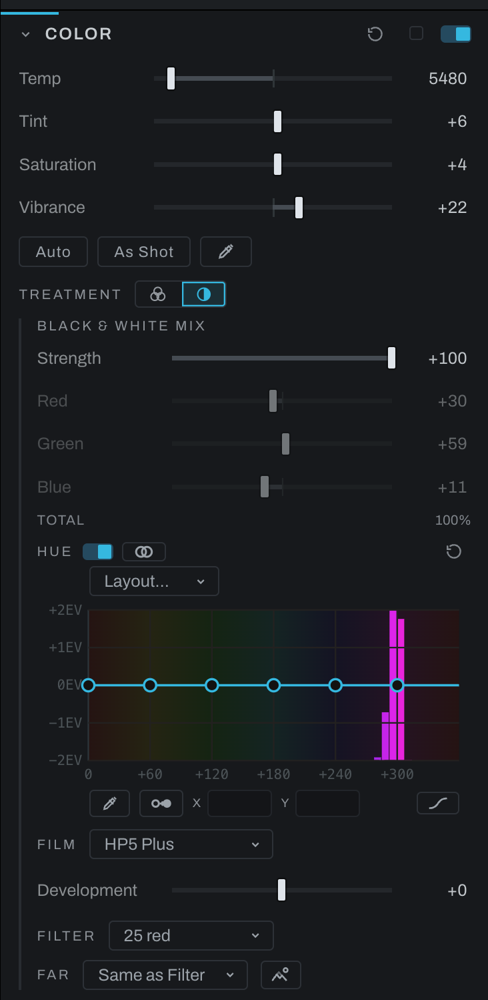
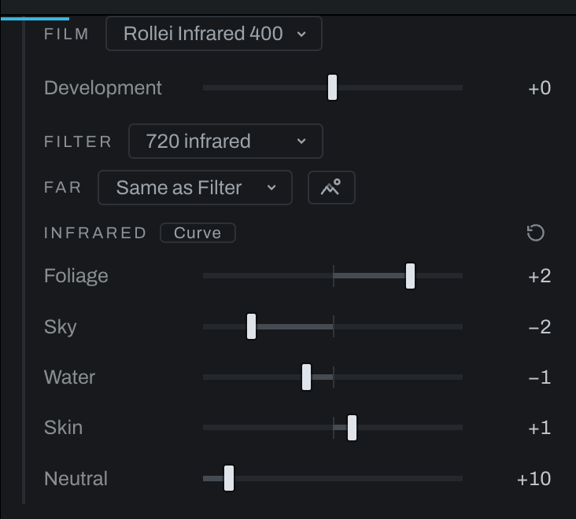
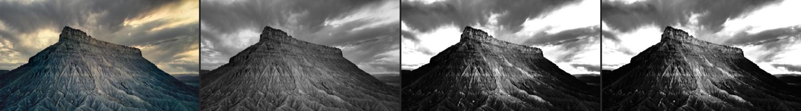
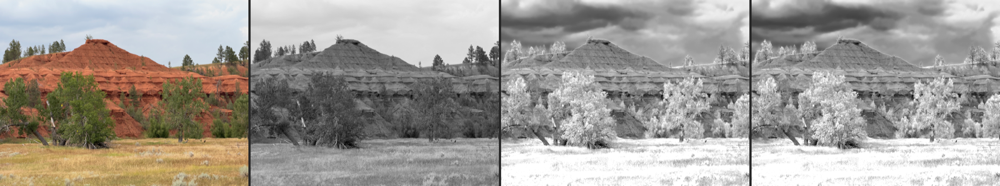
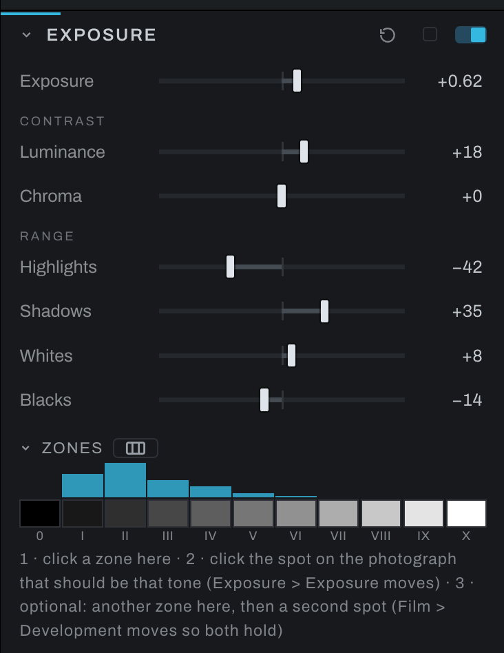
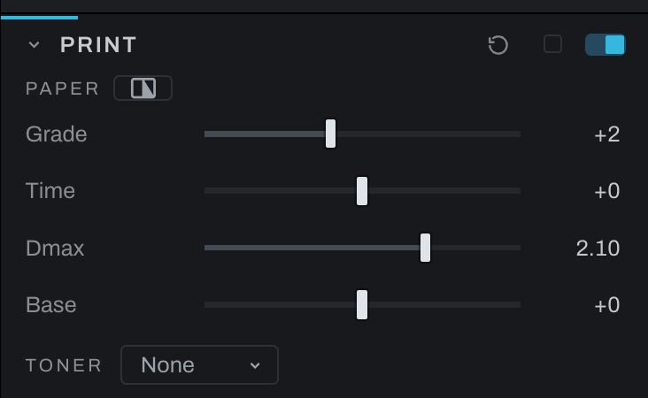
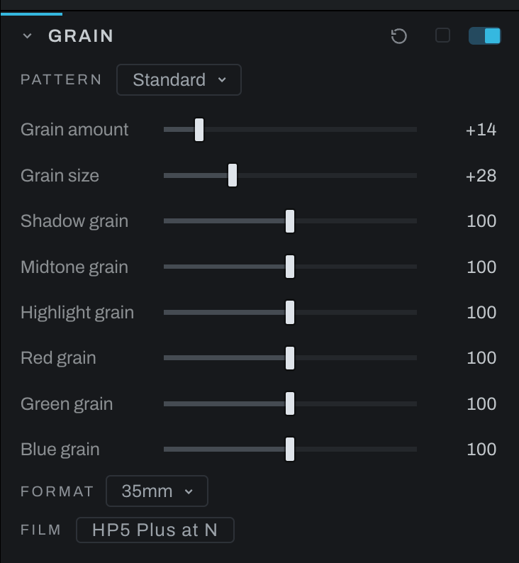

# Black and White

Most editors make a black and white photograph by dropping the color and weighing three channels. Heeler models the darkroom instead: a filter in front of a film, the film's own characteristic curve and its development, the Zone System's placement of tones, the paper the print is made on with its grade and its toning bath, and the grain that enlargement lays down. Each step is a control somewhere in Adjustments, in the order the darkroom takes them, and this page walks them in that order. The curves behind them are modeled on the published shapes of the named films, filters and papers; none is a fit to measured sheets, and the pages say so where it matters.

The treatment begins in the [Color](color.md) section: **Treatment** chooses black and white, which builds the conversion, and its controls open below the dials. **Strength** fades between color and mono, and the mixer, **Red**, **Green** and **Blue**, is the simple face.

## The order of work

1. **Convert**, with the Treatment switch in Color.
2. **Separate** the colors that land on the same gray, with the Hue curve, the eyedropper, Separate and the Collisions view. Below.
3. **Choose the film**, its development, and the filter in front of it; a second filter for the far end of the depth map if the picture has depth; the infrared pair if that is the picture. Below.
4. **Place the tones** with the Zone System in the [Exposure](exposure.md#zones) section: expose for the shadows, develop for the highlights, on the film you chose.
5. **Print** on paper in the [Print](print.md) section: grade or split grade, the paper's black and its base, the toning bath.
6. **Grain** as the film and the enlargement lay it down, in the [Grain](grain.md) section: the Film chip and the Format row.

## The hue curve and separation

The **Hue** curve is the expert face over the same conversion. Hue runs round the wheel along the bottom; the curve lifts or drops the gray of each hue in stops, up to two either way, on top of the mixer or spectral conversion. A neutral has no hue, so grays are never touched by the curve; the line is drawn on saturation, a color's chroma against its own lightness, so a green in shade counts as the same green as one in the sun. Under the curve, bars in their own hue show how much of the photograph's color sits at each hue, read from the picture as it enters the conversion, so a point goes where the color is. Drag a point, or use the tools beside it:

- **The eyedropper** (the first chip on the curve) ties the curve to the picture. Hover the photograph and a ghost point rides the curve at the hue under the cursor, so you know which point a patch belongs to before touching anything. A click adds a point on the curve at that hue, and holding the click and dragging up or down lifts or drops it; releasing before the hue is read still adds the point. A click right on a point already there takes that point instead. A gray has no hue: over one the ghost stays at the last hue it read, and a click there drops its point at the ghost.
- **Separate** (the two-circle chip on the curve) is for the oldest failure of a conversion: two colors that land on the same gray, the red flower and its green leaves. While it is armed the picture shows the collisions: everything dims except the colors that share a gray with a color of another hue, each lit in its own hue. Click one of them, and only that color and the ones it merges with stay lit; click one of those, and the curve moves each hue half a stop in opposite directions, the brighter one up. Do it again to push further; drag the points to taste.
- **Layout** offers a point every 180, 90, 60 or 30 degrees, and the Smooth, Straight and Tangent faces are the ones Relight and Recolor have.
- **The switch** beside the Hue kicker turns the curve's effect off and on without losing a point, to see what it is doing to the picture.
- **Reset** (at the right end of the Hue row) flattens the curve alone; the mixer keeps its weights. The section's reset clears both.
- **Collisions** (the eye beside the Hue kicker) shows where that failure is happening. The picture dims, and every color that shares a gray with a different color lights up in its own hue. Turn it on, separate what lights up, turn it off. It is a view, never part of the photograph. **Tolerance**, shown while the view is up, is how far apart two grays may be and still count as one collision, either side, as a share of the tonal range: at rest about three percent, one of the view's bins, the smallest step a print shows as two tones. Widen it to find colors that nearly merge, narrow it to the exact ones.

While the treatment is on, hue-keyed masks below the conversion (a Color Set's, for one) still select by the color the photograph had, so "the sky by its blue" works on a mono picture, and Recolor's hue rows key on that color too. The histogram under each of these curves is the same picture: the color as it enters the conversion.

## Film, filter and development

**Film** develops the negative as a black and white film stock: the photograph's tones pass through the stock's characteristic curve, the density-against-exposure curve its maker publishes, with a toe where the emulsion starts to respond, a straight line whose slope is the contrast, and a shoulder where it saturates. The first cut is HP5 Plus, FP4 Plus, Tri-X 400, T-Max 400 and Ortho Plus. **Development** is the development time in N steps, N-2 to N+2: N+1 is a push, a steeper line and a touch more speed; N-1 a pull, flatter. Each stock is modeled on the published family's shape and says so under the menu; its parameters come from general knowledge of the family, not a fit to digitized measurements. Before the Print node, the negative is rendered on an ideal grade 2 paper, scene white on paper white. A stock develops a RAW and a rendered photograph alike: a JPEG's tones go through the curve as they are, white to paper white. The curve lives on the Tone Profile, so on a RAW the profile has to be on: bypass it in the graph and the Film row dims and says the stock's curve is off. With a stock on, the Zone System's second placement in the Exposure section moves Development instead of Luminance: expose for the shadows, develop for the highlights, on the film.

**Filter** puts a Wratten filter in front of the film: 8, 11, 15, 21, 25, 29, 47 or 58, as a transmission curve rather than a channel weight. With a filter on, or a stock chosen in Film, the gray is the color's spectrum through the filter's transmission and the film's spectral sensitivity, and the mixer stands down (its sliders dim). An orthochromatic stock is then a true difference: lips and freckles go dark, a saturated red goes near black, skies go white. The visible-band model is equivalent to channel weights derived from these spectral shapes. What a red keeps is its own share of gray: a dark red fabric that reflects a tenth of every color still shows that tenth. Each filter and sensitivity is modeled on the published shape, and the note under the menu says which. A neutral keeps its value under every pair that passes light: the filter factor is exposure's business. An 850 filter on a visible-only stock can produce a black frame.

**Far** is the second filter, the one on the far end of the depth map, with Filter on the near end: a red on the subject and a yellow on the distant hills, so the sky darkens behind the subject while the far tones stay soft, which is atmospheric perspective, the oldest depth cue in a black and white print, and the gesture that used to take a graduated filter and a burn. The conversion grades between the two along the depth map, and the curve under the menu says how: depth runs near to far along the bottom, NEAR to FAR over the map's own gray as the eye shows it, white near and black far, and the height is how much of the far filter each depth gets, a straight line by default. Same as Filter is one conversion for the whole frame. The eye beside the menu shows the depth map. Far needs the depth map: without one, Filter alone applies.

**Infrared** is the 720 and 850 filters and the two infrared stocks, Rollei Infrared 400 and Kodak HIE. Read this before using them: the sensor recorded nothing past 700 nm, so what an infrared film sees in Heeler is a guess from each color's hue, foliage up, sky and water down, skin a little up, the Wood effect as infrared film shows it. It is an artistic tool, not a simulation, and it cannot tell a green car from a leaf. Heeler gives you the dials to change the guess, **Foliage**, **Sky**, **Water** and **Skin** in stops and, behind the Curve chip, the guess itself as a curve of hue to stops, and it will not correct you toward what real infrared would have done; if you do not know what you are working toward, the defaults are a reasonable place to stay. The Infrared controls appear for an infrared Film, Filter or Far filter. The guess's curve and the depth curve under Far each carry their own Smooth, Linear or Tangent face, apart from the Hue curve's. The guess reads hue from a smoothed field, so a JPEG's chroma blocks and sensor noise do not become the picture; and it reads it only where the color is not a gray, which is **Neutral**'s call, the fifth dial in the fold: shaded pines on a far ridge, washed toward gray by haze, take the foliage lift when Neutral is low and stay the gray they are in the file when it is high. One Neutral serves all four materials, since the question is asked before any hue is looked up; an olive rock and a shaded pine are one color to the file, and the curve's reach by hue is what tells them apart. An 850 reaches deeper than a 720, and the sky keeps falling with depth, so the 850 darkens it further while foliage holds. HIE's glow is Halation's job: add it. A neutral keeps its value when the filter and film pass light.

Three of the same frames, four ways each: the photograph, HP5 Plus with no filter, Rollei Infrared 400 behind a 720, and HIE behind an 850, all at the Infrared fold's defaults. The sky falls and the clouds stand, foliage and grass go white, water goes dark, and a cool-toned rock falls with the sky. What the two right-hand panels show is the guess described above, not a record of infrared light.

## Zones, print and grain

The Zone System lives in the [Exposure](exposure.md#zones) section because it is about tone and works on any photograph, color or mono; with a stock chosen here, its second placement moves the film's Development, which is the darkroom's own answer. The paper is the [Print](print.md) section, last in the chain before Output, with its grade, split grade, Dmax, base and toner. The grain is the [Grain](grain.md) section's, where the Film chip sets the dials as the chosen stock and its development would, and Format sizes the grain as the enlargement does, the same on a preview and an export.

## In the graph

Every control here is on a node: the conversion's mixer, Hue curve, filters and infrared dials on the Black & White node, Film and Development on the Tone Profile, the paper on the Print node, the grain on Grain. The graph's inspector shows the same controls, so a treatment built in Adjustments reads the same in Graph.
