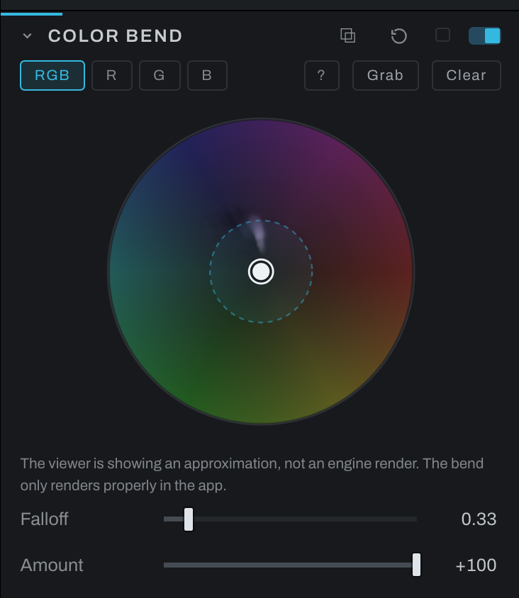

# Color Bend

Color Bend reshapes the distribution of colors found in the photograph. It is useful for harmonizing a palette or pulling nearby colors toward a more deliberate relationship.

## Controls

- **Graphical color field** defines the bend applied to sampled colors.
- **Falloff** controls how far from a chosen color the bend continues to influence neighboring colors.
- **Amount** controls the strength of the entire operation.

Use a low Amount while placing the bend, then widen Falloff only enough to avoid visible color boundaries. Watch neutrals and skin while making broad changes.

