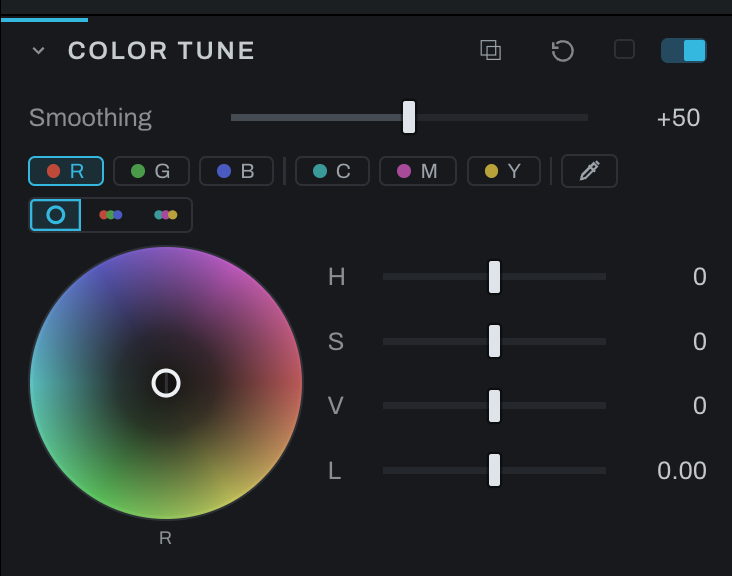

# Color Tune

Color Tune adjusts color families directly. It is the hue-indexed counterpart to Color Wheels: instead of grading by tonal brightness, it grades portions of the color spectrum. On an adjustment layer it follows the layer's mask, so one object's colors can be tuned without touching the same hues elsewhere.

The band strip picks which family you are editing: the six fixed bands sit in two groups, R G B and C M Y, with the eyedropper beside them. The wheel and the sliders belong to the chosen band. The view buttons on the row beneath show one wheel at a time, or the RGB or CMY trio together for balancing across a family.

**Custom bands.** Click the eyedropper, then a color on the photograph, and a custom band is born centered on that hue: skin, sky, a jersey, anything the six landmarks do not name. Custom bands appear in a list under the wheel, five rows tall before it scrolls. Each row has three parts:

- **The name.** Until you name a band it goes by the color you picked. The column header shows the notation and clicking it cycles through RGB, CMY and hex. The pencil beside the name lets you call the band something useful, like Bride's skin; a name stays whatever the header says, and clearing it returns the band to its color.
- **The row's eyedropper.** Moves that band onto a different color on the photograph. The band recenters on the new hue and keeps its name and its grade.
- **The cross.** Deletes the band and its grade.

Clicking a row makes that band the one the wheel and sliders edit. A custom band adds a **Width** slider for how far around its center it reaches. How many custom bands may exist is set in Preferences. Where two bands overlap, both grades apply: each band reads the original hue, their saturation factors multiply, and their hue and luminance changes add. The total hue change is limited to 90 degrees and luminance to two stops in either direction. A full wheel pull therefore approaches a distant target without necessarily reaching it.

A pick needs a colored patch. Clicking a near-neutral color, such as a gray rock or a white shirt, names no band because a neutral has no hue to center on; pick a more saturated part of the same family. The band you get acts in proportion to how colored each pixel is, so it still fades out gently toward the neutral parts of the frame.

**Smoothing** blends the hue lookup across neighboring pixels. Its reach scales with the whole photograph, including when you view a 1:1 crop. Original neutral pixels remain protected even beside a colored edge. For a lookup-table bake, set Smoothing to 0: a table cannot reproduce a correction that depends on neighboring pixels.

Color Tune is useful for foliage, sky, fabric, product colors, and skin-family refinement. Start with a narrow correction and increase Smoothing until transitions look natural.

