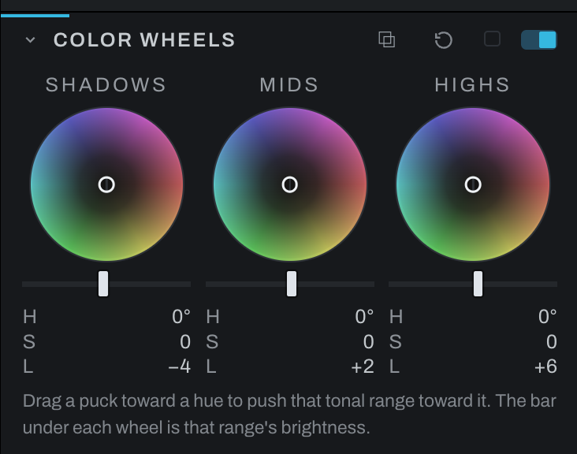

# Color Wheels

Color Wheels grades shadows, midtones, and highlights independently. Each puck controls hue by direction and color strength by distance from center; associated tonal controls adjust zone brightness where shown.

Use the Shadows wheel for dark-region color, Midtones for the body of the image, and Highlights for bright-region color. The three ranges use display-encoded brightness, accounting for downstream unmasked Exposure and the profile's baseline brightening. Raising Exposure moves a tone from one wheel's range into the next. This is an approximation of the finished picture: masked adjustments, film development, profile curves, and later edits can change its brightness further. Each wheel's range fades into its neighbors rather than stopping at a line.

Drag a puck anywhere and keep dragging past the rim: the strength holds at full while the direction follows the pointer. With the wheel focused, the arrow keys turn the hue (left and right) and change the strength (up and down); the bar under the wheel takes Left, Right, Home and End. Opposing hues in shadows and highlights can create separation, but keep skin and neutral objects under observation.

The color push is additive in scene-linear light. Shadows can lift a colored black, and strong pushes can take individual channels below zero before display clipping. The luminance bar multiplies its range by 0.6 at -100 or 1.4 at +100; it cannot brighten a pure black by itself.

## Split toning

Split toning, one color in the shadows and another in the highlights, is two pucks here: drag the **Shadows** puck toward the shadow color (teal or blue for a cool shadow) and the **Highlights** puck toward the highlight color (orange or yellow for a warm highlight). The distance from the center is the strength, and the Midtones puck stays at the center unless you want a third color. The wheels add their color, so a black and white photograph or a neutral gray takes the tint.

Color Wheels replaces the older two-zone Split Tone section, which is gone from the panel. Existing Split Tone edits still render. For a split tone with more than three zones, or one drawn as a curve along brightness, use [Recolor](recolor.md#split-toning).

