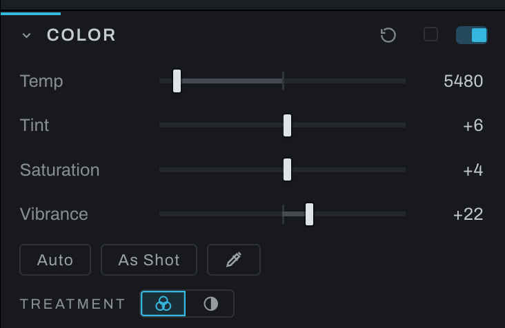

# Color

Color handles white balance, overall color intensity, and black-and-white conversion.

## Controls

- **Temp** moves the image between cooler and warmer white balance.
- **Tint** moves between green and magenta.
- **Saturation** changes all color intensity uniformly.
- **Vibrance** emphasizes less-saturated colors while protecting colors that are already strong.
- **Auto** analyzes the frame and sets available color corrections.
- **White-balance eyedropper** samples an area that should be neutral.
- **Treatment** chooses color (three overlapping circles) or black and white (a half-filled circle). Black and white builds the linked monochrome node the first time it is chosen; its channel mixer opens below.

## Black and white

The mixer is the simple face: **Strength** fades between color and mono, and **Red**, **Green** and **Blue** weigh the channels, applied directly, with the running total shown because a total away from 100% brightens or darkens the whole conversion.

The rest of the treatment, the film and its development, the filters, the hue curve and its tools, is on the [Black and White](black-and-white.md) page: it is the darkroom, and it has a page of its own.

For white balance, sample a neutral gray or white that is not clipped. Correct Temp and Tint before creative grading. Use Vibrance for a natural increase and Saturation when the whole color palette should move together.

