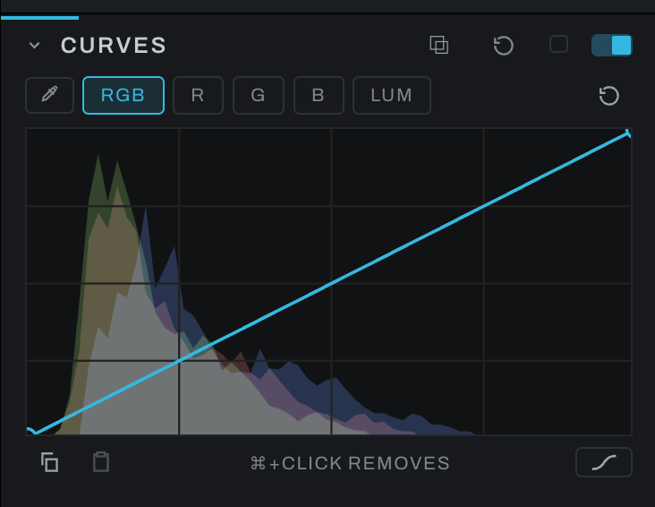

# Curves

Curves maps input tone to output tone. It can adjust all channels together or shape individual color channels.

## Using the editor

- Click the line to add a point.
- Drag a point horizontally to change the input tone it addresses and vertically to change its output.
- `Cmd` (`Ctrl` on Windows)-click a non-endpoint point to remove it.
- Use channel chips to edit the composite or an individual channel.
- Arm the picker (the eyedropper at the left end of the row, beside the canvas) and click in the photograph to add or select a point at that tone.
- The per-channel histogram behind the curve shows where image data lies.

A gentle S-curve increases contrast; the opposite decreases it. Channel curves can remove a color cast or build a creative grade, but small movements are usually sufficient.

## Hue stable

The **HUE** button under the plot's right corner, beside the interpolation button, sets how the RGB curve treats color.

- **Off (classic):** the curve runs on red, green and blue one at a time, the way most editors' RGB curve does. A contrast curve also adds saturation and can shift hue: skin can turn orange and a blue sky cyan, because one channel reaches the bend in the curve before the others.
- **On (hue stable):** the curve moves the brightest and darkest of the three channels, and the middle one keeps its place between them, the way the tone curve in common raw developers works. Contrast and brightness change; hue does not.

Grays look the same either way. The setting applies only to the RGB curve: the R, G and B curves always change their own channel, and LUM always keeps color. Curves start in classic, and a photograph edited before the button existed keeps rendering as it did. Turning it on or off is one undo step.

## Copying a curve to another channel

The two buttons under the plot's left corner copy and paste a curve. **Copy** takes the curve on screen, points, slopes and handles. Pick another channel and **Paste** replaces its curve with the copy; it is one undo step. Paste stays dimmed until something is copied.

A copy is taken as it is shown, and a paste lands as it will be shown. Copy **C** and paste onto **R** in the RGB view and the red curve takes the shape C had on screen; paste it onto **M** in the CMY view instead and green becomes what red is. The copy stays while you move between photographs, so a curve can be carried to another photograph's Curves. Curves and Recolor keep separate clipboards: a curve copied here never pastes into Recolor.

## RGB and CMY

**Option-click** (Alt-click on Windows and Linux) the **RGB** chip to show the four color curves as CMY, and Option-click the **CMY** chip to go back; hovering the chip says so. With the chip focused, Option+Enter or Option+Space does the same (Alt on Windows and Linux). RGB shows them as light: raising **R** adds red. CMY shows the same curves as ink, the way a print or a CMYK curve reads them:

- **C** is the red curve inverted, **M** the green curve inverted and **Y** the blue curve inverted. **CMY** is the RGB composite inverted. **LUM** is the same in both.
- Inverted means flipped on both axes: a point at input 0.25, output 0.4 on the red curve shows at 0.75, 0.6 on C. The axis runs from paper (no ink) on the left to full ink on the right.
- Raising C adds cyan, which takes red away and darkens. Adding cyan in the shadows is one upward pull on the right half of C, where on RGB it would be a downward pull on the left half of R.
- Editing one edits the other. There is one red curve; C is that curve seen from the ink side, so a point moved on C is there on R, and Reset on C resets red.
- Switching keeps the channel you are on: R becomes C, G becomes M.
- The picker works in both views: its point lands on the stored curve at the tone under the cursor and shows where that tone falls on the view you are looking at.

### Why views and not separate CMY curves

C, M and Y could have been curves of their own, applied after the RGB set. Then a channel could be changed twice, once by R and again by C, and the two would double up on the same pixels: the result of a red curve would depend on a cyan curve sitting further down, and reading back how the red channel was changed would mean working out both. As views there is one curve per channel, so what you see on R or on C is everything that happened to red. You get the subtractive way of working with one source of truth, and nothing about how a photograph renders changes: a graph made in CMY view is the same graph as one made in RGB.

### The default, and switching for one photograph

**Preferences > Interface > Curves channels** sets which view Curves opens in. Option-clicking the composite chip in the Curves section (or on the Curves node in the Graph inspector) switches for the photograph on screen only: it is not saved with the photograph, it is not an undo step, and moving to another photograph goes back to the Preferences setting.

Hold the picker click to drag the new point vertically. Releasing before the sample returns still places the point once, without starting a drag. Moving out of the photograph clears the hover preview, including a preview still being read. A change to the selected curve while a pick is pending keeps the newer curve.
