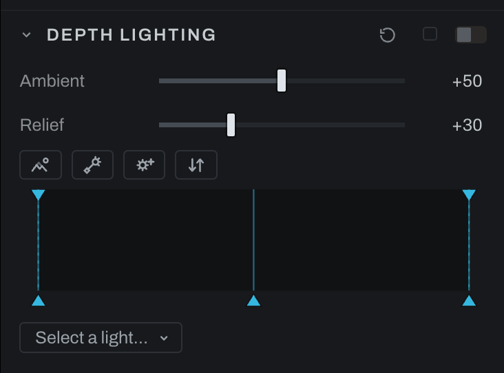

# Depth Lighting

Depth Lighting uses inferred scene depth to relight forms with a movable light rig.

## Controls

- **Light rig** adds, selects, positions, and removes lights. The rig's rings, lines and handle borders take the LINES color every overlay shares, automatic the opposite of the photograph so the rig reads over any scene; a LINES row under the rig buttons sets it, as in Grid Warp. How thick the rig draws is the **Thickness** row beside it, the same row Shape Warp has: the **Shape outline thickness** preference under Interface sets it for every photograph and ships at 2 pixels, the number here sets it for this photograph alone, the shape overlays included, and is kept with the photograph as a view setting rather than an edit; **Preference** hands it back. Drag the slider, drag the number itself sideways a pixel at a time, or click the number to type. A handle's fill still says what the light is: amber emitting, near-black dark, or the light's own color. Selected-light controls adjust that light's contribution. A point light's **Depth** can be read from the scene with **From scene**, which sets it to the depth plane's value where the light sits, so a lamp placed on a streetlamp stands at the streetlamp's distance.
- **Levels** shapes the depth map as Depth Lighting reads it, with the widget a layer's Depth mask carries: below Black is the far floor, above White the nearest relief, Gamma bends the depths between, and the falloff handles on the top edge soften either end so the cut does not draw a matte line. This section only. Pull Black up and White down and the soft step the model draws around a subject becomes a hard one, which takes the bright or dark band off the background along the silhouette.
- **Color** tints a light. An emitting light adds its color where it reaches; a dark light, one with a negative Strength, casts a shadow of its color, so a red dark light leaves red shadows rather than cyan ones.
- **Strength** runs from -100 to 100; 100 is three times the light. It only adds: a light brightens where it reaches and leaves what it does not reach at its unlit value, and a negative Strength takes light away by the same shape, most where the light would land hardest. A directional light lands hardest on the plane its Depth names, the near relief unless you move it.
- **A directional light** is a sun: one direction over the whole scene, with no place of its own. The target you drag on the photograph sets where it shines from, not a spot it is aimed at. Its three dials:
  - **Elevation** is how high it stands over the scene, from 5 to 90: at 90 it shines straight in from the camera, and lower it rakes across the relief from the side. The handle's distance from its target on the photograph sets the same number.
  - **Depth** is the plane it lands hardest on, 0 the nearest thing in frame and 100 the farthest. At 0 it favors the near relief, as a directional light always has; raise it to light the middle distance or the background. **From scene** sets it to the depth under the light's target.
  - **Reach** is how far it carries along depth from that plane. 50 is the falloff it always had, down to about a third at the far end of the scene; 100 lights every plane alike; toward 0 it keeps to its own plane and leaves the rest unlit.
- **A point light** is a lamp in the scene. **Depth** is where it stands along the near-far axis, with **From scene** to read it from the spot the lamp sits on, and **Reach** is how far its push carries, which the ring around it on the photograph also sets.
- **Ambient** sets baseline illumination outside direct lights.
- **Relief** controls how strongly depth differences are interpreted as shape.
- **View depth** shows the plane itself; **Invert** flips it when the inferred order is reversed. Every section that reads the depth map carries the View depth eye.
- **Normals**, shown only for an OpenEXR that carries a normals pass: **File** shades with the render's own surface normals when the file also says which way its camera faces (when it does not, the section says NO CAMERA IN THE FILE), **Camera** takes the pass as camera space already, the way a compositor's Vector Transform writes it, and **Off** shades from the depth map alone. With the render's normals the relief is the geometry's, not an estimate, and Relief no longer applies to the shading's direction.

Begin with one light and moderate Relief. Position it in the on-image rig, then use Ambient to keep unlit regions from collapsing. Add lights only when one source cannot describe the intended result.

A depth pass from the file is shaded exactly. When the photograph is an OpenEXR carrying a Z or mist pass, the Depth Map reads the renderer's own depth instead of inferring it, and this section shades that plane as measured: every surface shades from its own slope to its last pixel, silhouettes stay one pixel wide, and there is no smoothing between a thing and what stands behind it. The model's map keeps its smoothing, which is what makes a guessed map usable. Edges or Flatten above zero in the Depth Map section smooth a file's pass too, and the section then shades it along the smoothed path; the clips and this section's Levels do not.

Depth is inferred from the photograph, not reconstructed geometry. Watch silhouettes and overlapping objects for halos: the Depth Map section's Edges control takes them off, and Flatten calms a rippling wall. The relief shading itself runs to the last pixel of each surface, and the model's own soft step between a near thing and a far one takes the shading of what surrounds it rather than a seam of its own; this section's Levels can narrow that step. The shading reads the shape of things at the scale of a head or a fold, not the ripples the model draws in hair, cloth and pavement: a surface flatter than the model can resolve reads as flat, so a lamp placed low over the ground shades the ground evenly rather than in blotches. Relief now shows on surfaces it used to leave flat; lower it if a subject reads too sculpted. Reduce Relief when depth errors remain visible. A very strong dark light rolls off toward black on the flanks that face it rather than clipping.

## Lens Flare

The Lens Flare section, below Depth of Field, draws the lens's flare for the rig's lights: the
source glow, diffraction rays, the chain of aperture ghosts across the frame,
an anamorphic streak, and the veiling glare that lifts the blacks around a
bright source. Nothing is painted; every element is drawn from the light's
position and the lens's character, so moving the light moves the flare and
the flare renders fresh at every size, in the export included.

- **Which lights flare** is chosen per light, in Depth Lighting's selected-light
  controls or in the Lens Flare section's list. In the rig, every flaring light
  shows a sun marker where its flare comes from, pinned to the frame edge when
  the source is off-frame, so the aiming handle and the source are never
  mistaken for each other. A directional light flares from
  the frame edge its direction names; its elevation sets how far past the edge
  the source sits. A point light flares from where it stands.
- **Lens** picks a preset for the look: modern prime, zoom, vintage, telephoto,
  wide, anamorphic, phone. Heeler suggests one from the photograph's focal
  length and lens name but never applies it for you.
- **Anamorphic** is the streak: its strength, thickness, reach and taper, its
  angle, its offset from the source along and across its line, and its
  breakup, the swelling, thinning and clumping a real streak carries along
  its length. Its color is a
  ribbon from the source to the streak's end, below the dials: drag a point's
  handle to place it, click the swatch under it for its color, click the bar
  to add a point in the color found there, click the X above a point to
  remove it, and select a point to set its opacity. Single goes back to one
  color.
- **Occlusion** reads the depth plane two ways. Around the light, something
  nearer than it hides the source and the whole flare dims. Across the frame,
  anything nearer than the light cuts the glow and rays at its silhouette, so
  a flare sits behind a person or a pole rather than being painted over them;
  the ghosts and the veil, which form inside the lens, are not cut. **Veil by
  depth** lets the glare land on the far plane rather than the near one.
- When Depth of Field is on with a different blade count, the section says so
  and offers **Match**, so bokeh and ghosts share one aperture. It is a click,
  never automatic.

From scene belongs to the selected light. Selecting another light or changing that light while the depth read is pending cancels the answer. Edits to other lights are preserved when the depth arrives.

In the graph the depth arrives by wire, from the Depth Map node's depth output to this node's **depth** input, and asking for depth here adds the wire. With no wire the scene reads as flat, every depth the same, and a Develop section that is asking says NO DEPTH MAP. See [Depth Map](depth-map.md).
