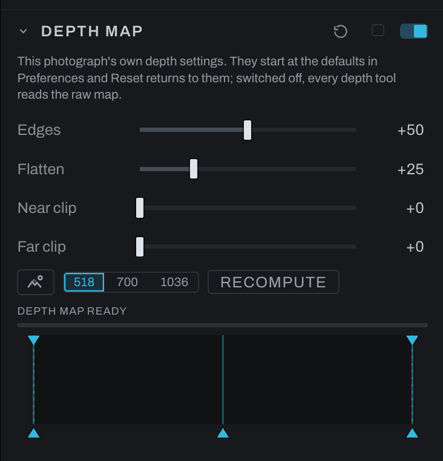

# Depth Map

Fog, Depth Lighting, Depth of Field, Recolor's depth row and Lens Character all read one depth map: the photograph's near-to-far plane, inferred by the depth model the first time any of them asks. Depth Map is where that plane is tuned. The section sits above the tools that use it, and a change here changes all of them at once.

The model answers at a fixed, modest size and its answer is stretched to the photograph, so every edge between a near thing and a far one arrives as a soft ramp, and on plain surfaces the model can invent shape from a shadow. Depth Lighting shows both at once: an embossed rim around a subject, and ripples across a flat wall. Depth Lighting itself no longer shades across an occlusion, since a cliff between a near thing and a far one is not a surface facing the light; the controls here clean up the map that every depth tool reads, using the photograph itself as the guide.

## Controls

- **Edges** snaps the depth's edges onto the photograph's. Higher takes more of the halo off a subject against its background. A color edge counts as an edge, hair against foliage or a red jacket against green, not only a change of brightness; and where the depth steps but the photograph shows nothing there, the step is kept as the model drew it rather than smoothed across.
- **Flatten** smooths the depth across what the photograph shows as flat: walls, sky, skin. Higher takes more of the ripple out; a real edge between two surfaces is kept, whether the photograph shows it or only the depth does.
- **Near clip** and **Far clip** fold the nearest or farthest slice of the scene into the end of the range, as a share of the picture. When one close thing eats most of the depth, or the far end is one flat wall or sky, a few percent here spreads the rest of the scene back across the range.
- **Detail** chooses the size the model reads the scene at: its own 518 px, or 700 or 1036 for finer edges. Each step up costs about twice the time of the last, and the largest also asks for more memory.
- **Recompute** reads the scene again from scratch, at the current settings.
- **From file** stands in Detail's place for an OpenEXR that carries a depth pass (a Z or mist channel): the render's own depth is the map, exact to the pixel, no model runs, and Recompute reads the pass again. Edges, Flatten, the clips and Levels still apply.
- **Levels** is the map's own: the same three-handle widget a layer's Depth mask carries, over the raw plane's histogram. Below Black reads as farthest, above White as nearest, Gamma bends the depths between, the two falloff handles on the top edge soften either end so a cut through the plane's soft edge does not draw a matte line, and every depth tool and every depth mask is handed the shaped map. Each of Fog and Depth Lighting has a Levels of its own on top of it, for that section alone.
- **View depth** shows the photograph as its depth map, white near and black far, so you can see what the tools below will read. Invert Depth in Depth Lighting flips the view with it. The same eye sits on every section that reads the map, so you can check it from wherever you are editing. **Option-click** (or **Cmd-click**) any of them to see the map as a red tint over the photograph instead: white, the nearest, takes the overlay opacity (50 percent unless changed in Preferences), middle gray half of it, black none, so you can see which parts of the picture a depth tool will reach. Option-click again for black and white. The flavor is the one Show mask uses, shared app-wide, in the **Mask overlay color** and at the **Mask overlay opacity** set under Preferences > Editing & Brush.

Adjustment layers and Finish layers read the same map through their **Depth mask** block, so one setting here shapes every depth user at once. Switching the section on refines the map; off returns every depth tool to the raw plane. A moved control recomputes the map when you let go. The status line at the foot of the section says when the map is ready and what the last read took; while a read runs it shows a bar with the time it expects, learned from the reads it has already done at that size this session, and the tools and View depth keep the old map until the new one lands.

The settings are the photograph's own: the section is born with the defaults set in Preferences under Models (Edges, Flatten and **Depth map detail**, a dropdown menu of 518, 700 and 1036), Reset returns it to them, and changing the preferences later touches no photograph that already has its section. Switched off, every depth tool reads the raw map, not the preferences. Start with the defaults, turn View depth on, and raise Edges until the rim around your subject is gone, then Flatten until the flat surfaces stop rippling. Push either past what the photograph needs and fine depth detail starts to go with it.

In the graph the Depth Map card sits at one fixed seat: right after the geometry nodes (Crop & Rotate, Lens Correction, the warps) and before anything tonal, so the map is computed from the straightened photograph rather than from a graded one, and the seat never wanders with which sections happen to be on. The picture passes through the card untouched; what the card adds is a second output, a small diamond below its image output: **depth**, the tuned plane itself as a field, 0 near to 1 far after Edges, Flatten and the clips. The map is computed from whatever is wired into the card's input, so a tonal node moved in front of it changes the map, and dragging the card later in the chain does the same. The one exception is a file that carries its own depth pass: an OpenEXR's Z or mist channel supplies the plane, exact to the pixel, and the card's input is ignored for the map. Every depth tool and every depth mask but one reads the plane from the depth output, by a visible wire; Black & White still reads its planted raster, as it did before the port existed. Pipe it anywhere a mask pipe goes: Invert Mask, Compare, Logic, Math, Remap, or another node's mask input. Depth becomes an ordinary building block, so invert it for a far-things selection, run it through Remap for a custom falloff, or feed an Export Layer with it so the plane lands in the exported file. The **Export** checkbox in this section's header wires that for you: the map writes into every TIFF or EXR export, as farness, near black and far white. Until the model has answered for the photograph the port carries nothing; a consumer whose depth input is unwired renders as if the whole scene stood at one distance, and its section says NO DEPTH MAP.

