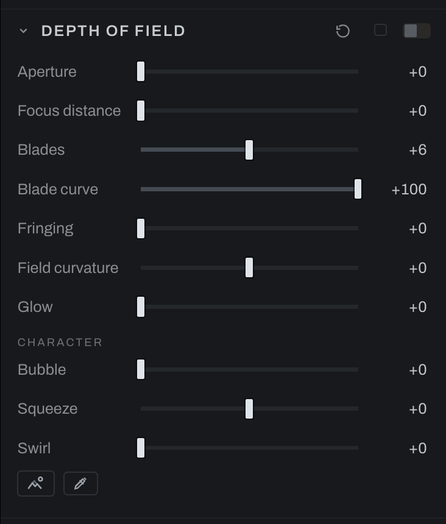

# Depth of Field

Depth of Field uses inferred depth to simulate optical focus and bokeh.

## Controls

- **Aperture** controls blur strength.
- **Focus distance** selects the depth plane that remains sharp.
- **Blades** sets the number of aperture blades shaping highlights.
- **Blade curve** changes the roundness of the aperture shape.
- **Fringing** adds chromatic edge behavior.
- **Field curvature** bends the focus plane across the frame.
- **Glow** adds bloom to bright out-of-focus highlights.

### Character

The disc's own vices, the vintage-lens bokeh (see [Lens Character](lens-character.md), which sets these by lens):

- **Bubble** puts the light on the disc's rim: a flat disc on the left, a bright ring over a hollow center on the right, the soap-bubble bokeh of a Trioplan.
- **Squeeze** makes the disc tall (left, the anamorphic oval) or wide (right).
- **Swirl** stretches discs around the frame's center the farther out they sit, the spinning field of a Petzval or a Helios. The center stays round; the edges spin.

All three shape only the out-of-focus discs, so they appear exactly where the lens would have drawn them and nowhere in focus. Open the aperture to see them.

Use the focus picker or Focus distance to place focus on the subject. Increase Aperture gradually, then tune blade shape on visible highlights. Add Fringing and Glow sparingly. Inspect hair, transparent objects, and thin foreground edges, where inferred depth is most likely to need a gentler setting.

Set focus keeps your current focus if you adjust it while the depth read is pending. A newer focus click replaces a pending one. Changing photographs, takes, or presets, or closing the picker, cancels the old answer.

In the graph the depth arrives by wire, from the Depth Map node's depth output to this node's **depth** input, and asking for depth here adds the wire. With no wire the scene reads as flat, every depth the same, and a Develop section that is asking says NO DEPTH MAP. See [Depth Map](depth-map.md).
