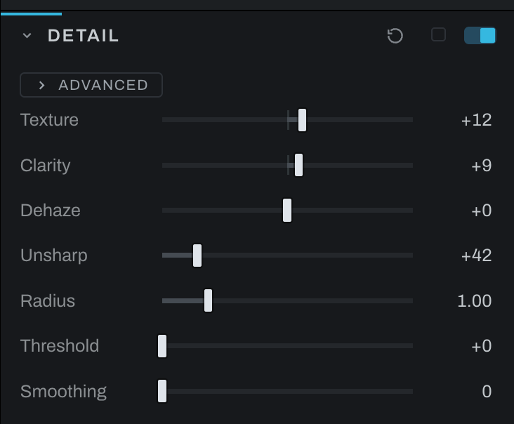

# Detail

Detail contains quick texture, local contrast, haze, sharpening, and smoothing controls. Some controls follow the selected Develop layer, making this the place for masked detail work.

Detail is off by default and has no node until its switch builds one. Texture, Clarity and Dehaze live on the Detail node, which sits right after Color in the graph; Unsharp, Radius, Threshold and Smoothing build a Sharpen or Denoise node the first time they move. The section's switch bypasses all of them.

## Controls

- **Texture** emphasizes or softens fine structures.
- **Clarity** changes mid-scale local contrast.
- **Dehaze** reduces a neutral veil and restores color, or adds a neutral veil at negative values. It is a contrast and color treatment, not a measurement of the atmosphere.
- **Unsharp** sets ordinary unsharp-mask strength.
- **Radius** sets the width of sharpening edges.
- **Threshold** protects flatter areas from sharpening: it measures the detail under an edge rather than the edge itself, so raising it reaches fewer edges too.
- **Smoothing** applies a single noise-smoothing strength.

Use Texture for fine detail and Clarity for larger local contrast. Raise Threshold to keep Unsharp away from skin or smooth sky. Keep Smoothing modest; for separate luminance and chroma treatment use [Noise Reduction](noise-reduction.md).

Texture and Clarity use edge protection to reduce halos. Their widths follow the frame, so a full-size export treats the same structures as the preview. Strong settings can still emphasize noise and draw broad bands beside transitions. Negative values soften detail; they do not undo a previous positive pass.

## Advanced weights

Open **ADVANCED**, choose **Texture**, **Clarity**, or **Dehaze**, then adjust that effect's six weights. The badge counts effects with any weight changed from 100. **Even** restores the selected effect's weights. The same controls and values appear on the Detail node in Graph mode. Opening the fold or choosing an effect changes only the panel, not the photograph; those choices are not saved in the edit.

**Shadows**, **Midtones**, and **Highlights** are overlapping brightness ranges, with smooth transitions. They describe the incoming brightness, not a hard selection. **Red**, **Green**, and **Blue** scale the change in each channel. Unequal channel weights can change hue.

- **0** removes the selected effect's contribution from that band or channel. It does not invert the effect. Neighboring bands can still contribute in a transition.
- **100** keeps the strength set by the main slider.
- **200** doubles that contribution, until shadow protection or the black boundary stops further darkening. Band and channel weights multiply: setting both to 200 can give four times the contribution.

For skin, start with a modest negative Texture and lower **Texture > Highlights** to protect bright skin from further softening. For positive Texture on clothing and hair, lower Highlights to hold bright skin out of the added texture. This is a brightness adjustment, not skin detection; use a layer mask when you need to isolate the face. To keep Clarity off dark areas, lower **Clarity > Shadows** toward 0. Dehaze weights affect both its brightness and color treatment.

When a local-adjustment layer is selected, the quick Unsharp and Smoothing controls operate behind that layer's mask, and so do the Sharpening and Skin Softening sections. The Noise Reduction recipe remains global.

