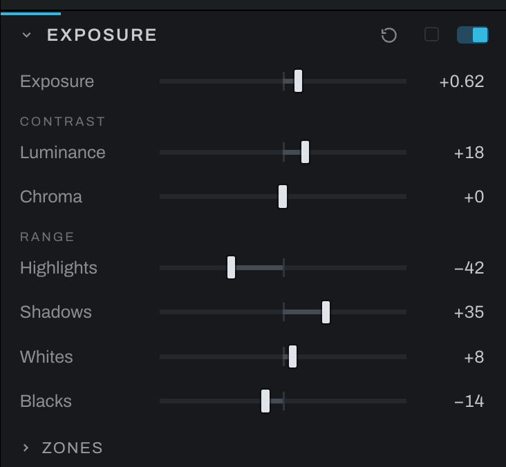

# Exposure

Exposure shapes brightness and tonal range. It separates luminance contrast from chroma contrast so tonal punch and color separation can be controlled independently.

## Controls

- **Exposure** shifts overall brightness in stops.
- **Luminance** changes light-dark contrast while protecting color intensity.
- **Chroma** increases or decreases contrast among color channels.
- **Highlights** adjusts bright tonal regions.
- **Shadows** adjusts dark tonal regions.
- **Whites** sets the upper tonal endpoint and brightest range.
- **Blacks** sets the lower tonal endpoint and deepest range.

Start with Exposure, then recover Highlights or open Shadows. Use Whites and Blacks to establish endpoints. Add Luminance for shape; use Chroma cautiously when color feels flat or over-separated.

## Zones

Under the dials, the **Zones** ruler is Ansel Adams' scale as print values: eleven swatches from 0 (black) to X (white), Zone V at middle gray, five equal steps of tone either side. Hover a swatch and the photograph lights the pixels in that zone; the eye beside the kicker shows the whole picture posterized to its zones, a spot meter reading the scene.

Placement is two clicks, and it moves the two dials above it. It works on any photograph, color or black and white: the Zone System is about tone. Click a zone on the ruler, then click the spot on the photograph that should sit there, and **Exposure > Exposure** moves so it does ("place a shadow on Zone III"). The zone is then spent: choose another zone on the ruler and click a second spot, and **Exposure > Luminance**, the development, moves so the second spot lands while the first holds ("expose for the shadows, develop for the highlights"). When a black and white Film is chosen in Color and its profile develops (on, or a rendered photograph), the second placement moves Film > Development instead of Luminance. Each placement is one undo step, the help line under the ruler says the next move at every step, and the gold pin marks the first spot until the second lands or Escape drops it. The bars above the ruler are the picture's tones by zone, so you can see what a placement moves. Zones folds away under its own chevron and opens closed. It has no reset of its own: Undo steps a placement back, and the Exposure section's reset puts the dials at their defaults and drops the placement.
