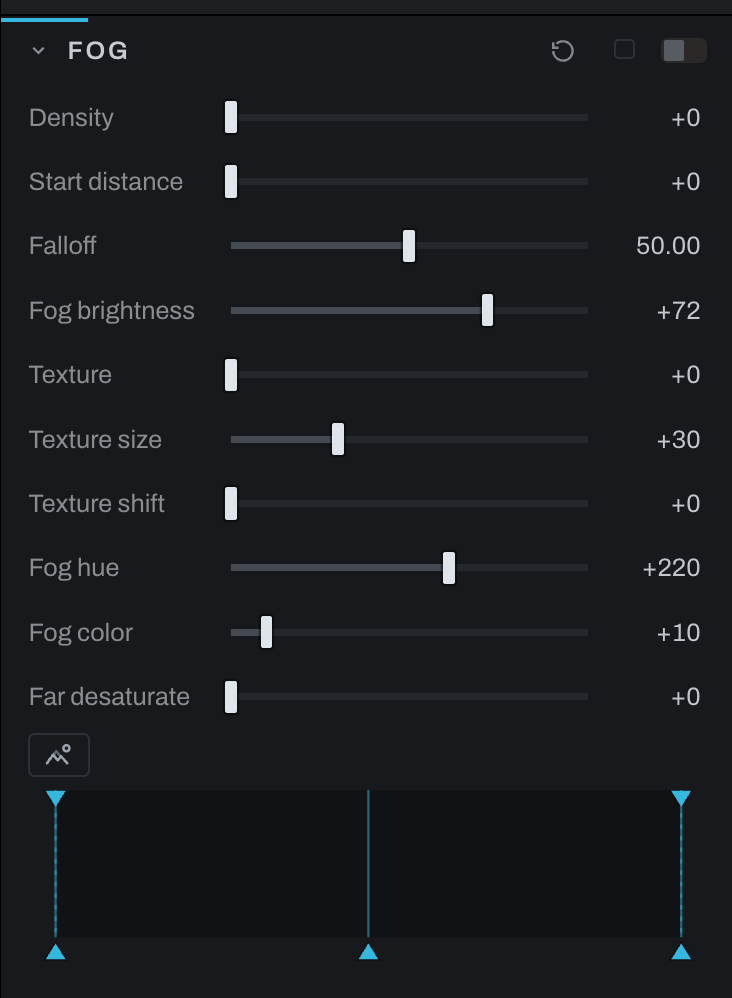

# Fog

Fog uses a computed depth map to place atmosphere through the scene. The first depth-based edit may ask to download or run the depth model.

## Controls

- **Levels** shapes the depth map as Fog reads it, with the widget a layer's Depth mask carries: below Black no fog, above White the thickest, Gamma bends the depths between, and the falloff handles on the top edge soften either end. This section only; the Depth Map section's Levels shape the map for every reader.
- **Density** sets fog strength.
- **Start distance** sets where fog begins.
- **Falloff** controls how it builds with distance.
- **Fog brightness** sets the fog's luminance.
- **Texture**, **Texture size**, and **Texture shift** shape variation in the atmosphere.
- **Fog hue** and **Fog color** set color direction and saturation.
- **Far desaturate** removes color from distant regions.

Use View depth to inspect the inferred near-to-far map, and the Depth Map section's Edges and Flatten controls to clean the map up. Set Start distance before Density. Add texture only after the depth transition looks plausible. Invert depth if the inferred order is reversed.

In the graph the depth arrives by wire, from the Depth Map node's depth output to this node's **depth** input, and asking for depth here adds the wire. With no wire the scene reads as flat, every depth the same, and a Develop section that is asking says NO DEPTH MAP. See [Depth Map](depth-map.md).

