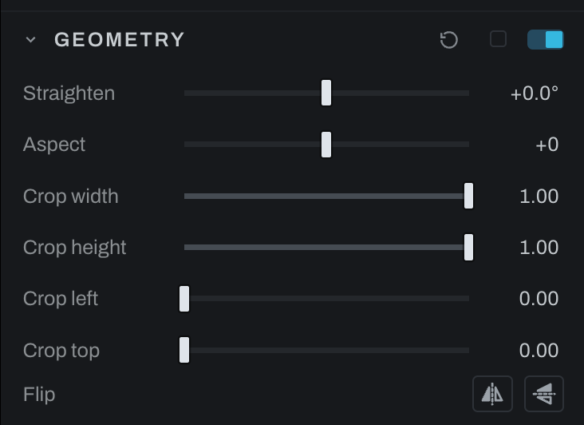

# Geometry

Geometry controls image rotation, aspect transformation, and the nondestructive crop rectangle.

## Controls

- **Straighten** rotates the photograph. Use the viewport tool to drag along a line that should be level.
- **Aspect** stretches the picture: negative values widen it and positive values heighten it. It is not the crop's ratio. To crop to 16:9, 3:2 or another ratio, choose **Photo > Crop / Straighten** and pick the ratio there (see [Image viewport](../image-viewport.md)).
- **Crop width** and **Crop height** set the retained size.
- **Crop left** and **Crop top** position the retained rectangle.

Geometry starts off, and a photograph carries no geometry node until it is used: switching the section on or making the first crop or straighten drag in the viewport adds it. The viewport crop tool is the normal visual way to edit these values. Numeric rows are useful for matching crops or entering exact geometry. Pixels outside the crop are retained and can be restored.

## Flip

**Flip** (two buttons on the **Flip** row at the foot of the section: Flip Horizontal, a shape and its mirror across an upright dashed line, and Flip Vertical, across a level one) mirrors the photograph left for right or top for bottom, the same two switches as **Photo > Flip Horizontal** and **Flip Vertical**. A lit button is on; pressing it again puts the photograph back. Each press is one undo step. The same two buttons sit on the Crop & Rotate node in the graph inspector.

The edits flip with the photograph. A brush stroke, a selection, a radial or linear mask, a Smart selection's clicks, the crop's rectangle and angle, Grid Warp and Shape Warp, Depth Lighting's lamps and every Finish layer all stay on the subject they were made on, so the whole result is the old one mirrored: the export, the view at Fit and at 1:1, the histogram and the thumbnail. A picture placed in Finish mirrors with it (a baked warp's kept warp too, so **Unbake** lands on the mirrored subject), and directions follow: a Gradient layer's angle, a Shadow's or Bevel's light, a motion Blur, a Flare's rays and streak. Grain and the Fog's texture are made fresh where they land and are not mirrored. The flip is applied with the crop, to the photograph before it is turned, so a Smart selection's model and the depth map read the photograph as it is. A depth map computed after the crop is computed again on the flipped frame.

**Paste Edits** carries the flip with the crop, and **Reset** on this section puts the photograph back the right way round. While the Crop & Rotate node is bypassed in the graph the buttons gray: switch it on first.

## Following the crop

Anything painted or placed on the scene follows a change of crop, in the same undo step: masks, brush strokes, selections, Finish painting, Grid Warp, Shape Warp and the lamps of Depth Lighting stay on the content they were made on (see [Painting and the crop](../finish/README.md#painting-and-the-crop)). Switching Geometry off is a change of crop too.

