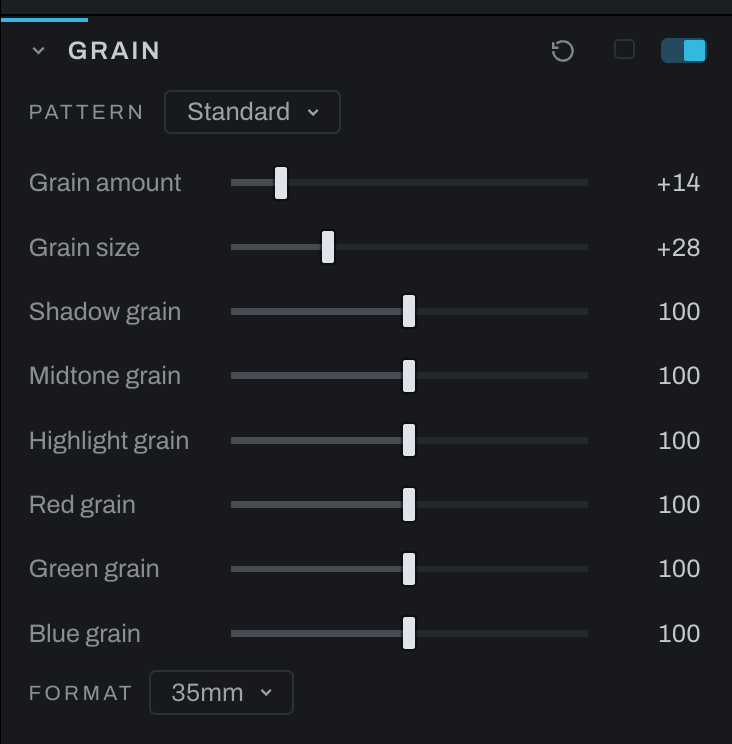

# Grain

Grain adds photographic grain with independent tonal and color weighting.

## Controls

- **Grain amount** sets overall visibility.
- **Grain size** sets particle scale.
- **Pattern** chooses fine, standard or coarse clumps, or cinema's mix of coarse and fine grain.
- **Shadow grain**, **Midtone grain**, and **Highlight grain** weight the effect by tone.
- **Red grain**, **Green grain**, and **Blue grain** weight the effect by channel.

**Film** appears above the dials when a stock is on under the black and white treatment in Color: one chip, named for the stock and its development, sets Grain amount, Grain size, the grain's character and the tonal bands as that film would lay them down. A push coarsens and strengthens the grain, a pull the reverse. It is a starting point from general knowledge of the families, the film's word and not a rule; take the dials from there. Changing Film or Development later updates the chip; click it again to apply the new starting point.

**Format** is the enlargement: the negative's size against the print. Grain is sized as a share of the frame, so a preview and an export from the same photograph carry the same grain in picture terms, and a larger export carries it in more pixels the way a larger print does. 35mm is the reference, the grain as Grain size sets it; a roll-film negative is enlarged less for the same print and its grain is a smaller share, down to a quarter for 4x5. A grain finer than a pixel cannot be drawn and fades rather than turning into noise, so a small preview shows a faint trace and the true grain shows at 1:1 or on the export. A photograph edited before this change keeps the grain it was drawn with, sized in the render's pixels, and offers one click, Size by the frame, to move over: 4000 px is the reference short side for the same nominal size. Fine grain below one pixel also takes the fade, so migration can make it fainter even at that reference size.

Set Grain size at 100% first, then raise Grain amount. Use tonal weighting to keep grain out of clean highlights or add character to shadows. Channel weighting changes whether the grain feels neutral or color-biased; equal channel values are the neutral starting point.

