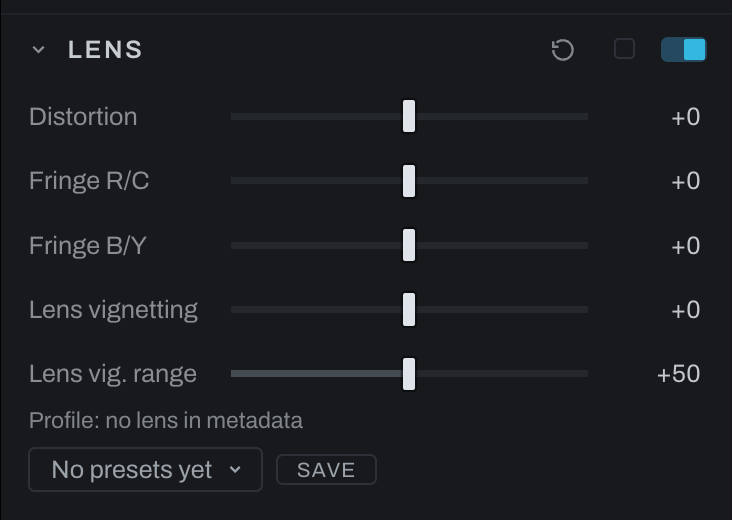

# Lens

Lens corrects geometric distortion, chromatic fringe, and vignetting. Profile support may prefill or guide corrections; the manual controls remain available.

## Controls

- **Distortion** corrects barrel or pincushion curvature.
- **Fringe R/C** corrects red/cyan lateral chromatic separation.
- **Fringe B/Y** corrects blue/yellow separation.
- **Lens vignetting** brightens the corners back up to undo the falloff the lens put there.
- **Lens vig. range** controls how far that correction reaches toward the center.

Correct distortion before final crop because straightening edges can expose empty corners. Inspect high-contrast edges near the frame at 100% while adjusting fringe.

The controls here undo what the glass did. For a falloff you want, use [Vignette](vignette.md), and correct first: working the other way makes this correction fight a look you chose.

