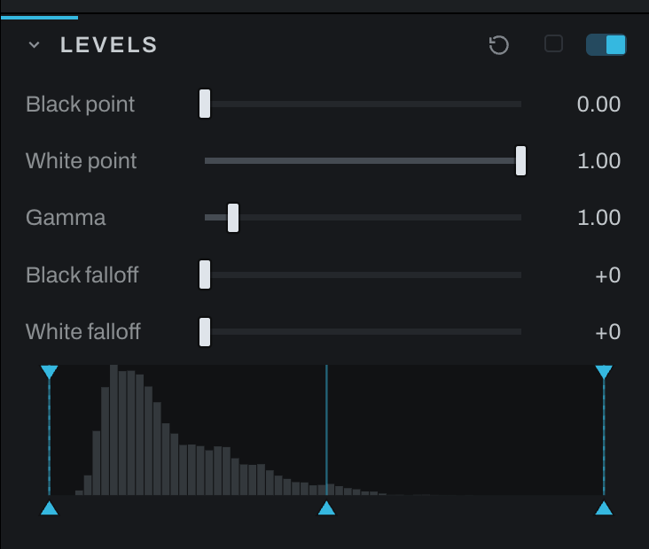

# Levels

Levels establishes black and white points, adjusts midtone brightness, and softens the approach to the endpoints.

## Controls

- **Levels widget** shows the tonal distribution and draggable input positions.
- **Black point** sets the input value treated as black.
- **White point** sets the input value treated as white.
- **Gamma** brightens or darkens midtones without moving the endpoints.
- **Black falloff** softens the transition into black.
- **White falloff** softens the transition into white. Values brighter than white keep their headroom through it, so a later section can still bring a highlight back.

Levels reads the picture the way the screen shows it, as Curves does: the widget's histogram is the displayed photograph, and the black point, white point and gamma sit on that same axis, so a black point at 0.1 takes the darkest tenth of what you see, no more. Levels sits after the tone profile in the chain for that reason, just ahead of Curves. A photograph whose Levels was never set catches up to that position when it is opened; one with a Levels already set keeps its place.

Move Black point inward until the image has a solid foundation without losing needed shadow detail. Move White point inward to establish clean highlights. Adjust Gamma for the middle of the image. Add falloff when endpoint changes look abrupt.

Use the gamut/highlight warning in the viewport to distinguish intentional endpoints from accidental clipping.

