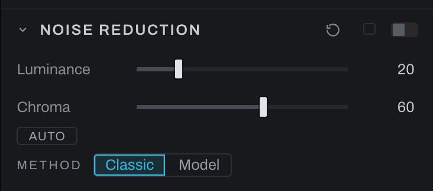

# Noise Reduction

Noise Reduction treats luminance and chroma noise separately. It is a global recipe and is off until enabled, at every ISO: nothing smooths a photograph you have not asked to. The Source section's capture sharpening, on by default, reads the photograph's noise and does not sharpen below it; on a very noisy frame, set Source's Sharpening to Low or Off before judging noise at 100%.

## Method

- **Classic** is the pair of denoisers in the graph: a luma denoise and a chroma denoise, instant, the same kernel Detail's Smoothing uses, one dial each.
- **Model** is the SCUNet denoiser's answer blended in: a blind real-noise model that reads the photograph as it came off the sensor and answers a cleaned copy, which Luminance and Chroma then blend in half by half. It is downloaded on consent the first time you choose it (about 77 MB, or ahead of time from Preferences, Models), and it runs on your machine, on the CPU. At about 0.6 seconds per tile on the measured Mac16,5 with 48 GiB, a 2048 by 1365 preview uses 77 tiles and takes roughly 45 seconds; a 6000 by 4000 full-size answer, which export needs, uses 651 tiles and takes roughly 6.5 minutes. Times vary with your machine, so the section says how many tiles and about how long, and runs it either when you press FULL SIZE or when you export.

## Controls

- **Luminance** smooths grain-like brightness variation. High values can remove real texture. With Model, it is how much of the model's luminance answer lands.
- **Chroma** smooths colored blotches. It can usually be set higher because real color changes more slowly than fine brightness detail. With Model, it is how much of the model's color answer lands.
- **Edge detail** (Model only) returns the fine luminance the model took, where the model's own answer shows an edge, so surfaces keep their texture while flat areas stay quiet.
- **Auto** analyzes the frame and proposes a balance, for whichever method is on.

Inspect at 100%. Increase Chroma until colored speckling is controlled, then add only enough Luminance to make brightness noise acceptable. If texture becomes waxy, reduce Luminance, or with Model raise Edge detail.

Detail's Smoothing control moves both kinds together. Setting Classic's Luminance and Chroma to the same value is equivalent to that simple treatment; the value of this section is independent control. Avoid using both heavily, because the photograph would be smoothed twice.

The model reads the photograph before any other adjustment, so its answer holds while you edit; a change to the Source section's white balance or demosaic asks it again. Highlights the sensor clipped are left exactly as they are. The model's answers are kept beside the smart-selection rasters and can be cleared from Preferences, Storage.

The Model answer follows the source pixels: changing a stack's merge mode or a panorama's recipe invalidates the old answer. Changing Luminance or Chroma only blends that answer, so it reuses inference. Preview and full-size answers remain separate.

## Freeze a Model pass

**Photo > Bake to Image…** runs Model at full resolution through the same path as Export and freezes it, together with the other current edits, into a new file beside the original. The DNG default keeps highlights above white and opens with fresh controls and its tone profile bypassed. Further editing starts from those pixels without rerunning the baked Model pass. The original keeps its editable settings. See [Bake to Image](../composites.md#bake-to-image).

## Full-size answers stay on disk

The Model status checks the desktop cache when you return to a photograph, reopen the panel, or relaunch Heeler. **Full size ready on disk** means the saved answer is available for Export. The FULL SIZE button uses this disk check instead of session memory. Changing source decode options, a composite recipe, or the model can require a different answer. Preferences > Storage > Clear removes cached rasters and refreshes this status.

A cache check is not a model run: the status says **checking preview cache** or **checking full-size cache** first. A saved preview says **preview loaded from disk**. Tile progress appears only when the desktop actually runs the model. If memory is too tight to load a saved answer for Export, Heeler reports that refusal instead of rerunning the model.
