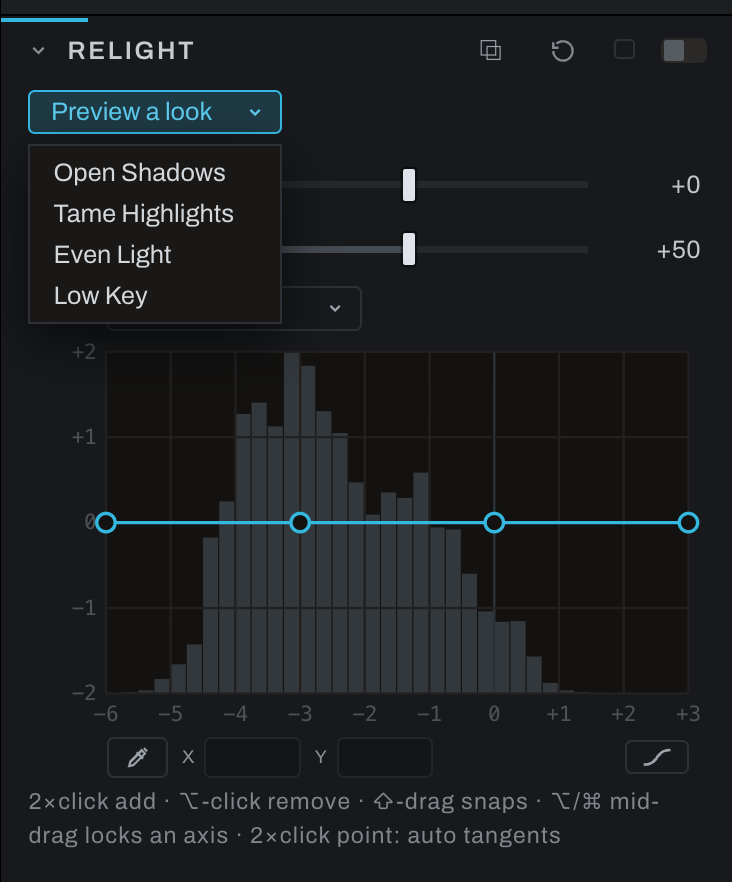
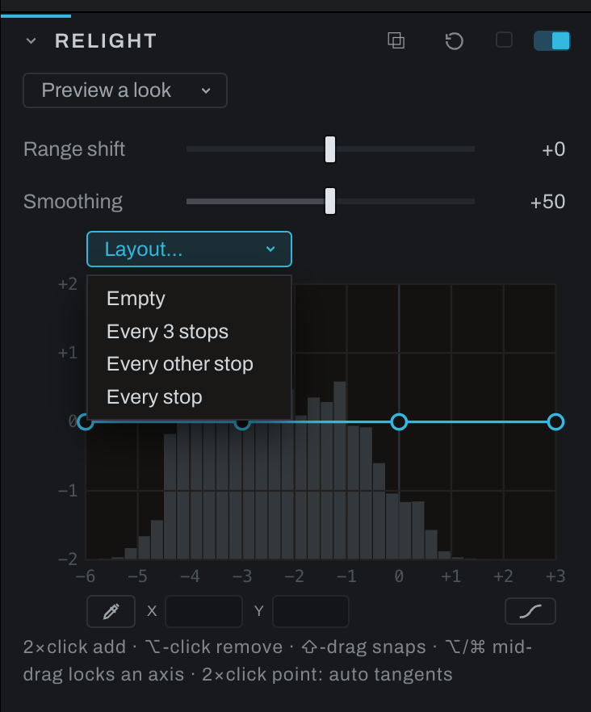

# Relight

Relight is a tonal equalizer. Its graphical bands raise or lower brightness by zone, allowing more localized tonal shaping than a single contrast control. On an adjustment layer it follows the layer's mask, so a zone can be reshaped on one subject alone.

## Looks

A **Preview a look** menu sits at the top of the section when it is open, each look a whole Relight setting:

- **Open Shadows** lifts the shadows by most of a stop and leaves the highlights alone, the fill a reflector would give.
- **Tame Highlights** brings bright skies and hot skin down by up to a stop while the shadows and midtones stay put.
- **Even Light** lifts the shadows and lowers the highlights together, so a contrasty scene reads like an overcast one.
- **Low Key** sinks the shadows and midtones and keeps the brightest tones, for a darker, moodier photograph.

Open the menu and point at a look: the viewer shows it on your own photograph, and pointing at another look shows that one instead. Close the menu (Escape, or a click anywhere else) and the photograph comes back exactly as it was. Moving the pointer off the list does not close it, so the last look stays up while you study it. The arrow keys work too: Down on the closed menu opens it, and each look the arrows land on shows. A **PREVIEW** label sits over the picture while a look shows. Nothing is saved, nothing goes into undo or the history, and the look never reaches an export, a bake, a Take, copied edits or the thumbnail.

Click a look to apply it. It replaces what the section held (the curve, Range shift and Smoothing) and switches Relight on, as one undo step, and every control stays yours to change from there.

Looks work on the photograph's own chain. With an adjustment layer selected the menu steps aside, since a look is not written to a layer. The Relight node in the Graph inspector offers the same menu.

## Controls

- **Tone EQ widget** edits tonal zones directly. The simplified face emphasizes shadows, midtones, and highlights; Graph exposes the complete nine-zone operation.
- **Range shift** moves the zones toward darker or brighter tones.
- **Smoothing** blends transitions between neighboring zones.

Drag a tonal zone up to brighten that range or down to darken it. Adjust Range shift when the affected part of the photograph does not line up with the desired zone. Increase Smoothing if the correction creates visible tonal boundaries.

Use the on-image picker to put a point on the curve at the tone under the pointer.

## Placing points precisely

- The **X** and **Y** fields under the curve show the selected point's position and follow it live while you drag. Type a value and press Enter to place the point exactly; typed values are never snapped.
- Hold **Shift** while dragging to snap both axes to quarter stops.
- Hold **Option** or **Cmd** (**Alt** on Windows) while dragging to lock the drag to its dominant direction: mostly-vertical movement locks to Y, mostly-horizontal to X. Release and re-press to re-aim mid-drag. Combined with Shift, the moving axis snaps and the frozen one holds its exact value. Option (Alt on Windows) engages only after the drag has begun, since Option-click (Alt-click on Windows) removes a point; on a Mac, Cmd also works from the start.
- The **Layout** menu offers evenly spaced starting layouts, from every third stop down to one handle per stop, plus **Empty** for starting fresh: double-click adds the first point wherever the work is, and with no points the curve is an identity.

## The three faces and the tangent handles

One button below the plot's right edge wears the curve's face and cycles it with each click: **Smooth** (the automatic curve through the points), **Straight** (rulers between them), then **Tangent handles**, and round again. Its hint names the face it will switch to. The same button and the same handle grammar appear in Recolor, Curves and the black and white Hue curve.

In Tangent mode, click a point and its handles appear at their true lengths; drag one to steer and stretch the slope, and a longer handle holds the curve to its line further. The sibling handle mirrors the drag, length included. `Option`-click or `Cmd`-click (`Alt`-click on Windows) a handle to break the pair so the two sides move independently; `Control`-click (`Ctrl`-click on Windows) a handle, or double-click the point, to return its tangents to automatic, pairing and all. Section Reset puts the starting layout back.

Arm the on-image picker and move over the photograph: a ghost point rides the curve at the tone under the pointer, read the way Relight reads it, from the smoothed light of the area rather than the single pixel, so on foliage or a cloud edge it shows the tone the curve will actually move there. Click, and a point lands on the curve at that tone, at the height the curve already has there. On a **Smooth** or **Tangent handles** curve the segments beside it ease a little to pass through the new point, so the picture can shift slightly before you move it; on a **Straight** curve it changes nothing until you move it. Hold the click to drag the new point vertically. A click on a point already there takes that point instead. Releasing before the tone is read still places the point once, without starting a drag. The point sits where the curve reads that tone, so it follows **Range shift**. The picker reads the input of the Relight node you armed, including a separate instance in Graph. Changing that node while the read is pending keeps your newer settings.
