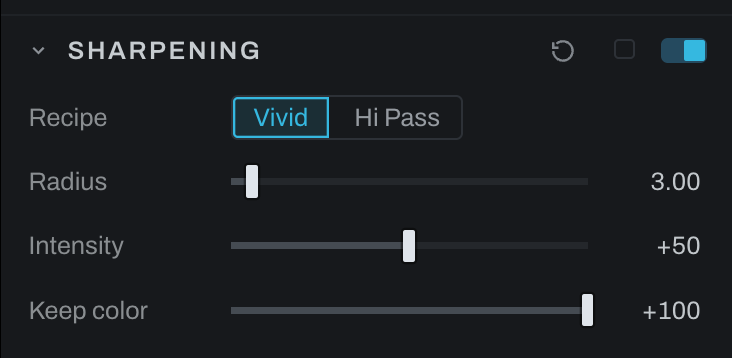

# Sharpening

Sharpening is the Develop sharpening recipe as one section with two methods. It is separate from Detail's ordinary Unsharp control, and from the capture sharpening every RAW already has, which is the Source section's **Sharpening** row (Standard by default): this section is creative sharpening on top of that. In Graph it is a group of the recipe's own nodes, the layer stack you would build in a layer editor drawn as a graph: open the group to see and change every node, and the group rides an adjustment layer behind that layer's mask: sharpen the ground and not the clouds, the rocks and not the water.

## Methods and controls

- **Vivid** inverts and smooths the picture and lays it back through Vivid Light, for a crisp, contrast-forward result.
- **Hi Pass** desaturates the picture, keeps only what is sharper than the radius, and lays that back through Overlay.
- **Radius** sets edge width in the active method, in full-photo pixels. Use another editor's number as a starting point: the finished recipes can differ.

Both methods use Gaussian smoothing; the overshoot beside an edge is the recipe's own punch.
- **Intensity** sets the blend strength of the sharpening result.
- **Keep color** sharpens the brightness and leaves the color as it was. At 100 no edge changes hue; lower it to let the recipe's own color through, which on a dark spot against warm fur reads as a green rim.

Choose the method by result rather than name, inspect at 100%, set Radius for the subject's edge scale, then increase Intensity. Fine texture wants a smaller radius; larger forms tolerate a wider one.

On the Base layer the section applies to the whole photograph; on an adjustment layer it follows the layer's mask, and the section header says which. The section's switch bypasses the group without destroying its settings. In Graph the group is named Sharpening: inside it are To Display, Invert, Blur and a Vivid Light blend (the Vivid branch), Desaturate and High Pass (the Hi Pass branch), the Overlay blend whose opacity is Intensity, a Color blend that lays the picture's color over the result at Keep color, To Scene with the original picture as its highlight reference, and a final Apply mask blend in scene-linear light (a Picture pass-through at the entrance feeds those two); the Recipe switch wires one branch into the Overlay and leaves the other in place, disabled. The group's face carries Radius, Intensity and Keep color; a change to a node inside is read back by the section's dials. Photographs saved with the earlier one-node Sharpening open as the group with their values carried over.

