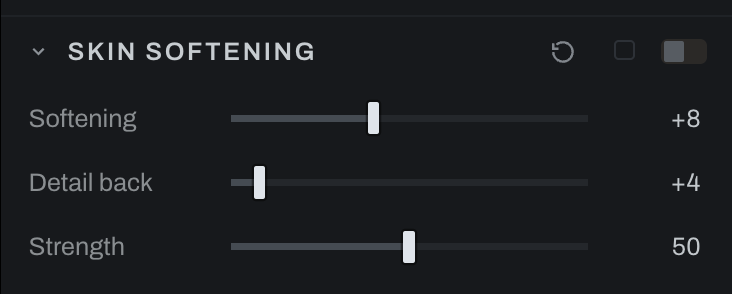

# Skin Softening

Skin Softening reduces small texture while returning selected detail. It is one section, and in Graph a group of the recipe's nodes, so it can sit on an adjustment layer behind that layer's mask: a face mask or a smart layer's subject matte keeps the softening to the skin and off the rest of the photograph, which is how it is meant to be used.

## Controls

- **Softening** sets the scale of smoothing. The normal useful range is intentionally modest.
- **Detail back** restores higher-frequency structure after smoothing.
- **Strength** blends the result over the original.

Set Softening to address the texture size, raise Detail back until pores and edges remain believable, then lower Strength until the change is not obvious. The numbers mean what they mean in a layer editor: the group is the same layer stack, its High Pass keeps half the residual, and its blur's sigma is the radius, so a tutorial's Softening 20 and Detail back 4 give the same picture here. Avoid judging at Fit; use 100% and also check the whole face at normal viewing size.

On the Base layer the section applies to the whole photograph; on an adjustment layer it follows the layer's mask, and the section header says which. In Graph the group is named Skin Softening: To Display, Invert, High Pass (Softening), Blur (Detail back), a Vivid Light blend, a Normal blend whose opacity is Strength, and To Scene, wired as the layer stack was; open the group to see and change any of them. Photographs saved when Skin Softening was one node open as the group with their values carried over.
