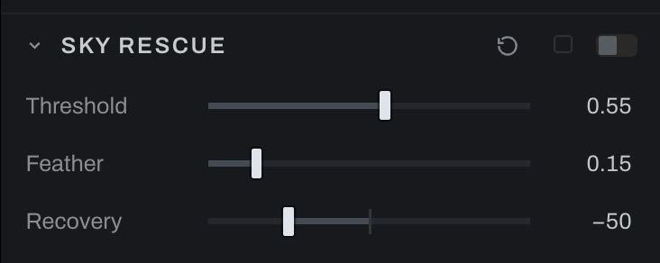

# Sky Rescue

Sky Rescue identifies bright sky-like tones and applies highlight recovery through a soft conditional mask. It is an optional global recipe.

## Controls

- **Threshold** sets how bright a pixel must be before entering the sky mask.
- **Feather** softens the transition around the threshold.
- **Recovery** darkens the selected sky: the higher it is, the further the sky's highlights are pulled down. Raise it to darken the sky more; lower it for a lighter touch.

Begin with Recovery high enough to see the effect, then move Threshold until the intended sky is included without pulling in bright foreground objects. Increase Feather to remove hard transitions, and finish by lowering Recovery until the sky looks natural: less Recovery means a lighter sky, not a darker one.

In Graph, the recipe appears as measurement, comparison, conditional, and exposure operations. This makes its inferred mask and logic inspectable.

