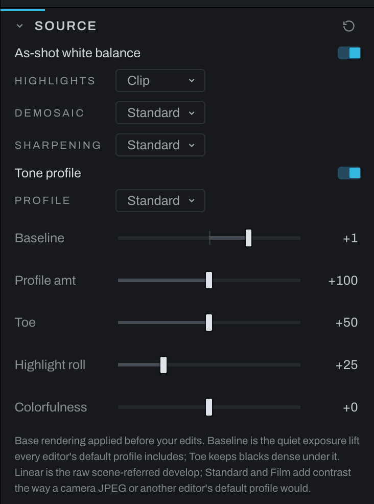

# Source

Source controls raw decoding and the base tone rendering applied before creative adjustments. It is always present and has no enable switch.

## Raw controls

Highlights, Demosaic, Sharpening and Profile are dropdown menus, all one width. Click one, or focus it and press the Down arrow, to open its list; the arrow keys move through the choices, `Return` (`Enter` on Windows) picks one, and `Escape` closes the list unchanged. Resting the pointer on a choice shows what it does in the status bar.

- **As-shot white balance** uses the camera's recorded white-balance multipliers. Turn it off when you want the later Color section to begin from a neutral decoder state.
- **Highlights: Clip** cuts blown sensor channels at white.
- **Highlights: Blend** fills a blown channel from the channels that survived.
- **Highlights: Rebuild** reconstructs blown areas and rolls off their color.
- **Demosaic: Fast** uses the quickest, softest interpolation for culling.
- **Demosaic: Standard** uses the decoder's normal quality.
- **Demosaic: Fine** uses slower DHT processing to resolve fine detail.
- **Sharpening** is capture sharpening: a small-scale detail correction applied while decoding sensor RAW data. **Standard** is the initial choice unless you change the import preference; **Low** is lighter, for soft subjects and high ISO; **High** is crisper, for landscapes and architecture at base ISO; **Off** shows the RAW as the demosaic leaves it. A newly imported RAW starts at the choice in **Preferences > Import & Files > RAW default sharpening** (Standard unless you change it); changing that preference never changes a photograph that already has edits, and one edited before Sharpening existed reads as Standard.

## Tone profile

The **Tone profile** switch shows whether the profile is on. A RAW opens with it on. A JPEG or other finished picture, a phone DNG that carries its own rendering, a DNG baked by Heeler and a stack or panorama of finished pictures open with it off, because their picture already carries a look; the profile's controls step aside while it is off, and switching it on brings them back and adds the profile on top.

- **Linear** is a scene-referred raw development without a display-style contrast profile.
- **Standard** applies a conventional camera/editor starting profile.
- **Film** applies a more film-like base contrast.
- **Baseline** sets the quiet exposure lift applied before later edits.
- **Profile amt** controls profile contrast in Standard and Film and is hidden in Linear.
- **Toe** keeps blacks dense under the baseline lift.
- **Highlight roll** compresses bright values into the display range.

A phone's DNG, such as an iPhone ProRAW, opens with the Tone Profile off. The file carries its own rendering (an exposure shift, a local tone map and a contrast curve), Heeler follows it while decoding, and the photograph opens close to the picture its thumbnail shows; brightness and color can still differ a little from the phone's own preview, most in very saturated scenes. The newer DNG 1.7 form of the tone map is not read yet: a file carrying only that develops as an ordinary RAW, and one carrying both uses the older map.

Phones differ in how much of the rendering their files carry. An iPhone's ProRAW and a Pixel's DNG carry the contrast curve too, so they open with the Tone Profile off. A Samsung Expert RAW carries the exposure shift and the tone map and no curve of its own: Heeler follows what is there and leaves the Tone Profile on to supply the contrast. A Pixel's file also carries a color look table that Heeler does not read, so its color can differ from the phone's more than an iPhone's does. Edit from there as you would any photograph; switching the profile on adds its lift and contrast on top. A camera's DNG is developed like any other RAW.

Capture sharpening works on brightness only, so no edge changes color and color noise is not sharpened. It reaches about one sensor pixel, the scale of the detail a RAW loses, over an edge-aware base, so texture gains and a high-contrast edge does not ring. It measures the photograph's own noise in its smoothest places and leaves differences smaller than that alone, so a high ISO frame sharpens its detail without growing its grain for Noise Reduction to fight. It applies to sensor data only: a linear DNG, such as a Bake to Image result, was sharpened when it was made and is never sharpened again. The Fit preview is sharpened at its own scale, so it shows what the export will. For creative sharpening on top, use the Sharpening section or Detail's Unsharp.

Choose demosaic quality for the stage of work: Fast while rapidly culling, Standard for routine editing, and Fine when judging detail or exporting. Choose the tone profile before building the rest of the look, because it changes the starting contrast under every later section.

Use the [Metadata tab](../metadata.md) for file and camera facts. Graph's source and tone-profile inspectors expose the same operations in node context.

Batch export and Bake to Image apply the same untouched-profile catch-up to a phone ProRAW saved before this rendering change, even if you have not reopened it. A profile you changed stays as you set it.

A Film chosen on a phone's DNG is carried into batch export and Bake to Image just as it is in the viewer.

Merges treat a phone's DNG by what they need. A stack (HDR, mean, median or max) merges the frames scene-linear, before the phone's tone map and curve, because an exposure merge needs light as the sensor counted it; the merged photograph is then developed like any RAW merge, with the Tone Profile on. A panorama stitches the frames as the phone rendered them and opens with the Tone Profile off. A stack or panorama made only of JPEGs (or other finished pictures, such as TIFF or PNG) also opens with the Tone Profile off, as a single JPEG does: the camera's contrast and color are already in its frames. One with a RAW frame in it is developed like a RAW. A JPEG XL DNG with no readable embedded preview uses its developed picture for the thumbnail.
