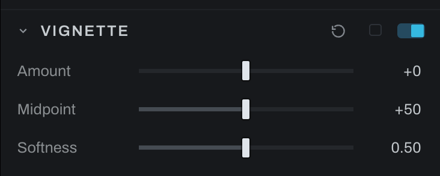

# Vignette

Vignette darkens or brightens the frame toward its corners, as a look. It is separate from the corner falloff a lens produces, which [Lens](lens.md) corrects.

## Controls

- **Amount** sets how far the corners fall away. Negative darkens them, which is the usual direction; positive lifts them.
- **Midpoint** sets where the falloff sits between the center and the corners. Lower values reach further into the frame.
- **Softness** sets how gradual the shoulder is, from a defined edge to a slow fade.

At an Amount of zero the section is an identity and the frame passes through untouched, so the section can stay on while you decide.

The falloff is measured from the center along the diagonal and normalized so a corner sits at the same distance whatever the aspect ratio. A panorama and a square crop with the same settings fall away by the same amount at their own corners.

## Vignette against Lens vignetting

Both change the corners, and they are opposites.

| | What it does | Where it lives |
| --- | --- | --- |
| Vignette | Puts a falloff there because you want one | This section |
| Lens vignetting | Removes the falloff the lens put there | [Lens](lens.md) |

Correct first and shape second: undo the lens in Lens, then place the look here. Working the other way makes the correction fight a falloff you chose.

## Order

Vignette runs after sharpening and before [Grain](grain.md), which is the order the optics imply: a lens shades the light before the film records it, so the grain lies over the vignette rather than being darkened by it.
