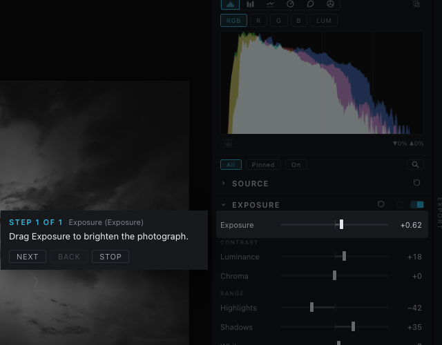
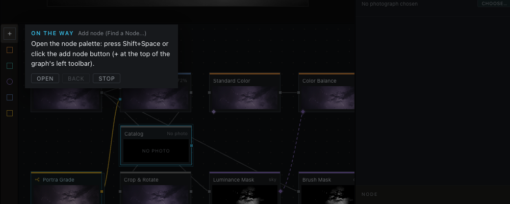

# The assistant

The assistant answers questions about Heeler from this user guide. You ask in the Console's **Assistant** tab, a language model running on your own computer picks the chapters your question needs from the guide's contents and reads them, and the answer names the chapters it used, each a link that opens it in the Help viewer.

It is off until you turn it on.

In this version the assistant answers Help questions and does nothing else. It has no way to change your photographs, the graph, the catalog or any file: it reads the guide, a few facts about the open photograph and numbers Heeler measures from it, and it writes an answer. The numbers let it answer about this photograph ("your shadows sit about two stops under the midtones") rather than photographs in general.

The language model cannot see the picture. With **Florence-2** installed (see [Setting it up](#setting-it-up), step 6), it gets a machine description instead: a small vision model running inside Heeler describes the picture, lists the things it finds and where they are, and Heeler measures how bright and what color each of those parts is, so an answer can say "the sky measures about 1.5 stops above the tower". That description is not sight, and it can be wrong: Florence-2 has called a cheetah a leopard and a serval, and it sometimes finds things that are not there. The assistant is told to use it for where things are and roughly what they are, never to name a species, a place or a person from it, and to take your word over it. Your eyes decide. Without Florence-2 the assistant works from the numbers alone, and for "select this face" it says it cannot see the picture and names the tool that does it.

## What is sent, and where

Each question is asked in two steps. First Heeler sends the question and the guide's table of contents (every chapter's name and a line about it), and the model answers with the chapters it wants. Then Heeler sends the question again with those chapters' most relevant sections, and the best sections from other chapters, and the model writes the answer. If the model's choice cannot be read, Heeler picks the sections itself, on your computer, by the question's words. Across the two steps, Heeler sends these to the model server you named in Preferences:

- your question, and the few questions and answers before it in the same conversation;
- the guide's table of contents, and the parts of this guide picked for the question;
- where you are in Heeler when you ask, so the steps are given in the place you are working: the workspace (Develop, Graph or Canvas); in Develop, the right panel's open tab (such as Adjustments or Finish) and the layer being worked on (Base, or an adjustment or Finish layer by its name); in Graph and Canvas, the selected nodes by their type and the name on their card (never their settings) and the name of an open group; and the viewer tool in hand, such as Crop. The first step gets only the workspace and the selected nodes' types;
- a few facts about the open photograph, read from its edit: whether it is in color or converted to black and white, the names of the Develop sections and Finish layers that are on, and its file type (such as RW2 or JPG);
- numbers Heeler measures from the picture as it looks now, with your edits, when you ask a question with a photograph open (the same frame the viewer and the Spectrums show):
  - its tones in stops from middle gray: the share of the picture in each stop from under -5 to +2 and up, the mean and median brightness, and the 2nd and 98th percentiles;
  - how much of each color channel sits at pure black and at pure white;
  - the average color and saturation of the shadows, the midtones and the highlights, as a name and a hue angle ("warm orange, 28 degrees");
  - a white balance estimate from the picture's near-neutral tones: whether they lean warm or cool, green or magenta, and how far;
  - a grid of 4 by 4 cells, each with its average brightness and a color name, so "the top half is bright and blue" can be read without the picture;
  - when the photograph was taken, as the camera's clock wrote it, and, when the file records where, how high the sun was (in degrees above or below the horizon) and whether that was day, golden hour, twilight or night. Heeler works this out on your computer from the position in the file; the position itself is never sent;
- with Florence-2 installed, its description of the same frame, made on your computer when you ask a question with a photograph open:
  - a caption of a few sentences ("a man in a red hoodie taking a selfie in the desert");
  - the things it finds, by label ("man", "human face"), and where the question names something ("the sky", "the cheetah's face"), where Florence-2 places it;
  - for each of those, where it is in the picture (as fractions of the width and height, and in words such as "top left"), how much of the picture it covers, and its average brightness in stops, against the rest of the picture, and its color, measured by Heeler from the same frame as the numbers above;
- instructions to answer from the guide, suggest the most direct tool, and name the chapters it used;
- when you say yes to a guided tour, a third step: the question, the answer, a shorter part of the same guide material, and the names of the places and controls in Heeler that fit it (see [Guided tours](#guided-tours)). Nothing is sent for a tour you do not ask for.

Nothing else is sent: no pixels of the photograph, no file name or folder, no GPS position or other metadata beyond the file type and the capture time, no part of the catalog. The numbers and the description are made only when you ask, and only while the assistant is on. Florence-2 reads the frame on your computer and sends nothing anywhere itself; its description goes to your model server with the question, like the numbers. It has a few seconds: if it takes longer, the question goes without its description, and the answer does not wait.

To see what was read from the picture for a question, turn on debug logging (the bug icon in the Console's LOG tab): each question then leaves one line in the log with Florence-2's caption and detected objects and the measured numbers. Regions requested by words in your question are left out of the log. Your questions and the answers are never written to the log.

It goes only to the server you chose, and only when that server is on this computer or another computer on your home network, never the internet. Heeler decides by the address a name leads to, not by the name: a name ending in `.local` counts for nothing, and a name that leads to an internet address is refused. Heeler looks the address up once for each connection, checks the address it finds, and connects to that exact address, so a name that leads somewhere else is refused rather than followed. Nothing is sent to Vagabond Burro, nothing is sent until you ask, and Heeler keeps no record of what you asked: the conversation lasts until you clear it or quit.

What the server does with a question is up to the server and the app running it. LM Studio and Ollama run the model on your computer.

## Setting it up

You need an app that runs a model and serves it the way OpenAI's interface does. Heeler works with [LM Studio](https://lmstudio.ai) and [Ollama](https://ollama.com); other servers that answer at `/v1/models` and `/v1/chat/completions` work too. Heeler does not start the app for you.

1. In LM Studio, download a model, load it, and start its local server, in its **Developer** tab. Its address is `http://localhost:1234`. Ollama serves at `http://localhost:11434` once it is running.
2. In Heeler, open **Preferences > Assistant** and turn on **Assistant**. The first time, a notice asks you to accept that Heeler is not responsible for instructions or answers from another model and that you review what it says. Accepting records the date on this computer; the notice is not asked again.
3. **Server address** starts at LM Studio's `http://localhost:1234`. Change it if your server listens elsewhere, on this computer or on another computer at home: many people run LM Studio on a separate machine because models take a lot of memory. Use that computer's name (such as `http://studio.local:1234`) or its address (such as `http://192.168.1.50:1234`), and in LM Studio turn on serving on the local network.
4. Press **VALIDATE**. It says what it found:
   - the address is neither this computer nor your home network, and the address the name led to;
   - nothing answers there (is the server started?);
   - the server answers but has no model loaded;
   - connected, and how many models the server lists.
5. Pick a model from **Model**, which lists what the server offers. A model marked **Tested with Heeler** is taken at once. Any other model asks, the first time, for an acknowledgment: it has not been tested with Heeler, and its license and its answers are the responsibility of whoever runs it. The acknowledgment is recorded, with its date, for that model name.
6. Optionally, download **Florence-2** from its row at the end of the tab. It lets the assistant know what is in your photograph (the sky, a face, a car) and where, so its advice can point at the right part of the picture. **DOWNLOAD** opens the same card every model shows, with its size (970 MB), its license (MIT, Microsoft's code and weights) and where it comes from, and nothing is fetched until you press the card's button. It is free on every copy, it runs on this computer and reads only the frame on screen, and it sends nothing anywhere. The assistant works without it; until it is installed, the first question you ask with a photograph open shows a one-line reminder under the answer, with a **PREFERENCES** button and **DISMISS**, once a session. Once installed it shows as installed here and in Preferences > **Models**, where **REMOVE** takes it off again (see [Downloaded models](models.md)).

With a model picked, the Console has an **ASSISTANT** tab beside **LOG** and **PYTHON** (**Window > Console**).

The models tested with Heeler are listed in **Preferences > Assistant**, under **Works with**: each model by the name its app shows, and the app, LM Studio or Ollama. Today that is **Qwen3 30B A3B Instruct 2507** (Apache-2.0), listed in LM Studio as `qwen/qwen3-30b-a3b-2507` (or `qwen3-30b-a3b-instruct-2507` from LM Studio's community uploads) and in Ollama as `qwen3:30b-a3b-instruct-2507`. It needs a computer with plenty of memory, which is one reason many people run it on a separate machine at home. Any other model asks for the acknowledgment once. Testing a model means checking its license on its model card and running Heeler's own questions and tours against it; more will be listed as they pass.

## Asking

Type a question and press **Enter** (**Shift+Enter** starts a new line).

The answer is given where you are working. Asked in Develop, "How do I add grain?" is answered with the Grain section and its sliders; asked in Graph or Canvas, with the Grain node, where to wire it and which of its controls to set in the Inspector. The other workspace's way comes up only when the task cannot be done where you are, or when you ask about it ("in the node graph"). In Graph, "What does this node do?" is about the node you have selected. Answers take as long as your model takes: a small model on a laptop can need a minute. **STOP** stops waiting for an answer. The clear icon in the tab's header starts a new conversation.

The conversation lasts until Heeler closes. Close the Console, open it again, and every question and answer is still there, with its chapter links, tours and **Learn more**; a question asked then carries on the same conversation. An answer still being written when you close the Console arrives while it is closed. Nothing of it is saved to disk: quitting Heeler or the clear icon ends it.

Each answer ends with the chapters it used, under **From the guide**; click one to open it in the Help viewer, which opens in the main window and brings it to the front. An answer that names no chapter says so; treat it with care. The model can be wrong even when it names a chapter, so check what matters against the chapter itself.

Small models hold little text at once, and LM Studio loads many models with room for about 4,000 tokens. Heeler budgets guide sections and recent question-answer pairs together, reserving room for the reply. Long earlier answers are left out; a question that is too long gets a request to shorten it. Token estimates vary by model, so a server refusal can still require a smaller retry. LM Studio also says how much room the loaded model has, and when it has more, Heeler sends more of the guide. If answers miss things the guide does say, a larger context length for the model in LM Studio helps, and so does a more specific question.

## Asking well

Two kinds of question work best: how to do something in Heeler, and what to do about the photograph in front of you.

### How to do something

Ask for the result you want, in your own words. The assistant answers from the user guide, in the workspace you are in, and offers to show you.

- "How do I make a photo black and white?"
- "How do I crop to 16:9?"
- "How do I export a JPEG 2048 pixels on the long side?"
- "How do I blur only the background?" (in Develop: Depth of Field; in Graph: a mask wired into a Blur node)
- "How do I use the red channel as a mask?" (in Graph)
- "What does this node do?" (in Graph, with the node selected)

Follow-ups carry on the same conversation: after the black and white answer, "How do I simulate infrared?" or "And only on the sky?" are understood in its light. To hear the other workspace's way, say so: "How would I do that in the node graph?"

### Help with this photograph

With a photograph open, the assistant knows how it measures (the tones, clipping, the color of its shadows, midtones and highlights), and with the Florence-2 download it also knows what is in it and where. Ask as you would ask someone looking at it:

- "Is my photo underexposed?"
- "What should I fix in this photo?"
- "Why do my shadows look muddy?"
- "Is the sky too bright compared to the rocks?"
- "How do I brighten the man's face?"
- "Is the subject separated enough from the background?"

Name the thing you mean ("the sky", "the man's face", "the rocks"): with Florence-2 installed, Heeler looks for it in the picture and gives the assistant that region's own brightness and color, so the answer can say "the face sits 2.6 stops under the rest of the frame" instead of guessing. The description comes from a small vision model that can be wrong about what things are (it has called a cheetah a leopard), so the assistant uses it for where things are and roughly what they are, never for names or species. It measures; it does not judge taste. Your eyes decide.

### Tips

- One question at a time gets a clearer answer than three at once.
- Say where, when it matters: "in the Finish tab", "on the adjustment layer", "in the graph".
- If an answer misses, ask again more specifically, or name the section or node you think is involved.
- Answers name the chapters they used; open one to check a step that matters.

## Guided tours

An answer that gives directions in Heeler ("How do I make a photo black and white?", "How do I use the red channel as a mask in the graph?", and a follow-up such as "How do I simulate infrared?") ends with an offer: **Would you like me to show you? Say yes, or press Show me.** Reply **yes** (or **sure**, **ok**, **show me**, **please**), or press **SHOW ME**, and Heeler makes the guided tour of those steps then, which takes a few seconds (ten or twenty on a laptop) while **Making the guided tour of these steps...** shows, and starts it in the main window. Reply **no**, or ask something else, and the offer is left behind; a **yes** after that is read as a question like any other. **SHOW ME** stays under each answer that had an offer. An answer with nothing Heeler can point at (what a control is, why something looks the way it does) has no offer, and if you ask to be shown anyway, or a tour cannot be made whole, the assistant says so: "I'm sorry, I can't give you a tour of this, but I can answer another question."

The tour walks the steps in the main window. The window dims, with a clear cut-out around the control for the current step and a sentence beside it saying what to do there. Do it, and the tour moves on: the section unfolds, the Treatment switches, the slider moves, the node lands in the graph. When a step is somewhere not open yet, another workspace, a closed tab, a folded section, the Export panel, the tour first points at the way there, as a step of its own: click it yourself, or press **OPEN** and the tour opens it for you. A step you have already done is skipped and left out of the count, so a tour that starts where you already are begins at step 1. The Console gives the number of steps once the tour starts, counted the same way, so it matches the card. A control near the top or bottom of a panel is scrolled toward the middle first, and the sentence sits beside it, or above or below it, always whole inside the window. In the graph it keeps clear of the whole node a step points into, both nodes of a wire, and moves with them as you pan or zoom.

- **NEXT** goes on to the next step whether or not you did this one, **BACK** goes back to the step shown before, and **STOP** or **Esc** ends the tour.
- Every shortcut works while a tour runs, as it does without one: the card never takes the keyboard, so when a step says to press **Shift+Space**, it opens **Find a Node**. While a tour runs, **Find a Node** is never dimmed: however you open it, it gets a clear cut-out of its own, its search field has the keyboard so you can type the node's name at once, and the sentence moves clear of it. **Esc** inside the node palette closes the palette and leaves the tour running. A step that adds a node always says both ways: press **Shift+Space** or click the add node button (**+**).
- A tour is made where you asked: in Develop it walks sections, sliders and layers, in Graph and Canvas it walks nodes, ports and wires, and it sends you to another workspace only when the answer's step is there. Canvas draws the same graph over the photograph, so a graph tour started in Canvas stays in Canvas while its nodes are shown.
- In the graph, a tour can point at a node's card, at one of its ports, or at two ports at once: drag from the first (an output) to the second (an input), and the step is done when the wire exists. Before a graph tour is shown, Heeler plays it on a copy of your graph (never the graph itself) and checks that it makes a whole network: every node it has you add ends up on the picture's way to Output, and every mask it has you add is made from the photograph and wired into the mask of a node that changes the picture. Where the model left a gap Heeler closes it when there is only one way to: a node dropped onto the wire, a mask wired into the node it limits, the node the answer names added for it. It also leaves out steps that add a node the answer never mentions, a second Output, or a wire the tour already made. A tour it cannot make whole is not shown.
- A tour never edits your photograph or the graph. It only points and waits; everything is done by you, with the same controls, in your own undo history. The only things it opens by itself, when you press **OPEN**, are places: a workspace, a tab, a section, a panel, the node palette.

The steps are chosen by your model, but only from a fixed list Heeler keeps of its own places and controls: every workspace and tab, every Adjustments section and slider, the Black and White treatment, its film, filter and Infrared dials, the crop and straighten tools, the Export panel, the Finish toolbar, the menus a beginner needs, and in the graph every node type, each of its ports, and the graph's own gestures (wiring, splicing, groups, backdrops). Heeler checks every step against that list; a reply that names anything else is dropped, and the answer stands alone. The model can still choose a poor step from the list, so read each sentence as you go.

When a tour ends, **Learn more** offers two or three follow-ups made from Heeler itself: the chapter or node reference for what the tour used (it opens in the Help viewer), and things placed near it, such as another control of the same chapter, the node beside it in the node catalog, or an [example network](graph/examples.md) that uses the same node. Choosing a question asks it, and a how-to question brings its own tour. **Learn more** is offered both under the answer in the Console and on the card the main window shows when the tour ends; a question chosen on that card is answered in the Console, which opens, or comes to the front, on its Assistant tab. The card also has a field across its width for a question of your own: type it and press **Enter**, or the arrow at the field's end, and it is asked in the same conversation, with the tour you just walked as its context. The cross in the card's top right corner, or **Esc**, closes the card.

## When it is not answering

- **The tab is missing.** The assistant is off, or the address changed since the last **VALIDATE**. Open **Preferences > Assistant** and validate again.
- **The tab says it is not connected.** The server stopped or no longer lists the model. Start the server, load the model, and the tab works again; its **PREFERENCES** button opens the address.
- **The address is refused as neither this computer nor the home network.** A server is accepted on this computer (`localhost`, a loopback address, or one of this computer's own network addresses) or on another computer of your home network: the home IPv4 ranges (192.168.x.x, 10.x.x.x, 172.16.x.x to 172.31.x.x), self-assigned addresses, and IPv6 addresses of the home network, including the provider-assigned ones that share this computer's network prefix. Anything on the internet is refused, whatever the name says. If a home server is refused, check the address in the message: a name that leads to an internet address is set up wrongly on the network or the server.