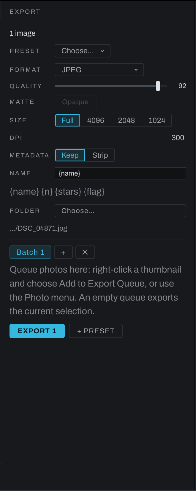

# Export

Export renders the selected photographs through their edits into new files. It does not alter source files, catalog entries, or editing instructions.

## Reading tagged photographs

Heeler reads embedded matrix/TRC ICC profiles from JPEG, PNG, TIFF, and HEIF photographs and converts their color once into its linear sRGB working space. This includes Display P3, Adobe RGB, and ProPhoto profiles with RGB primaries and supported transfer curves. Preview and export use the same conversion, and alpha remains unchanged.

Untagged photographs are read as sRGB. Malformed, gray, unsupported, and LUT-based profiles also fall back to sRGB, with the reason and source filename in the log. HEIF uses the operating system's decoder on macOS and Windows; it requires the platform's HEIF support. RAW development retains its existing color interpretation. Export profiles remain sRGB.

## Open the Export panel

Click the vertical **Export** bar at the far right, or press `Cmd+E` (`Ctrl+E` on Windows). Click it again to collapse the panel. The panel is available in Develop, Graph, and Canvas.

When the queue is empty, Export uses the current thumbnail selection or active photograph. When the queue contains photographs, it exports the active batch group's queue instead.

## Settings

### Preset

Choose a saved export preset to fill the settings at once. To create one, configure the panel, enter a preset name, and save it.

### Format and quality

- **JPEG** is the standard sharing format.
- **WebP** is a compact web format.
- **PNG** is lossless.
- **PNG 16** and **TIFF** provide 16-bit archival or further-editing output.
- **TIFF 32-bit float** writes the scene-linear values without a transfer curve or clipping, for compositing. The file carries no profile tag that says so, and a reader that assumes display-referred input shows it dark until its input colorspace is set to linear. It carries no camera record or keywords.
- **EXR** writes one file with many channels: the picture plus every wired Export Layer node as a named layer, in 16-bit float (a depth channel in 32). Alpha is written premultiplied, the OpenEXR convention, so a compositor lays it over a plate without a conversion; a layer that is a mask alone is written as it is. It carries no camera record or keywords.
- **DNG** creates a baked linear raw-like file for another raw workflow.

Quality applies to lossy formats and is disabled for formats that do not use it. A setting around 92 is a strong general JPEG default; lower values trade fidelity for smaller files.

### Matte

Enable Matte when transparent areas must be composited against a solid background for a format or destination that should not preserve transparency.

A mask wired to the Output card's alpha diamond sets transparency directly and takes precedence over this toggle. Either way, transparency needs a format that carries it: PNG, TIFF or EXR. The panel warns when the chosen format cannot.

### Export layers

A TIFF or EXR export can carry extra layers beside the picture: what a Develop section produces, a Finish layer, a layer's mask, or the depth map. EXR packs them into the one file as named layers; TIFF writes each as a sibling file beside the export (a mask or the depth map as gray, a picture as RGBA). JPEG, WebP and DNG cannot carry extra layers, so the panel counts what would be dropped and the log names each one. The file name's extension decides the file type, so the layers follow it too: a TIFF export saved under a name ending in .png is a PNG, and its layers are dropped and named in the log. Each tick is one undo step, and Takes, Copy and Paste Edits, linked photographs and the saved edits carry it.

**A Develop section.** Each section header in Adjustments has an **Export** checkbox, a small box with no word beside it (point at it to read what it writes), just left of the section's switch, on every section whether the photograph uses it yet or not. Tick it and the picture as it leaves that section writes as a layer named after the section: the render with that section and everything ahead of it in the chain, and nothing after. The order is the graph's, not the panel's (Exposure's layer includes Color and Detail, which run before it), and a section built from several nodes is tapped after the last of them. Ticking a section you have not used builds its nodes, switched off and in their places, in the same undo step, so the picture does not change; switch the section on and the layer carries its effect. Depth Map's builds switched on, since its card passes the picture through and is what computes the map. Unticking removes the export and leaves the section's nodes, as its switch does. Source has no checkbox; tick Geometry's for the cropped photograph as it came in. While an adjustment layer is selected the section headers show its tools, and the checkboxes step aside.

**A Develop adjustment layer's section.** With an adjustment layer selected, the same box on a section that edits the layer taps the layer's own copy of that section. Ticked, the picture as it leaves that section on that layer writes as a layer named for both (`Sky Exposure`): everything ahead of it in the chain, with the layer's edit applied through its mask, and nothing after. Each layer's boxes are its own, apart from Base's. Ticking a section the layer has not used yet brings its copy in switched off, so the picture does not change. Renaming the layer renames the written layer, removing the layer removes it, and Duplicate Layer gives the copy clear boxes.

**A Finish layer.** Tick **Export** in the layer's row in the Finish tab and its picture writes as a layer named after it, with its mask and opacity folded into the layer's alpha. Its blend mode, opacity and group ride along as a record in the file (EXR header attributes, the TIFF sibling's description); nothing reading the file acts on them, and a linear merge of the layers will not reproduce the composite you saw on screen, because blend modes are not linear. Adjustment and Warp layers have no picture of their own and offer no layer checkbox. See [Exporting a layer](finish/README.md#exporting-a-layer).

**A layer's mask.** **Export Mask as Layer** writes a gray layer named after the layer (`Sky mask` for a layer called Sky, `Range 1 mask` for a new Develop range layer) holding exactly the weight the layer is applied through at each pixel: its mask, whatever kind it is, times its Depth mask with its Levels and Invert, times the layer's opacity, and on a Finish layer the clipping to the layer below too. A layer at 70 percent writes 0.7 where its mask is white, and a layer with no mask, or a brush layer not painted yet, writes its opacity everywhere. The layer's own picture is not part of it. The checkbox is in three places, one setting in all of them:

- On a Finish layer, right under the Depth mask button (on every adjustment layer, and on any layer wearing a mask), selected or not, and in the brush panel's row beside the mask eye while you paint the mask.
- On a Develop adjustment layer (the ones **Layer > New Adjustment Layer…** makes: Range, Radial, Linear, Brush and the rest), directly below the layer's Depth mask block, whether the Depth mask is on or not.
- On the layer's node in the graph inspector.

Renaming the layer renames the written layer, deleting the layer removes it, and Duplicate Layer gives the copy a clear box.

**The depth map.** Depth Map's section checkbox writes the depth map itself: farness, 0 near to 1 far after the Depth Map's own Edges, Flatten and clip controls, so near reads black and far reads white, the convention compositors read and the reverse of the View depth eye. Its card in the graph says so. EXR writes it as the layer `mist` with the channel `Z`, whatever the node is named, which is the name readers (Heeler included) take as a normalized depth pass, where a `depth.Z` would be read as metric distance and inverted on the way back in. It keeps 32-bit float precision where the color channels halve to 16. TIFF writes it as another gray sibling.

**In the graph.** Each checkbox is a view over an **Export Layer** node: a node that passes its input through and writes one extra layer with every export, so you can also drop one onto any wire by hand to tap it, or wire the Depth Map card's depth output into its gray input. Deleting the node removes the checkbox's tick. The node says what it is (`Curves Export Layer`, `Depth Map Export Layer`, `Sky Export Layer` for a Finish layer called Sky, `Sky Mask Export Layer` for its mask), while the layer in the file keeps the plain name a compositor wants: `Curves`, `Sky`, `Sky mask` (and `mist.Z` for the depth map in an EXR). Renaming the Finish layer renames its nodes and keeps the ending. The file takes its name from the card with ` Export Layer` dropped, so renaming a card by hand to `Grade Export Layer` writes `Grade`, and a card renamed without the ending writes as it reads; type a **Name** in the node's inspector to set the file's name outright. Graphs saved before this keep their nodes' old plain names and write exactly as they did.

Masks from Smart selection arrive at the export's size, their preview rasters resampled up. For pixel-exact layer edges, refine the mask or bake it first. EXR and 32-bit TIFF carry scene-linear pixels when the Output is wired ahead of a Tone Profile, which is the wiring compositors expect; a Finish layer is painted display-referred and linearized on the way into the scene-linear file, and only the 16-bit TIFF sibling keeps its display encoding.

### Size

Choose **Full** for all pixels or a long-edge limit such as 4096 or 2048 for web, review, or email output. Resizing preserves aspect ratio.

### DPI

The print resolution the file declares, in dots per inch: 300 unless you change it. It does not change a single pixel. It is the number a print lab, a layout program or a word processor reads to decide how big the picture is on paper, so a 6000 pixel wide file is 20 inches wide at 300 DPI and 83 inches at 72. JPEG, PNG, WebP and both TIFFs carry it, whether **Metadata** is set to Keep or Strip, because it describes the print rather than you or your camera. Heeler does not apply this setting to its DNG and EXR exports.

Type DPI or quick export size freely, then press Enter or leave the field to apply it. Clearing a field and leaving it keeps the previous value. Press Escape to abandon what you typed. Arrow keys step the typed value.

TIFF layer and mask files written beside an export carry the same DPI as the main image. This keeps their print size consistent when you place them together. A scene-linear float TIFF keeps its original pixel values; DPI describes only its size on paper.

Presets remember their DPI. A preset saved before this setting existed loads at 300.

JPEG exports keep their print density consistent even when other header metadata comes first.

Some WebP readers ignore its EXIF print resolution. On the Windows codec checked for this release, Explorer reports 72 DPI even when the file declares another value. For a print workflow that reads Windows properties, use JPEG, PNG or TIFF.

### Metadata

**Keep** includes available camera and exposure metadata. **Strip** removes camera, location, and capture-time metadata from the output. This choice does not change the original.

### Name

The filename template accepts `{name}`, `{n}`, `{stars}`, and `{flag}`. The preview under the field uses the first target photograph. Add `{n}` when multiple targets would otherwise produce the same name; Heeler warns about collisions before export.

### Folder

Choose a destination folder. If no folder is set when a run starts, Heeler asks for one and remembers it for that batch group.

## Existing files and originals

Exports never overwrite by default. When a name is already taken at the destination, the export writes to the next free name with a `-2`, `-3` suffix and says so in the log. Re-running last week's batch into the same folder adds files beside the old ones rather than replacing them.

The **Never overwrite an existing file** preference (Preferences > Export) controls the one exception: with it turned off, a save dialog's Replace? confirmation is honored again for that single file. Batch runs and the queue always move to a free name, because nothing ever asked.

Two protections have no setting and cannot be turned off:

- An export never writes over the photograph being exported, however the destination is spelled.
- An export never writes over any photograph in your library. The save dialog asks about a file; it cannot know the file is a negative your catalog depends on, so the catalog is asked too. A previous export the library has never seen can still be replaced, which is what the Replace? prompt is for.

## Queue and batch groups

Use **Photo > Add to Export Queue** or a thumbnail's context menu to add the current selection. Queued items remain available while you browse other folders and after restarting the app.

- Use the up and down controls to change run order.
- Remove an item with its remove control; the catalog photograph is untouched.
- Click `+` to create another batch group.
- Double-click a group tab to rename it.
- Each group has independent format, quality, size, metadata, naming, folder, preset, and queue settings.
- Removing a group removes that export setup, not the source photographs.

This makes it possible to queue the same photographs as full-size TIFFs in one group and web JPEGs in another.

## Run and stop

Click the solid **Export** button. The progress bar advances through the targets, the line under it names the file being written, and the report lists written and failed files. **Stop** abandons the remaining work but leaves files already written in the destination.

The Export button is disabled until there is at least one target and a usable destination. Check the queue or thumbnail selection and Folder when it is unavailable.

## Quick Export

Use **Photo > Quick Export…**, a thumbnail's context menu, or the title-bar Export button for an immediate export without adding to the queue. The title-bar button exports JPEG by default; hold `Option` (`Alt` on Windows) for PNG. Right-click it to set shared quick-export quality, output size and DPI. The app asks for a destination and reports completion in the log.

## Memory and large exports

Before allocating whole-frame buffers, Heeler checks the image dimensions and estimates the render, resize, encoding and known intermediate buffers against the machine's physical memory. Cached images and other work in progress count against the same allowance. A large image can run when it fits; there is no fixed megapixel ceiling. A full-resolution panorama is capped at 8000 pixels on its long side, a 40 inch print at 200 dpi.

An export that cannot fit stops with a message naming the source file, the work that needs memory and the approximate shortfall. Memory pressure does not silently reduce the exported image or panorama canvas. Only your output-size settings change its size. Close other images, or choose a smaller output or a simpler edit. The original photograph remains untouched.

Stopping a batch finishes the photograph already being written. The final progress count shows how many photographs were attempted, including any that failed, rather than marking the whole batch complete.
