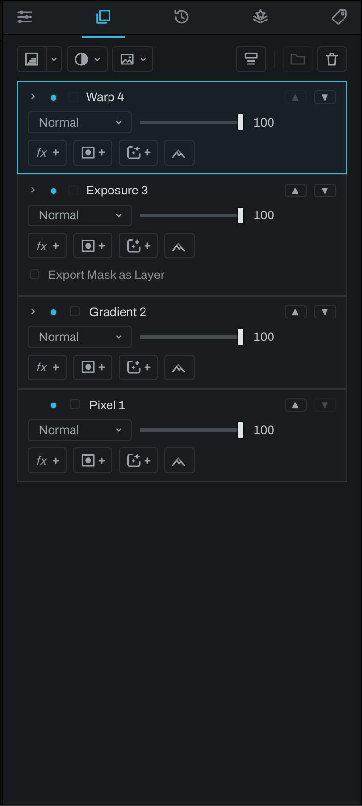
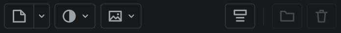

# Finish tab

Finish is where you retouch and composite after Develop. It stacks layers over the developed photograph: paint, clone and heal, isolated parts of the picture, fills, gradients, other pictures, warps and adjustments, each with its own blend mode, opacity and mask. Every layer stays editable, and each one is also a node inside the graph's Finish group, its mask included (see [Groups](../graph/groups-popout.md#groups)).

## Layer pages

-  [Pixel layer](pixel-layer.md)
-  [Smart layer](smart-layer.md)
- [Isolate layer](isolate-layer.md)
-  [Dodge & Burn layer](dodge-burn-layer.md)
-  [Fill layer](fill-layer.md)
-  [Gradient layer](gradient-layer.md)
- [Image layer](image-layer.md): a picture from a file or from the catalog, to move, size, turn, flip and warp
- [Warp layer](warp-layer.md): a Grid Warp or a Shape Warp over everything below it, its mask the cut-out that moves with the warp
-  [Adjustment layers](adjustment-layers.md)
-  [Groups and clipping](groups-clipping.md)
-  [Masks and selections](masks-selections.md)
-  [Layer effects](layer-effects.md)
- [Finish toolbar](toolbar.md)

## Add-layer toolbar

The icon row at the top has three buttons that add a layer, then a toggle and two buttons at the right end that act on the layers you have:

- **Pixel, Gradient or Fill**: a split button. The left half adds a layer of the kind it shows; the arrow beside it lists **Pixel layer**, **Gradient layer** and **Fill layer**. Whichever you made last is the one the left half shows and repeats (Pixel to start), and Heeler remembers it with its other tool choices.
- **Adjustment** (the half-filled circle): a menu of the adjustment kinds, then a **Utility** section with **Smart layer** and **Warp layer**, the layers that work on the picture below rather than paint or tone it.
- **Image** (the framed picture): **From File…**, **From Catalog…**, or **From Selection**, which copies the pixels inside the selection to an image layer, as **Layer > New Layer via Copy** does (grayed until there is a selection).
- **Expand settings on select**, a toggle just left of the divider: lit, selecting a layer opens its settings; unlit, each layer opens with its own chevron. See [Settings that open and close](#settings-that-open-and-close).
- After a thin divider, **Group** (a folder) groups the selected adjacent layers; when a group is active, the same position becomes **Ungroup**. **Delete** (the bin) deletes the active layer.

A small caret marks the buttons that open a menu. Point to a button to read its name and result in the status bar; `Tab` reaches every button, and the arrow keys walk an open menu. Each add is one undo step. The add buttons stay together. When the panel is too narrow, Group and Delete move to the right end of a second row.

While the stack is empty, the panel lists the same choices in the same groups, each with a line on what it is for: click **Pixel layer**, **Gradient layer**, **Fill layer**, **Smart layer** or **Warp layer** to add one, or **Adjustment layer** or **Image layer** to open its menu. Right-click the empty list for the same choices as a menu. **Layer > Layers from File…** also reads a multi-page TIFF or a layered OpenEXR into referenced image layers, one per page or layer group. Right-click a layer (or use the Layer menu) for **Duplicate Layer**, which copies a layer outside a group just above itself, with its mask, effects and placement.

## Reading the stack

The top row composites last and appears in front. Click a row to make it active. `Cmd`-click (`Ctrl`-click on Windows) or `Shift`-click selects multiple rows for grouping. Use the visibility dot to bypass a layer without deleting it. Use the up and down arrows on the row, or **Move Up** and **Move Down** in its right-click menu, to change order.

Every layer has a blend mode, opacity, and optional mask. Click a layer's content or mask area to choose what its controls edit. Right-click a row for rename, grouping, movement, clipping, mask, and delete commands.

### Settings that open and close

Adjustment, Warp, Gradient, Image and Fill layers have settings under their row: an adjustment's sliders or curve, a warp's Type and controls, a gradient's colors and shape, an image's picture and transform, a fill's color. Any layer with [effects](layer-effects.md) has their settings there too, Pixel layers included. **Expand settings on select**, the toggle just left of the divider in the [add-layer toolbar](#add-layer-toolbar), decides when they show:

- **Off** (to start): every row stays compact, the height of a Pixel layer's row, whether it is selected or not. A small chevron beside the visibility dot opens that layer's settings (**Show settings**) and closes them (**Hide settings**). A layer stays open while you select other layers, until its own chevron closes it, so you can keep two open side by side. A closed Fill row shows its color as a small chip beside its name; click it to open the settings.
- **On**: selecting a layer opens its settings and closes the ones of the layer selected before. There are no chevrons.

The choice is one for the whole app, not per photograph, and Heeler remembers it at the next launch. A Pixel, Dodge & Burn, Smart, Isolate or group row has no settings of its own to open, so it shows a chevron only once it carries an effect, and that chevron folds the effects' settings; each effect keeps its name and visibility dot while folded. A group's effects chevron sits after its own chevron, which opens its layers. A Smart or Isolate layer shows its Smart dials while it is selected, folded or not. Adding an effect opens the layer's settings so the new effect shows its controls. Opening a Warp layer's settings puts its handles on the canvas, and closing them puts the handles away, keeping the warp. An adjustment with nothing to set, such as Invert, has no chevron.

The selected layer's **Show mask** eye sits in its row of buttons, beside the mask buttons, on every kind of layer with a mask: click it to see the mask in black and white, or **Option-click** or **Cmd-click** it (**Alt-click** on Windows) to switch to the red overlay. While you paint the mask, the brush settings carry the eye instead.

## Painting and the crop

What you paint stays on the photograph when you crop it again. Pixel strokes, clone and heal strokes, Dodge & Burn, the Fill brush's strokes, brush masks, selections, a [Warp layer](warp-layer.md)'s grid and shapes, and a Pixel layer you moved or warped with **Transform** all stay on the part of the scene you painted them on, whatever you change about the crop afterwards: its rectangle, its ratio or its angle. A clone keeps reading the same place, because its source turns with the crop. A brush stays the same size on the photograph, so a crop that keeps less of the frame shows the same stroke larger. **Undo** takes back the crop and the move of the painting together. What is placed on the frame rather than painted on the scene keeps the frame's rule instead: an [Image layer](image-layer.md) from a file or the catalog keeps its place and size in the frame (a copy made with **New Layer via Copy** stays on the scene it came from), and Fill, Gradient and adjustment layers fill whatever frame there is (their masks follow the scene). Painting outside the new crop is not lost: widen the crop again and it is there.

## Flipping a layer

**Flip Horizontal** and **Flip Vertical** (a shape and its mirror image across a dashed line) sit in the bar above the canvas, after Crop and Straighten, while the Finish layers are up. Each mirrors the selected layer, one undo step, and pressing it again puts the layer back:

| Layer | Flipping it |
| --- | --- |
| [Image layer](image-layer.md), a copy, a baked warp | The picture mirrors where it stands, turned as it is. A baked warp's kept warp mirrors with it, so **Unbake** afterwards puts the warp where the mirrored picture is. |
| Pixel, Dodge & Burn, Clone and Heal | The strokes mirror about the middle of the frame, the brush the same size. A clone's source mirrors with it, so it copies from the mirrored place. |
| [Gradient](gradient-layer.md) | A linear gradient turns over; a radial one is the same mirrored, so the button grays. |
| [Warp layer](warp-layer.md) | Its grid and shapes mirror, a twist turning the other way. |
| Group | Every layer in it flips about the middle of the frame, as a unit. |
| Adjustment, Isolate, solid Fill | Nothing of their own to mirror: only a painted or drawn mask flips. |
| Fill brush | Its patch is made for the place it fills, so it does not flip; paint the Fill brush where you want a new one. |

A layer's painted or drawn mask flips with it, and so does a Transform you gave it. A Smart or Object mask stays on what it found in the photograph. When there is nothing to mirror the buttons gray, and pointing at one says why. To mirror the whole photograph with every edit on it, use **Photo > Flip Horizontal** or **Flip Vertical** (see [Geometry](../adjustments/geometry.md#flip)).

## Exporting a layer

Each picture layer's row carries an **Export** checkbox beside the visibility dot. Tick it and the layer writes into a TIFF or EXR export as a layer of its own, named after the Finish layer: inside the one EXR, or as a sibling RGBA TIFF next to a TIFF export. The layer's mask and opacity are folded into the written alpha, and its blend mode, opacity and group ride along as a record in the file. Untick and it stops. The checkbox is a view over an [Export Layer node](../graph/nodes/utility.md) inside the graph's Finish group, so the graph shows exactly what the export will carry, and the same checkbox sits on the layer's blend node in the graph inspector.

Adjustment and Warp layers have no picture of their own and offer no layer checkbox; an adjustment layer exports its mask instead. **Export Mask as Layer**, right under the Depth mask button (on every adjustment layer, and on any other layer wearing a mask, selected or not), writes the layer's mask as a gray layer named after it, such as `Sky mask`: the weight the blend applied, so the mask, its Depth mask and Levels, the clipping to the layer below and the layer's opacity are all in it. An adjustment layer with no mask writes its opacity everywhere. While you paint a mask with the brush, the same checkbox sits in the brush panel's row beside the mask eye and the overlay button; the two are one setting, and so is the **Export Mask as Layer** box on the layer's blend node in the graph inspector. A layer inside a group exports through its group. A group layer exports its isolated composite. Renaming the layer renames the written layer; deleting the layer removes it from the export.

## Brush panel

When a brush-based tool is active, the lower panel holds size, flow/opacity, softness, strength where relevant, tip, texture, and tip-specific controls. `[` and `]` change brush size while working.
