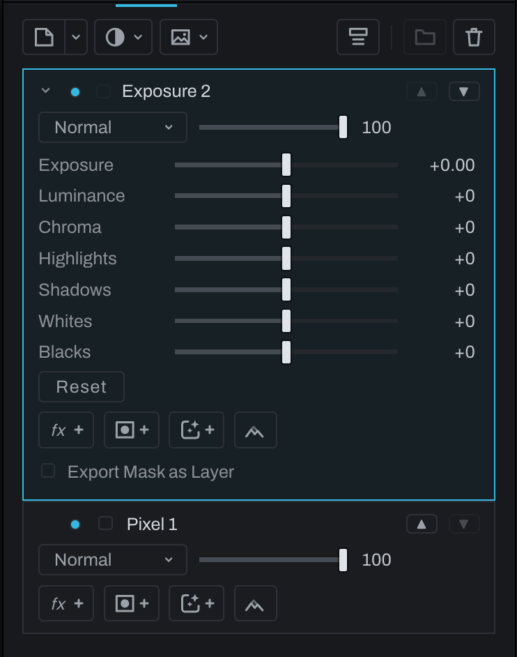

# Adjustment layers

An adjustment layer changes the composite of everything below it. It has its own mask, opacity, and blend mode, so the correction can be stacked and limited like any other Finish layer.

Click the **Adjustment** button (the half-filled circle with a caret) in the Finish toolbar, or **Layer > New Finish Layer… > Adjustment Layer…**, then choose:

- **Exposure** for light and tonal range.
- **Curves** for composite or channel mapping.
- **Levels** for endpoints, gamma, and falloff.
- **White Balance** for temperature and tint.
- **Color** for saturation and vibrance.
- **Color Balance** for shadow, midtone, and highlight hue, saturation, and luminance balance.
- **Black & White** for monochrome strength, channel mixing, color filters, and hue shaping.
- **Invert** for tonal inversion.

To map dark, middle, and bright tones to chosen colors (what a gradient map does), add a [Gradient layer](gradient-layer.md#by-tone) and set its shape to **By tone**. It has every stop, falloff, and alpha control the Gradient layer has. A Gradient Map layer from an earlier version opens as a Gradient layer set to By tone, with the same colors and the same look.

The same menu ends in a **Utility** section with the [Smart layer](smart-layer.md) and the [Warp layer](warp-layer.md): layers that isolate or bend the picture below rather than change its tone.

Finish adjustment layers are ordered compositing operations. They differ from Develop local-adjustment layers, which are part of the Develop chain behind range, radial, linear, brush, selection, or smart masks.

## Defaults and controls

New adjustments start neutral, with two exceptions named for what they do: **Black & White** removes color as soon as it is added (lower **Strength** to bring some back), and **Invert** reverses the picture.

Open the layer with its chevron to change its controls. Exposure, White Balance, and Color use the same ranges and meanings as Develop. Drag a track for an ordinary value or click its number to type. Double-click an ordinary numeric track to return it to its starting value. **Reset** resets the adjustment. Curves and Levels have their usual plots, with a histogram of the input below this adjustment, excluding layers above it. Color Balance has three color wheels and luminance tracks; **Reset all** centers all three. The adjustment's node in the Graph inspector uses these same controls.

## Limit a correction

To brighten just a person's face without changing the rest, add an Exposure layer and raise Exposure. Add a layer mask, turn **Invert mask** off, and paint over the face to reveal the correction there.

An adjustment uses the composite below it inside its current group and keeps that composite's transparency. Moving it changes which layers it corrects. Opacity sets the strength from 0 to 100 percent, including values below one percent. Blend mode changes how its corrected colors combine with the colors below. A layer mask, its Depth controls, and its inverted state limit the correction; a disabled mask reveals the correction everywhere.

Use a clipping mask when the adjustment should change only the visible contribution of the layer below. On a partially transparent image, the photograph visible through it keeps its color. Successive clipped adjustments apply in stack order. Use a regular mask when the correction's shape should be independent. Grouping keeps the layer's blend mode and clipping setting.

## Export

An adjustment has no separate picture to export, so its picture **Export** control stays off and explains why. **Export Mask as Layer** writes the correction's weight, including its mask, opacity, and clipping, as an EXR channel or a gray TIFF layer. With no mask and no clipping, it writes a flat field at the layer's opacity.

