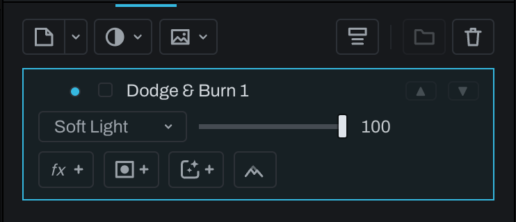

# Dodge & Burn layer

Dodge brightens and Burn darkens with brush strokes. Both tools use one toolbar slot. Tap to arm the displayed tool, hold to choose the other, and hold `Option` (`Alt` on Windows) while painting to temporarily reverse it.

If no suitable layer is active, the tool creates a Pixel layer configured to **Soft Light** and names it Dodge & Burn. There is no separate add-layer button because this is an ordinary Pixel layer with the correct blend setup.

Set Strength in the Brush panel, use a soft brush with low flow, and build the result gradually. Separate broad shaping from fine corrections into different layers when independent opacity control will help.

