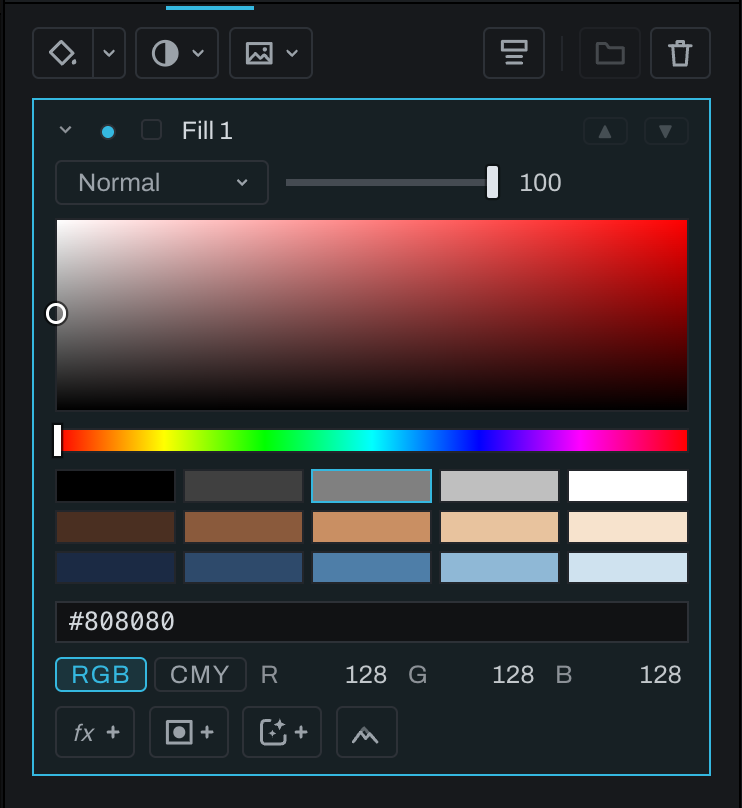

# Fill layer

A Fill layer supplies a solid color over the frame. Its color remains a parameter, so changing it updates every visible area immediately.

Choose **Fill layer** from the arrow of the split button at the left of the Finish toolbar (after that, the button itself makes another), click **Fill layer** in the empty stack's list, or choose **Layer > New Finish Layer… > Fill Layer**. Pick the color, then use a layer mask, clipping mask, blend mode, and opacity to control where and how it appears.

## Choosing the color

The color is in the layer's settings, which open and close like an adjustment's (see [Settings that open and close](README.md#settings-that-open-and-close)). Closed, the row shows the color as a small chip beside the layer's name; click it, or the chevron beside the visibility dot, to open them. Open, the settings hold Heeler's color picker in the row itself, with no pop-up:

- The square: saturation across, brightness down, over the current hue. Drag in it.
- The hue rail under it.
- Fifteen swatches: the neutral ramp, then warm and cool tones.
- The hex box, for a color you know by number.
- Three number fields, with **RGB** or **CMY** beside them. **RGB** shows red, green and blue from 0 to 255. **CMY** shows the same color as cyan, magenta and yellow ink from 0 to 100 percent, the complement of RGB (100 percent cyan is no red), the way the Color Console names a color in CMY. Type a number and press `Enter` or leave the field; a number past the range is taken as the end of it.

A drag in the square or the rail is one undo step, and so is each typed number, swatch or hex color. Only the left button drags (a pen's tip, a touch).

Use Fill layers for color washes, background replacements, local tinting, graphic blocks, and masks created from selections. This parameter layer is different from the model-assisted Fill brush and object removal, which create image content based on surrounding pixels.

