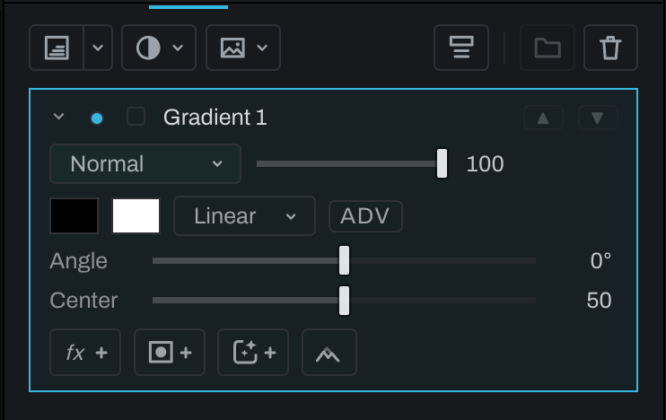

# Gradient layer

A Gradient layer blends colors and alpha across the frame, or from the picture's darks to its brights with the **By tone** shape. It is useful for graduated sky treatment, light shaping, color transitions, graphic overlays, and gradient maps.

Choose **Gradient layer** from the arrow of the split button at the left of the Finish toolbar (after that, the button itself makes another), click **Gradient layer** in the empty stack's list, or choose **Layer > New Finish Layer… > Gradient Layer**. Set the two end colors, the shape (**Linear**, **Radial** or **By tone**), the **Angle** and the **Center**. Use **ADV** for multiple stops, an opacity on each stop, and per-stop falloff.

Open the layer's settings with its chevron, then adjust its colors and shape. Blend mode and opacity apply to the layer as a whole; a layer mask further limits the gradient. Keep a gradient as its own layer when its position, colors, or opacity may need later revision.

## By tone

Set the shape to **By tone** to color the picture by its brightness instead of by position: each pixel takes the color at its own tone, read from everything below the layer, so the darkest tones take the first stop and the brightest take the last. This is a gradient map: a duotone or a toned black and white is a By tone gradient.

Everything else about the Gradient layer still applies: **ADV** for as many stops as you want with a falloff between each pair, an **Opacity** on each stop (so a stop can leave its tones untouched), the center weighting in simple mode, blend mode, opacity, and masks. By tone has no angle, so the Angle row is hidden while it is on. In **ADV** the ramp runs from **Dark** on the left to **Bright** on the right, and each stop's **Tone** says which brightness it colors.

The same controls are on the Gradient node in the graph Inspector. By tone replaces the Finish Gradient Map adjustment layer: a Gradient Map layer from an earlier version opens as a Gradient layer set to By tone, with three stops for its dark, middle, and bright colors, and renders exactly as before.

Each change can be undone with **Edit > Undo** (`Cmd+Z` (`Ctrl+Z` on Windows)). To bypass the whole gradient, click the layer's visibility dot.

