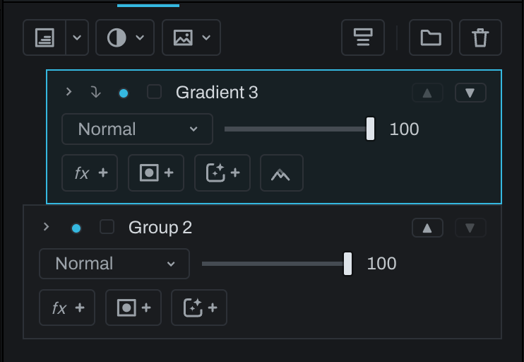

# Groups and clipping

Groups composite their members together, then blend the group result onto the photograph as one unit. A group has its own visibility, blend mode, opacity, and mask.

## Group layers

Select one or more adjacent top-level layers and click **Group** (the folder) in the Finish toolbar, or use the Layer menu's group item, which names how many it groups (**Layer > Group 2 Layers**, for example). Click the disclosure arrow to show members. A group cannot be placed inside another group.

Use **Ungroup** on the group row to return members to the main stack. Use **Remove from Group** on a member, or **Add to Group…** on a loose top-level layer. Members can move within their group.

## Clipping masks

Select a top-level layer above another and choose **Layer > Create Clipping Mask**. The clipped row indents and shows an arrow. It becomes visible only where the base layer below has visible pixels. Multiple clipped layers can share the same base.

Choose **Release Clipping Mask** to restore ordinary full-frame compositing. Clipping is not available inside a group because group members do not use the same top-level base relationship.

