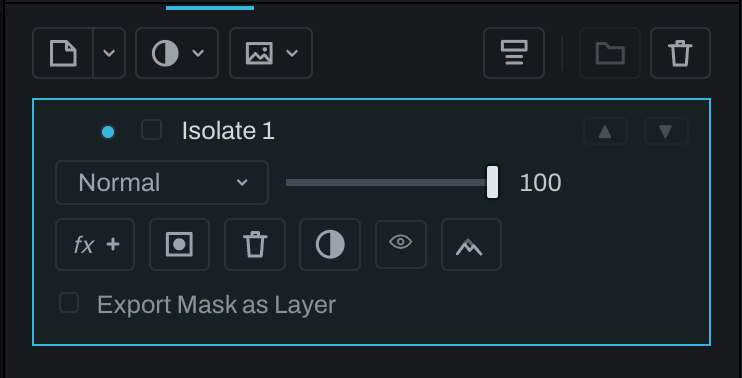

# Isolate layer

An Isolate layer contains the developed photograph from inside the current document selection. It is created by **Select > Isolate Selection** while Finish is active.

Use it to separate part of the photograph for independent blending, effects, or adjustment without removing that area from lower layers. Because the selection becomes editable layer geometry rather than a destructive cut, the original photograph remains intact below.

1. Draw or generate a document selection.
2. Switch to Finish if needed.
3. Choose **Select > Isolate Selection**.
4. Rename the new layer for its subject or purpose.
5. Change blend, opacity, mask, effects, or stacking as required.

