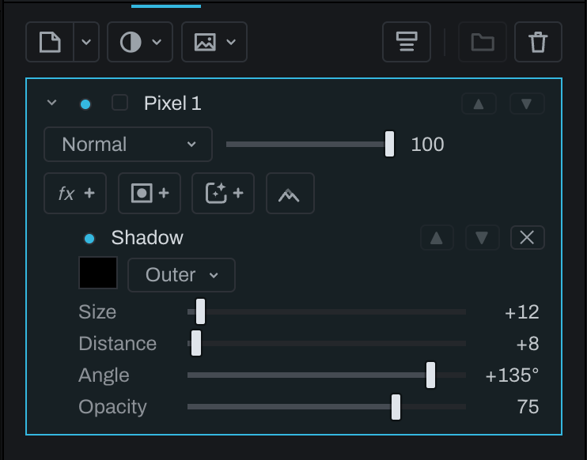

# Layer effects

Layer effects derive appearance from a layer's own visible shape. Click **Add effect** (the fx button with a plus) in a layer's row of buttons and choose an effect. Effects remain editable nodes on that layer's chain and can be repeated.

## Effects

- **Shadow** controls size, distance, angle, opacity, and color; choose **Outer** or **Inner**.
- **Glow** controls size, opacity, and color; choose **Outer** or **Inner**.
- **Color Overlay** covers the layer shape with a chosen color and opacity.
- **Gradient Overlay** applies a **Linear** or **Radial** gradient, angle, midpoint, and opacity. **Stops** opens the full color-stop editor. A stop's Alpha fades the overlay back to the layer's original color.
- **Bevel / Emboss** adds dimensional highlight and shadow with size, depth, angle, opacity, and colors.
- **Blur** offers **Gaussian**, **Box**, and **Motion**. Radius controls their reach; Angle directs Motion.

Each effect's settings sit under its name in the layer's row and fold with the layer's chevron, on every kind of layer, Pixel layers included (see [Settings that open and close](README.md#settings-that-open-and-close)); folded, the name and visibility dot stay. Angles read in whole degrees.

Effects read the layer after placement and its mask, before the layer's overall opacity and blend mode. Editing the layer or its mask updates the effect shape. An empty Finish mask leaves no silhouette for the effect. A moved or resized image can cast a shadow or glow beyond its own file's edges, within the photograph's frame. Layer opacity fades the content and its effects together; clipping limits their final contribution.

Size, Distance, and Radius are measured in the photograph's pixels. Fit scales them with the preview; 1:1 and export use the full sizes. Shadow and Glow size tracks run from 0 to 250 pixels, Bevel size from 0 to 100, and Bevel depth from 0 to 400. Type in a number for values beyond the track's usual range. Double-click a numeric row to reset that setting. Angles read in whole degrees. The same settings appear on each effect's node in the Graph inspector.

Effects run in the listed order, starting with the effect nearest the content. Two glows with different sizes or a blur before a shadow are distinct treatments. Move an effect to change that order, use its visibility dot to bypass it, or remove it; these edits can be undone. A Warp layer's mask travels with its warp before its effects run, and **Bake Warp** keeps the resulting effected pixels.

For a layer that can export its own picture, **Export** includes its effects, placement, mask, clipping, and layer opacity. **Export Mask as Layer** writes the layer's mask weight instead. Effects do not give an adjustment a separate picture to export.

