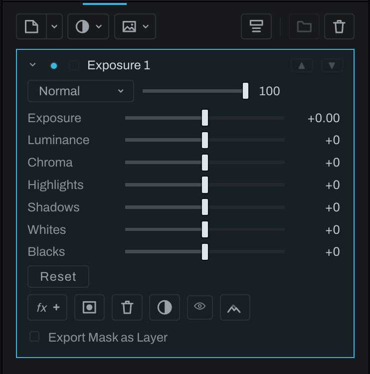
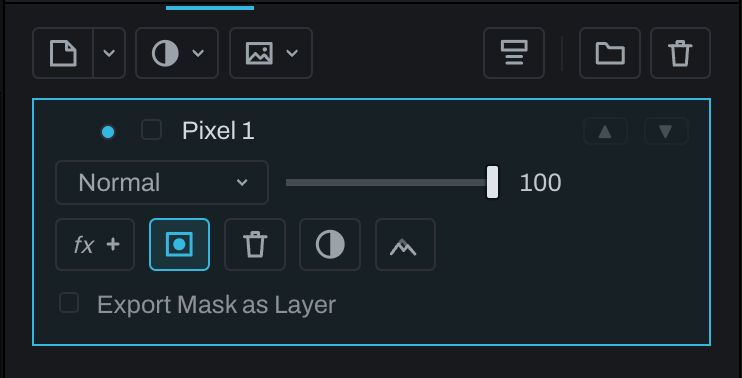

# Masks and selections

A layer mask decides where a Finish layer shows: white reveals, black hides, and gray partly reveals. To hide part of a layer, add a mask and paint on it: a new mask starts fully revealed, each brush stroke hides the layer where you paint, and erasing brings it back. The mask never erases the layer's own content, so anything you hide can be shown again.

## Add and edit masks

- **Add Layer Mask** creates a mask to paint by hand and goes straight into editing it: the mask button lights, the brush is in hand on the new mask and the brush settings open, so the next stroke paints the mask. Pick another tool to stop. **Undo** takes the mask away and puts the brush down in one step.
- **Add Smart Mask** creates a model-assisted mask, selects it and arms the Smart tool on it.
- **Object mask**, a toggle beside the Depth mask shown only for an OpenEXR, masks the layer by the objects the file names, chosen from the list under the layer or by clicking them in the photograph, with the pick tool in hand on the new mask. On a layer with another mask it takes that mask's place; off takes the object mask away.
- **Remove Layer Mask** makes the layer visible everywhere again.
- **Shift-click** the mask button (**Edit layer mask**) turns the mask off without losing it: the layer applies everywhere, at its opacity, and the button wears a red slash. Off stops the whole mask, its Depth mask included. Shift-click again turns it back on exactly as it was: the strokes, Smart clicks and Depth settings are all kept. **Layer > Disable Layer Mask** does the same, and reads **Enable Layer Mask** while the mask is off. You can still paint on a mask that is off: a plain click on the mask button arms the brush, the status line says the mask is off, and the strokes show once it is on. The mask eye shows a mask that is off as white, and **Export Mask as Layer** writes the layer's opacity everywhere. Each toggle is one undo step, saved with the edit, and carried by Takes, Paste Edits and linked photographs; in the graph the mask's card dims and its Inspector says the mask is off.
- **Invert layer mask**, beside Remove, flips the mask: the layer shows where it was hidden and hides where it showed. It lights while the mask is flipped.
- The **Show mask** eye previews the mask itself in black and white; **Option-click** (**Alt-click** on Windows) or **Cmd-click** it to see the mask as a red overlay on the photograph instead.

Choose whether the layer content or mask is active before painting. Mask brush settings use the same brush engine, tip, size, flow, softness, and texture controls as painting.

Every Finish layer except a group has a **Depth mask** button beside its mask button. Lit, the layer's mask is multiplied by the photograph's depth map, the nearest taking the layer's full effect and the farthest none, and a row appears under the buttons with **Invert depth**, which reads the map the other way for this layer only, and the eye that shows the map itself (**Option-click** or **Cmd-click** it to see this layer's mask, depth mask applied, as the red overlay on the photograph through the layer's own mask eye, as the Develop layers' eye does; the mask eye stays on until you press it, and a plain click on the depth eye shows the map over it until you turn the map off), with the Levels histogram of the depth map under it: the same three handles Develop's layers have, to choose which depths take the layer's effect. A layer with no mask yet gets a brush mask, born revealing everything, the moment Depth is switched on, so there is a mask for the depth to shape. See [Local adjustments](../adjustments/README.md#local-adjustments).

In the graph the depth arrives by wire, from the Depth Map node's depth output to this node's **depth** input, and asking for depth here adds the wire. With no wire the scene reads as flat, every depth the same, and a Develop section that is asking says NO DEPTH MAP. See [Depth Map](../adjustments/depth-map.md).

## Move between selections and masks

- **Selection from Mask** loads a baked copy of the active mask as the document selection without altering the mask.
- **Mask from selection** (the dashed square becoming a solid one, in the layer's row) masks the layer to the current selection. The mask is an ordinary black and white mask, the kind **Add Layer Mask** makes: the selection's coverage is rendered once, whatever made it (a Smart selection, the shapes drawn on or taken out of it, its Polish strokes, a **Refine edge** matte, its dials), and the brush paints on it from there. The document selection is spent on it: the selection is empty afterwards and the brush is in hand on the layer's mask (**Undo** brings both back in one step). **Shift-click** adds the selection to the mask the layer already has, and **Option-click** (**Alt-click** on Windows) takes it out of it; on a layer with no mask yet, Option-click hides the selection and shows the layer everywhere else. Each is one undo step. **Isolate Selection** and **Fill Selection** give their new layer the same kind of mask.
- **To Mask** on a Smart mask makes it the same kind of mask, in place.
- A layer's mask has the same controls however it was made (**Add layer mask**, **To Mask** or **Mask from selection**): **Edit layer mask** arms the brush on it, and **Remove Layer Mask**, **Invert layer mask**, the **Show mask** eye (click for black and white, **Option-click** (**Alt-click** on Windows) or **Cmd-click** for the red overlay) and the Depth mask sit together in the selected layer's row of buttons, on every kind of layer; while the brush is in hand the eye moves to the brush settings, beside the dab. To reshape a mask with the selection tools, load it with **Selection from Mask** (**Cmd-click** (**Ctrl-click** on Windows) **Edit layer mask**), change the selection, and make it the mask again.
- A layer saved with a mask made from a selection before version 2026.4 opens with the same kind of mask, showing exactly what it showed at Fit, at 1:1 and in the export; the brush paints on it from there.
- **Select Layer Pixels** creates a document selection from visible pixels on the active layer.
- **New Layer via Copy** (`Cmd+J` (`Ctrl+J` on Windows)) copies the pixels inside the selection to an image layer of their own, to move and warp; the selection stays. See [Image layer](image-layer.md#a-copy-of-the-selection).

A baked copy keeps the resolution of what it is made from. A selection whose matte Polish solved at the photograph's own resolution (see below) bakes at that size, from that answer, whether it goes through **Selection from Mask**, **To Mask**, **Mask from selection** or a removal's snapshot, so 1:1 and the export keep single hairs after the conversion; Fit shows a reduced copy of the same mask, and the brush works on it as on any mask. **Mask from selection** also bakes at the photograph's size when the selection or the mask it lands in has drawn shapes, Polish strokes or brush strokes, so a rectangle's edge stays the one drawn at 1:1 and in the export. On a 24 megapixel photograph such a copy takes about 24 MB on disk, and it travels with the edits, undo, takes and recovery like any baked mask. A Smart selection with nothing drawn on it bakes at the preview's size, the size the model answered at. A conversion asked for while Apply's full-resolution pass is still running waits for it (the progress row shows its tiles) and is made from what it lands; if the pass is canceled or keeps the preview's matte, the conversion uses the preview's matte.

## Shapes on a Smart selection

A shape drawn with the selection tools combines with the selection on screen. With **Subtract** (Option-drag, Alt-drag on Windows and Linux), **Add** (Shift-drag) or **Intersect** (Shift and Option), it acts on:

- the document selection, whenever it holds anything, including a Smart selection made with Select > Subject, Sky or Smart click (the shapes combine with it, and **Mask from selection** bakes the result);
- otherwise the live mask of the layer you are editing: a Smart layer's mask, a mask made with **Add Smart Mask**, an Object mask, a Develop Smart, Object or Selection layer's mask, or a Smart Mask node picked in the graph. The shape is kept on that mask, combined with the model's answer after its Threshold and Expand and before its Feather and Invert, rendered fresh at Fit, at 1:1 and in the export, with the ants following. The status line says it went to the layer's mask, and **Undo** takes back one shape at a time. **Clear** forgets the shapes with the clicks; **To Mask** bakes them in with the rest.

**New** always starts a document selection, so picking up the selection tool never changes a layer by itself. A Subtract or Intersect with nothing selected and no live mask to act on is not kept: the status line says nothing is selected and, on a Finish layer's black and white mask, to draw the shape with New and then Option-click **Mask from selection** to take it out of the mask. **Select By** ranges follow the same rule.

## Polish selection

Polish refines the edge of what the marching ants trace. Choose **Select > Polish Selection…**:

- With a selection on screen (the document selection, or a Develop Selection layer's), Polish refines it.
- With nothing else selected, Polish opens on the active layer's Smart or Object mask. On a Finish layer the mask's current shape becomes the selection being polished, at the photograph's resolution, and the status line says whose mask it is. **Apply** puts the refined edge back on the layer as an ordinary black and white mask, the one **Mask from selection** would make, replacing the Smart or Object mask, and leaves nothing selected; **Cancel** or `Escape` leaves the layer's mask as it was. The whole pass is one undo step, and Undo brings the Smart or Object mask back. On a Develop layer it does what the mask block's **Polish…** button does: the layer becomes a Selection layer wearing its mask's shape, and Polish refines it.
- With nothing selected and no such mask, Polish does not open, and the status line says to select something first.

**Matte** re-reads the edge from the photograph; **Add** and **Remove** paint directly; **Soften** feathers locally. Hold **Option** (**Alt** on Windows) to paint the opposite: Remove with any other mode, Add with Remove. Preview modes show the result as overlay, matte, or against neutral backgrounds. Apply keeps the refinement; Cancel or `Escape` restores the pre-polish selection.

The Matte brush refines an edge: paint over the edge with the fur or hair you want to keep inside the brush, and the matting model separates it from the background where you painted. The selection stays exactly as it was outside the painted area and the Reach corridor, so a stroke along the hairline cannot move a distant shoulder. Brush wide enough to cover the hair to its tips. **Reach** lets a strand the brush did not quite cover be followed past it, through the strand's own core, up to one brush radius at 100; at 0 the matte stays where you painted. The **Refine edge** button runs the model along the whole edge at once and clears the haze it leaves over soft background.

The edge dials beside the brush: **Grow** moves the edge, **Smooth** rounds off jags, **Feather** softens without moving it, and **Ramp** takes the soft part of the edge in (below zero) or lets more of it into the selection (above zero) without touching what is fully in or fully out. **Contrast** sets how decided a refined edge is. Heeler has no Border width: the Refine edge button keeps a wide search band on purpose, because a strand reaching past a narrow band is distrusted whole, and the brush is how to confine the matte.

While you brush, the matting model works on the preview so each stroke answers in about a second. When you press Apply (or pick up another tool, which keeps the refinement too), Heeler solves the matte again at the photograph's own resolution, in tiles along your strokes (or along the edge the Refine edge button changed), so single hairs stay crisp at 1:1 and in the export. This takes a few seconds, depending on how much edge you painted: on a 24 megapixel photograph with the brush run right round an animal, about six seconds and eighteen tiles. A progress row shows the tiles as they go, with **Cancel**; you can keep working while it runs. Cancel, an undo, or a new stroke on the same selection stops it and keeps the preview's matte. Fit, 1:1 and the export all use the full-resolution answer once it lands, and it is kept with the photograph's edits, so undo, redo, takes and Reset Edits bring it back or take it off with the refinement it belongs to. If the matting model is not installed or there is not enough memory, the preview's matte stays and the status row says why. The full-resolution answer survives turning the selection into a mask (see [Move between selections and masks](#move-between-selections-and-masks)).

After Apply, the marching ants trace the mask the layer applies, at its half-way line and at the resolution the viewer shows (at 1:1, the photograph's own), so they go jagged along fur, keep holes and separate pieces, and follow every later change to Grow, Smooth, Feather, Ramp, Contrast, Reach and every undo. Very complex outlines may simplify small islands to fit the display budget; this does not simplify the applied mask. While you zoom or pan at 1:1 the ants move with the photograph, the last outline held in place until the sharp one for the new view is traced.

## Masks after a crop

A mask stays on the part of the photograph it was made on when you crop again, change the crop's ratio or turn it. Brush strokes, selections (freehand, magnetic, pen, rectangle and ellipse), strokes of Polish not yet applied, and a key's sample point move with the scene; brush sizes, Grow, Smooth and Feather keep their size on the photograph. A rectangle or ellipse selection that the crop turns becomes the same outline as a path, so it stays exactly where it was. Smart, object and depth masks follow their subject the same way. **Undo** puts the crop and the masks back together.

## Select By ranges

**Select > Select By** offers Luma Range, Color Range, Contrast, and Depth Range. Adjust From, To, and Falloff while viewing the live selection.

Done keeps the selection and Cancel restores its previous regions.

Depth Range adds the familiar depth eye in the same header. It shows the photograph's depth map, white near and black far, so you can judge the distance limits. Done and Cancel restore the depth view to its state before the dialog opened. If it was already on, it stays on.
