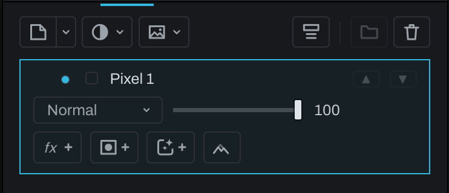

# Pixel layer

A Pixel layer is a transparent canvas for paint and retouching. Paint, Clone, Heal, Blur, Blend, Erase, and related brush tools write replayable strokes to the same layer type.

## Create and use

Click the split button at the left of the Finish toolbar while it shows the Pixel sheet (its arrow lists **Pixel layer** when it shows another kind), click **Pixel layer** in the empty stack's list, or choose **Layer > New Finish Layer… > Pixel Layer**. Select the row, choose a tool in the viewport toolbar, and paint. A document selection limits new strokes and that boundary remains part of the recorded stroke after deselection.

Clone and Heal require a source: `Option` (`Alt` on Windows)-click a clean source, then paint. Clone copies source pixels directly; Heal adapts their tone to the destination.

Pixel layers begin transparent. Their blend mode and opacity determine how painted content composites over lower layers. Use a mask to hide or reveal the layer nondestructively; use Erase when the intention is to remove painted pixels from the layer itself.

