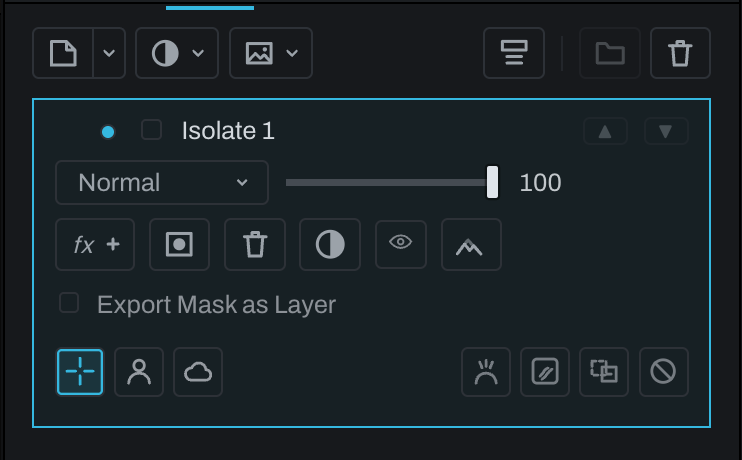

# Smart layer

A Smart layer isolates the photograph below using a model-assisted selection based on a subject, sky, or the user's clicks. It places that isolated image region on its own Finish layer.

Open the **Adjustment** menu in the Finish toolbar and choose **Smart layer** under **Utility**, click **Smart layer** in the empty stack's list, or choose **Layer > New Finish Layer… > Adjustment Layer… > Smart Layer**. Use the prompted Smart selection controls in the image, refine the result, and return to the stack. The layer can then be reordered, blended, masked, grouped, and adjusted like other Finish layers.

The Smart mask block's row holds two sets of square icon buttons of one size, each button a little apart from the next. At the left, the mode:

- **Click**, a crosshair (the pointer you get over the photograph): each click adds to the selection, and Option-click (Alt-click on Windows and Linux) takes away.
- **Subject**, a head and shoulders: selects the main subject in one step, no clicks needed.
- **Sky**, a cloud: selects the sky in one step.

At the right edge, what to do with the selection:

- **Refine**, a head with flyaway strands (the picture Polish's Refine edge button wears): sharpens the selection's edge with the matting model, for hair, fur and ridgelines.
- **Remove**, a patch with strokes closing it (the Fill brush's picture): erases what is selected; the model fills the hole from the surroundings.
- **To Mask**, a dashed square becoming a solid one (the Layers panel's mask-from-selection picture): turns the selection into an ordinary black and white mask, the kind **Add Layer Mask** makes, and puts the brush in hand to paint on it. The model's mask is made at the preview's size. To refine its edge instead, choose **Select > Polish Selection…** with nothing else selected: Polish opens on this layer's mask, and **Apply** puts the refined edge back as the same ordinary black and white mask, at the photograph's own resolution, in one undo step (see [Polish selection](masks-selections.md#polish-selection)). In Develop, **To Mask** makes a Smart layer a Brush layer the same way.
- **Clear**, a crossed circle (the Console's Clear picture): starts the selection over, forgetting every click, the mode and any shapes drawn on it. In the Develop panel it sits in the Smart mask header between Reset and Show mask instead.

Hover over a button to see its name, and the status line says what it does. Both sets fit one line down to the narrowest Develop panel, at every app zoom; if they ever cannot, the second set moves to its own line, still at the right. The same row appears on a Develop Smart layer.

When the model takes a little more than you meant, draw the extra away with the selection tools: pick up the selection tool (marquee, lasso, color brush, color pick and the rest), set **Subtract** in its mode menu or hold Option (Alt on Windows and Linux), and draw over the part to lose. The shape comes out of this layer's Smart mask at once, at Fit, at 1:1 and in the export, and the marching ants follow. **Add** (or Shift) puts a shape in, and **Intersect** (or Shift and Option) keeps only what is inside it. The status line says the shape went to the layer's mask, each shape is one undo step, and the shapes stay live: a new Subject or new clicks keep them on top. This works while nothing else is selected; with a document selection on screen the shapes edit that selection instead, and **New** always starts a document selection. The same holds on a Develop Smart layer, a layer with **Add Smart Mask**, an Object mask, and a Smart Mask node picked in the graph.

Use a Smart layer when the goal is to treat an inferred object or region as composited image content. Use **Add Smart Mask** instead when the layer content already exists and the model should only control its visibility.

