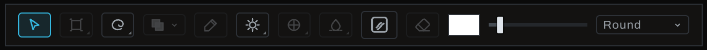

# Finish toolbar

The Finish toolbar floats across the bottom of the image viewport. Buttons are icons; point to one for its name and description. The active tool is highlighted.

## Tool order

- **Cursor** puts tools away so clicks select layers without painting.
- **Transform** is one slot with four modes in its popup (hold the button, or right-click it): **Transform** moves, sizes and turns the active layer; **Skew** slants it, an edge sliding along itself so the layer stays a parallelogram; **Perspective** pinches a corner and its partner on that edge together, so the layer leans away evenly; **Warp** pulls each corner on its own. The button shows the mode it arms, and a tap arms it or puts it away. In every mode the keys on the handles still work (`Cmd` on a corner distorts, `Cmd+Shift` skews, `Cmd+Option+Shift` pinches in perspective; `Ctrl` for `Cmd` and `Alt` for `Option` on Windows). It works on the active Finish layer, image layers included, and is grayed until one is picked. See [Image layer](image-layer.md#on-the-canvas).
- **Select** arms the current selection method; hold to choose another method.
- **Selection mode** chooses New, Add, Subtract, or Intersect and is enabled while Select is armed.
- **Paint** lays the current color on the active layer.
- **Dodge / Burn** share one popup; hold `Option` (`Alt` on Windows) during a stroke to use the opposite action.
- **Clone / Heal** share one popup. `Option` (`Alt` on Windows)-click sets the source.
- **Blur / Blend** share one popup for local softening or blending.
- **Fill** uses model-assisted content generation and manages the needed result layer.
- **Erase** removes paint from the active retouch layer. `Option` (`Alt` on Windows) with Paint can erase without switching.
- **Paint color** opens the active brush color control.
- **Brush size** changes radius; `[` and `]` also resize.
- **Brush tip** chooses the tip family. Tip-specific settings appear in the Brush panel.

Tools that require a Pixel-compatible retouch layer are disabled until one is active. Point to a disabled tool to see the needed context.

The row of buttons above the layer stack, which adds layers and holds **Expand settings on select**, **Group** and **Delete**, is described on the [Finish tab](README.md#add-layer-toolbar) page.

## Keyboard

Each tool has a key: `V` Cursor, `T` Transform (the mode the slot shows), `M` Select, `B` Paint, `O` Dodge/Burn, `H` Clone/Heal, `R` Blur/Blend, `G` Fill, `E` Erase. Pressing a tool's key again puts it away. The keys work only while this toolbar is on screen: the Finish pane in Develop, and inside the Finish group in Graph or Canvas. The exception is `M`, which arms the selection tool anywhere selections work, including Develop's Adjustments tab; `Shift`+`M` steps the Draw-with method to the next one in the list, wrapping at the end. All of these can be rebound in Preferences.

## Polish mode

While polishing a selection, the toolbar intentionally shows only Preview, Polish mode, model Matte, Apply, Cancel, brush size, and brush tip. This keeps unavailable Finish-only tools out of the refinement workflow.

## Brush behavior

Selection boundaries restrict new Paint and retouch strokes. Flow builds with repeated passes; opacity caps the result. Softness changes edge falloff. Texture and non-circular tips can add material variation. Textured tips show the same texture at Fit as the export does at that size: each pixel averages the grain under it, with the grain's size tied to the brush. Grain finer than a Fit pixel reads at Fit as an even tone; 1:1 and the export show its detail. A brush finer than a pixel draws at its own width at every zoom, as the export does. Tool-specific Strength appears in the Brush panel rather than expanding the toolbar.
