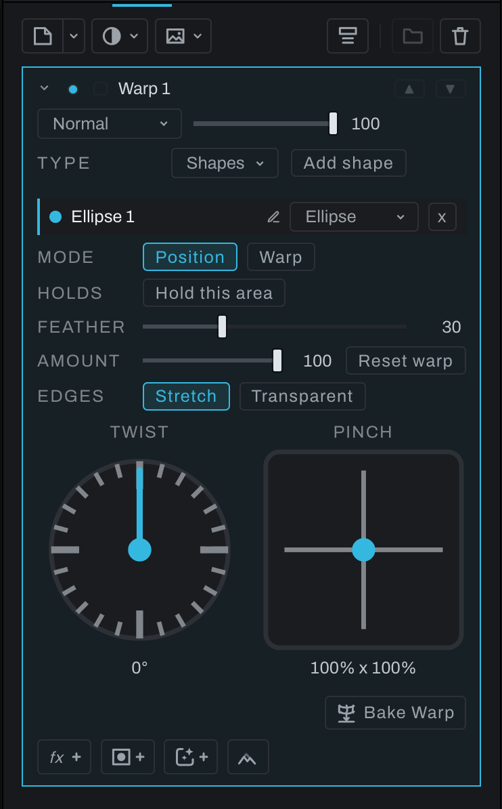
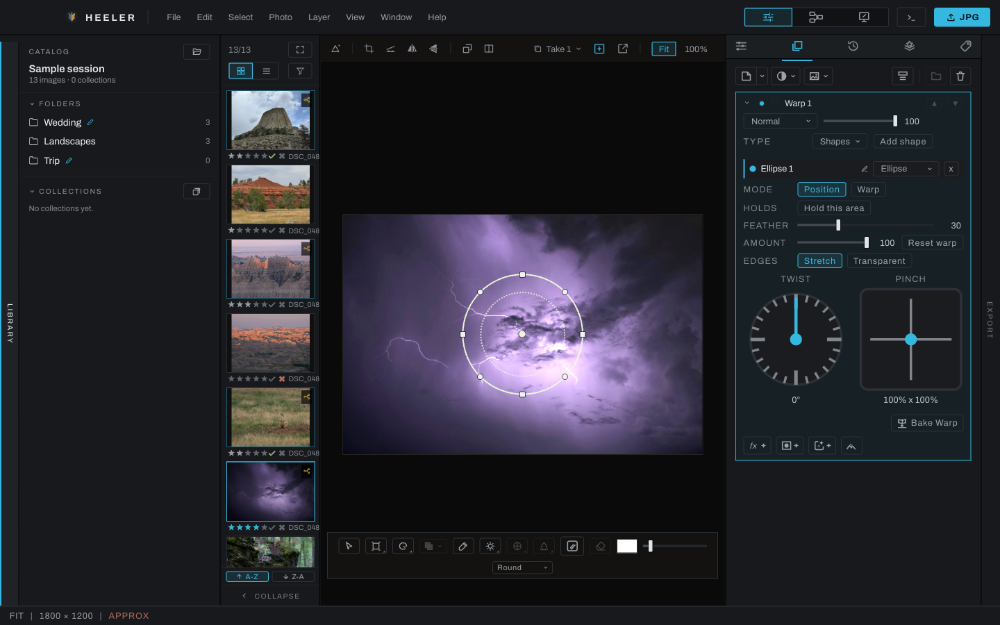
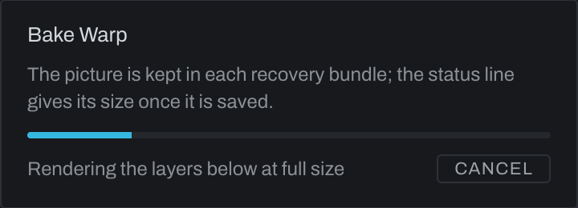

# Warp layer

A Warp layer bends everything below it in the Finish stack with a [Grid Warp](../adjustments/grid-warp.md) or a [Shape Warp](../adjustments/shape-warp.md). Its mask says what is warped: the masked part moves with the warp, like a cut-out, and the rest of the picture stays exactly as it was. Mask the layer to someone's head, scale the head up with a Shape Warp, and the head grows past its old outline while the background around it does not move.

It is the photograph's Grid Warp or Shape Warp on a layer. The grid, the shapes, the feather, Twist, Pinch, Hold this area and the handles on the canvas are the same controls you use in Adjustments, so there is nothing new to learn; the only difference is what gets warped and where it shows.

## Adding one

- **Warp layer** (a grid whose lines bow) under **Utility** in the Finish toolbar's **Adjustment** menu, or in the empty stack's list.
- **Layer > New Finish Layer… > Adjustment Layer… > Warp Layer**.

The layer arrives at the top of the stack, Normal, 100%, named Warp and a number (such as Warp 1), with its grid at rest and no shapes, so it changes nothing yet. It is one undo step.

## Warping

In the stack a closed Warp layer is the size of a Pixel layer: its name, visibility, blend mode, opacity and mask. Opening its settings is how you edit the warp: with the chevron beside the visibility dot, or by selecting the layer when **Expand settings on select** is on (see [Settings that open and close](README.md#settings-that-open-and-close)). Open, the warp's handles are on the canvas and the panel shows, in order:

- **Type**: **Grid** or **Shapes**, the one the layer applies. A new Warp layer starts on Grid. On Shapes, **Add shape** sits on the same row, to the right of the menu; on a narrow panel it shows only its plus, its name in the tip.
- For **Grid**, the Grid Warp section: drag a handle on the canvas and the picture below bends with it. Columns, rows, Influence, the heat map, the picks, Edges, Twist and Pinch work as in [Grid Warp](../adjustments/grid-warp.md), and so do its keys: `Shift` while dragging locks the move to one axis, the arrow keys nudge the picked handles one photograph pixel and `Shift`+arrow ten, each run of presses one undo step. The same keys work on an image layer's own Grid warp, along the picture's axes.
- For **Shapes**, the Shape Warp section, starting with the list of shapes: **Add shape**, beside the Type, puts a shape in the middle of the frame, ready to place; switch to **Warp** and drag inside it to move the picture under it, drag outside it to twist the picture about its middle, or grab its ring's edge to pinch it larger or smaller; Twist and Pinch in the panel do the same and follow a canvas drag as it goes. The ring stays on the picture you moved, the shape's placement a faint dashed ghost. The keys are Shape Warp's: `Shift` locks a move to one axis and steps a twist by fifteen degrees, and `Option` (`Alt` on Windows) on the ring pulls each of the shape's axes on its own. The same gestures and keys work on an image layer's own Shapes warp, measured on the picture. Feather, Amount, Hold this area and Edges work as in [Shape Warp](../adjustments/shape-warp.md).

A Warp layer applies one type at a time. Switching the Type keeps the other type's grid or shapes on the layer, not applied, so switching back brings them back exactly as they were; each switch is one undo step, and the handles on the canvas switch with it. To use a grid and shapes together, stack two Warp layers.

Close the settings (the chevron again, or select another layer when **Expand settings on select** is on), press `Enter`, pick another layer, pick another tool, switch to another photograph or take, or leave Finish, and the handles go away, keeping what you did. `Esc` puts the warp back the way it was when you opened it and puts the handles away. After `Enter` or `Esc` the settings stay open; close and open them again (or select the layer again) to put the handles back. Each drag is one undo step. One warp is edited at a time: opening another Warp layer moves the handles to it.

The lines use the shared overlay color and thickness. Set **Lines** and **Thickness** in Adjustments' Grid Warp or Shape Warp section; **Preference** returns this photograph's thickness to **Preferences > Interface > Shape outline thickness**. The layer's opacity, blend mode and mask stay in its row.

A Warp layer made before the Type existed, with both a grid and shapes, opens on **Shapes** (the grid is kept, not applied); one with only a grid opens on **Grid**.

## Masking it

A Warp layer with no mask shows its warp over the whole frame, like the Develop warps. Add a mask to pick out what is warped, the way you mask any layer: a painted mask, a selection made into the mask with **Mask from selection** (a marquee round the head, a Smart Subject, a Polish refinement), a Smart mask (the subject, a click), or a depth range. A selection made into the mask is an ordinary black and white mask the brush paints on, the same at Fit, at 1:1 and in the export (see [Masks and selections](masks-selections.md#move-between-selections-and-masks)).

The mask travels with the warp, as a cut-out of the subject would (a layer copied from a selection, then warped): the warp moves the masked pixels and the mask with them, so an enlarged head shows past the outline you masked, and everything the moved mask does not cover is the picture below, untouched. The layer's opacity and blend mode apply as on any layer. The **Show mask** eye and the brush show and paint the mask where you drew it, on the unwarped picture.

For a clean result:

- **Mask the whole subject, not the warp.** Select the animal, or its head, and make that the mask; then warp. The shape or grid can reach past the subject: only the masked part moves.
- **Feather the mask a little.** A soft mask edge travels with the subject, so its outline blends into the picture below wherever it lands.
- **Fill in what a shrink or a turn uncovers.** Where the subject gets smaller, moves or turns, the original subject shows behind it, because the picture below is still there. Add a [Pixel layer](pixel-layer.md) under the Warp layer and clone or heal the background over the old outline, or use the [Fill brush](fill-layer.md) there: the model fills it from the surroundings.
- **Push the subject where you want it.** What you push covers what is ahead of it, as in Liquify: a dragged head arrives whole over the background in front of it, and the mask travels with it, so the masked head shows whole there too.
- **Keep the feather wide for strong pulls.** A shape pulled hard with a narrow feather squeezes its feather into a thin band in front of it, which shows as a hard edge. Widen the feather, or pull less.

## Baking and Unbaking

**Bake Warp** turns a Warp layer into an image layer holding exactly what the layer shows now, so you can move it, transform it and warp it again as a picture of its own. The cost: the baked layer no longer follows what is below it. Develop edits, and changes to the layers under it, stay out of it from then on.

- **Bake Warp** at the end of the layer's settings, after the warp's controls.
- **Bake Warp** in the layer's right-click menu, and in the **Layer** menu with the Warp layer active. On any other layer it is grayed and says it works on a Warp layer.

A bake renders everything below the layer at the photograph's own size, so on a large photograph it can take a few seconds. When it takes more than half a second a dialog shows what it is doing with a progress bar; **Cancel** stops it and leaves the Warp layer exactly as it was, with nothing added to the undo history.

If full-size decoding fails or there is not enough memory for the full-size render, Heeler uses preview-sized pixels and records the fallback in the Console. That copy can be softer at 1:1 and in the export. Undo it and retry after resolving the decode or memory problem if you need full resolution.

The baked layer takes the Warp layer's place: the same spot in the stack or in its group, the same name, blend mode, opacity and clipping. At full resolution, it holds the warp as rendered at the photograph's own size:

- With a mask, the warped cut-out: the pixels the mask let through, carried by the warp, with the warped mask as their transparency and nothing around them. The mask itself is gone from the layer, because it is in the picture now.
- Without a mask, the whole warped frame.

The layer's effects are baked in too. At full resolution the picture does not change when you bake: the export and 1:1 are the same to the last step of a 16-bit file. At Fit the preview can shift slightly on a thin ring of pixels round a strong pull: the live layer bent the reduced preview, and the baked layer shows the full-size bend reduced, which is what the export shows.

The baked layer is an [image layer](image-layer.md): the toolbar's **Transform** slot moves, sizes, turns, skews, pinches and warps it, and its own **Warp** bends it again. It stays on the part of the scene it came from when you crop again. Its source line reads **Baked from a warp**; Heeler keeps the file with its other saved inputs, and recovery bundles include it while **Preferences > Backup > Keep baked pictures in backups** is on (the default). One undo step brings the live Warp layer back exactly.

A bake changes only the photograph it was made on. On a linked photograph, the other photographs in the link keep their own Warp layer as it was, live, with its mask; undoing or redoing the bake leaves them alone too.

**Unbake** turns a baked layer back into the live Warp layer it came from, at any time later, not only right after the bake. The baked layer keeps the Warp layer's whole definition (its type, grid and shapes, holds, feather, amount and edges, its mask and its effects), without any pixels, so it is saved with the photograph and travels with takes, Copy and Paste Edits and linked photographs. The live warp then bends whatever is below it **now**: Develop edits and layers below made since the bake show through it again.

- **Unbake** at the end of the baked layer's settings, where Bake Warp was on the Warp layer, and on its picture node in the graph inspector.
- **Unbake** in the layer's right-click menu, beside Bake Warp, and in the **Layer** menu with the baked layer active. On any other layer it is grayed and says it works on a layer made by Bake Warp. A Layer via Copy layer has no warp to bring back.

Unbake also arms the restored Warp layer, so its handles are ready on the canvas. The Warp layer comes back in the baked layer's seat, in the stack or in its group, with the name, blend mode, opacity and clipping the baked layer has now, so a change you made to those after the bake stays. A transform or own warp you gave the baked picture goes with the picture. If the Warp layer had a mask, it comes back, replacing any mask the baked layer was given since; without one, a mask the baked layer has stays. After a crop, the warp's grid, shapes and mask come back on the part of the scene the baked layer stayed on. Unbake is one undo step, and undo bakes it again with the same picture.

This is warping in the baked way, a picture you bend and then own, beside the live Warp layer that keeps bending whatever is below it. Keep the Warp layer live while the photograph below is still changing; bake it when the picture below is settled and you want to work on the warped result itself.

## Order in the stack

A Warp layer warps whatever is below it, image layers and other Finish layers included, in the order you arrange them. Move it above a layer to warp that layer too, below it to leave it alone. Layers above a Warp layer are not warped.

Clipped to the layer below it (right-click the row, **Create Clipping Mask**), a Warp layer still warps everything below it, and shows only inside that layer's outline, as clipping always does. The clip is not warped: it is the outline of the layer below as it sits.

## Crops and other photographs

A Warp layer's grid and shapes are drawn on the photograph, so they stay on the part of the scene you put them on when you crop again, as the Develop warps and your painting do. Undoing the crop puts them back.

**Duplicate Layer**, **Copy Edits** and **Paste Edits**, takes and saving carry a Warp layer like any other layer.

## What you see is what exports

The warp, and the mask it carries, render at Fit, at 1:1 and in the export from the same numbers, so the three agree. Because a warp reads the picture beyond any part of it, a photograph with a Warp layer that moves anything renders its whole frame sharp at 1:1 rather than just the visible part, which can take a moment longer on a large file.

## In the graph

A Warp layer is two nodes inside the Finish group: a **Warp** node, fed by everything below it, and the layer's Blend node, which lays it over the same and carries the mask, opacity and mode. The render passes the mask through the Warp node's own grid or shapes on its way to the Blend node, so it moves with the pixels; the graph shows the mask wired to the Blend node as you drew it. Select the Warp node and the Inspector shows an **Edit warp** button (the graph has no chevron to open), and when it is on the same Type and controls as the layer's panel. The same node also warps an [image layer's picture](image-layer.md#warping-the-picture).
