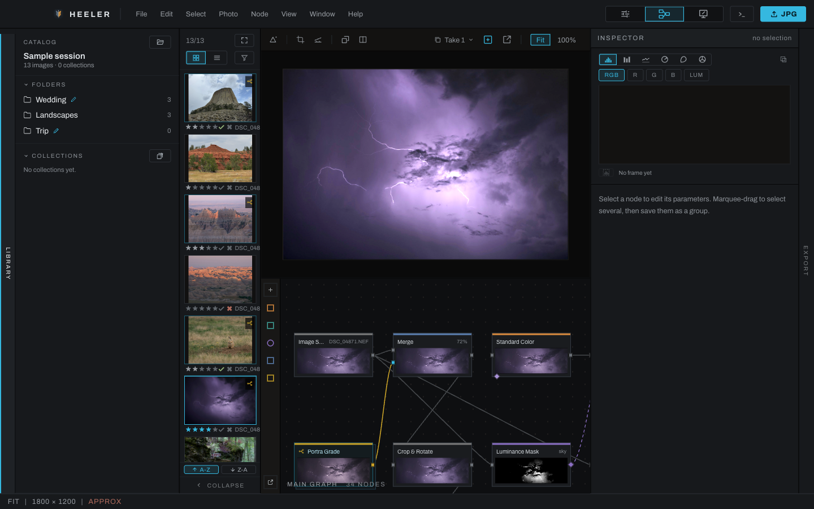

# Node graph views

The graph is the complete, editable processing structure behind Develop and Finish. Wires carry images from source toward output; purple dashed wires carry masks. A simple unedited photograph begins with source connected to output.

## Pages

- [Graph canvas](canvas.md): navigation, selection, wiring, menus, and organization.
- [Node inspector](inspector.md): parameters, actions, notes, probe, compare, and output.
- [Groups, backdrops, and pop-out view](groups-popout.md): reusable structures and multi-window work.
- [Node recipes](recipes.md): ready-made groups to drop into a graph, your own saved groups, and their published controls.
- [Advanced graph tools](advanced-nodes.md): choosing and wiring the graph-only mask, channel, color, depth and geometry tools.
- [Node reference](nodes/README.md): every node, its ports and parameters, and how it is used.
- [Example networks](examples.md): complete graphs, rendered to prove they run.

## Open Graph

Choose **Graph** in the workspace switcher. The image viewport moves above the node canvas and the right panel becomes the Inspector. Drag the horizontal divider to allocate more space to the graph or photograph.

Choose **Canvas** when you want the node graph over the image. The editing model remains the same, and the viewport's toolbar is the same one Develop and Graph have, with the graph and its HUD floating below it.

A photograph with no edits opens as five cards in a row: Image Source, Color, Exposure, Tone Profile and Output. Every other section adds its node the first time it is switched on or its first dial moves, so an untouched photograph carries nothing it does not use.

Where a section's node lands is a fixed seat in a workflow order, not wherever there was room: the source first, then geometry (Crop & Rotate, Lens Correction, the warps), the Depth Map directly behind them so its plane is read from the straightened photograph, then color and tone, detail work, the depth tools and optics, and Output last. Switching a section on splices its node in at its seat, in front of the first node downstream the graph already has, so the chain reads in the same order however the sections were switched on, and a photograph saved before a seat existed loads with its node moved there.

Hold `Space` and drag to pan the graph; scrolling zooms it. `Cmd` (`Ctrl` on Windows)+scroll pans too, and on a touchpad the two-finger scroll pans both axes at once, so `Command`+two-finger scroll is the touchpad's way around the graph. In Canvas, `Space`-drag pans the photograph under the graph instead, and the scroll gestures keep working on the graph above it.

Press `F` to frame the view: it centers the selected nodes, or everything in view when nothing is selected. Entering a group auto-frames its contents, and leaving restores the view you had outside, so the trip in and out costs nothing. Inside a group, `F` frames the group's contents.

## Read node cards

Node color identifies its category. A card shows its name, a live preview of the picture at that node, its enabled state, its note, and its ports. The preview is the engine's own render at that point in the chain, so a change after a node never alters the cards before it. The Image Source card names the file it decodes; File and Catalog cards show their own picture.

Image input ports are on the left and output ports on the right. Mask outputs and inputs use the masking color and dashed wire style. Nodes with two inputs expose separate upper and lower inputs; Channel Join has three, colored red, green and blue. Hover any port to see its name below the pointer, for example `Exposure.in` or `Merge.fg`, while the status bar says what it carries.

The color key on the left names each stripe in the status bar and, clicked, opens the Add Node palette narrowed to that category. The `+` button above it opens the whole palette. The bottom button pops the graph into a separate window.
