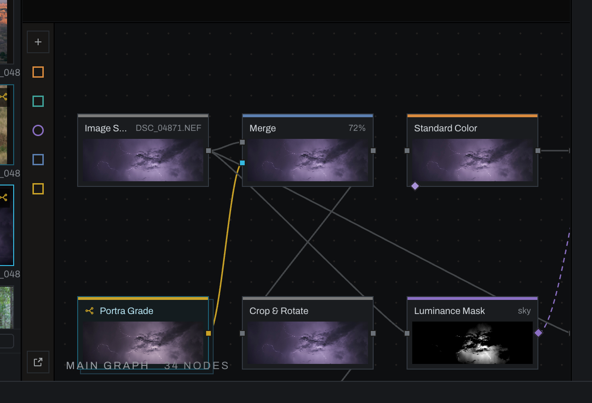
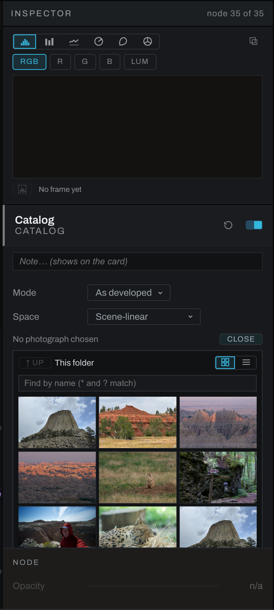
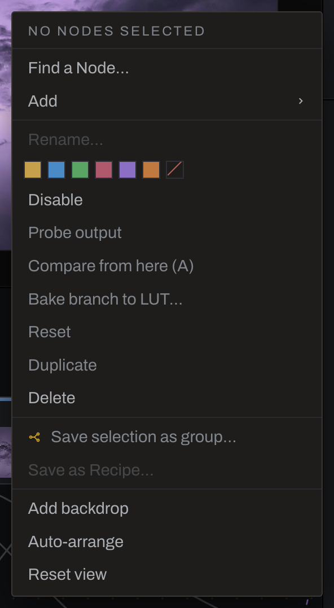

# Graph canvas

The graph canvas is a pan-and-zoom workspace for arranging and connecting nodes.

## Navigate

Scroll to zoom the graph; `Option` (`Alt` on Windows)+scroll zooms at half the rate. `Shift`+scroll pans sideways and `Cmd` (`Ctrl` on Windows)+scroll pans up and down; a touchpad's two-finger scroll or a middle-button drag pans freely, and so does dragging with `Space` held. A plain drag on empty canvas selects (below). Right-click and choose **Reset view** to return to the default framing.

## Select and move nodes

- Click a node to select it.
- `Shift`-click adds or removes a node from the selection.
- Drag empty canvas to marquee-select.
- Drag selected nodes to arrange them.
- Press `D` to disable or enable selected nodes.
- Press `F2` to rename one selected node.
- Press `/` to find existing nodes by name; `*` and `?` wildcards work and selection follows the query.
- `Cmd` (`Ctrl` on Windows)+`U` grows the selection upstream, including masks.

## Add nodes

Press `Shift`+`Space`, click the graph `+`, choose **Node > Find a Node…**, or right-click and choose **Find a Node…**. Search by operation name, or browse categories. A node added from the empty-canvas menu appears at the click position, moved to a free spot if needed. Other additions land beside the selected node. If the free spot is outside the view, the graph pans to reveal it. Adding from Find a Node leaves the new node unwired: drag the node onto a highlighted wire to splice it into the chain.

## Connect and rewire

- Hover any port to see its name (for example `Exposure.in` or `Merge.fg`) below the pointer; the status bar adds what the port carries. Gray squares on the left are image inputs (rgb); the diamond at the bottom left is the node's mask input (alpha); the diamond on the right of a masking node is its field output (alpha). Wires end at the center of each dot.
- Wires draw from either end, as in other node editors. Drag an output port to a compatible node or input: every input the wire can land on is ringed and its card outlined, and the input the drop would take fills. Drop on or beside an input to take that one; elsewhere on a card the drop takes the nearest stacked input for a picture, or the card's own field diamond for a field (the nearer diamond on the Displacement Map and the Export Layer).
- Or start at an empty input (an image input, the mask diamond, an alpha diamond or a depth input): the wire leaves that port, the nodes with an output that fits outline with that output ringed, and dropping on one connects them. Both directions follow one rule: an image input takes an image output, a mask, alpha or depth input takes a mask or field output, and a node that would make a loop, or the node itself, does not light up.
- Dropping on an already-fed input replaces that feed.
- Drag from a connected input to pick its wire up by that end: it stays on its source and follows the pointer. Drop it on another input to move it, on empty canvas to disconnect it, or back on the same input to leave it as it was. A move is one undo step, and a wire put back where it was is none.
- Drag a mask output to the node it should limit. One mask can feed multiple nodes.
- Drag the handle at the head of an existing mask wire to move it; drop on empty space to remove it. Drag a wire near its output end to give it a different source.
- Press `Escape` to cancel a wire drag. Dropping on an incompatible card also keeps the old connection. Touch and pen can drag from the same ports.
- Drop a node on a highlighted wire to splice it into that connection. Its previous neighbors reconnect. Only its main input and output move: the fields on its diamonds, a second picture and its own field outputs stay wired (one that would make a loop at the new place lets go).
- A node with a field in and a field out (Invert Mask, Morphology, Median / Percentile (Mask), Signed Distance Field, Guided Filter (Mask), Compare, Logic, Math, Remap, the Export Layer's gray pair) splices into a mask or alpha wire the same way: the wire's ends land on its field seats.
- `Option` (`Alt` on Windows)-drag a node out of a chain to remove it while reconnecting its neighbors. It keeps its fields and second inputs, ready to drop on another wire.
- A Merge or Blend Mode with nothing on its second input passes its base through, so deleting the node that fed it never breaks the render.

Connections that would create a loop are refused before the drop.

## Duplicate and reset

- **Duplicate** the selected nodes from the context menu or with `Cmd`+`D` (`Ctrl`+`D` on Windows). Copies land at the nearest clear spot, keep their layout and the wires among themselves, and become the selection. Groups and recipes copy whole, members and all. The photograph, Output, a layer's own cards and the Finish stack cannot be duplicated, and a notice says which were left behind. The key works in the popped-out graph window as well, and **Edit > Duplicate Nodes** shows it.
- **Reset** a node from the reset glyph beside its switch in the Inspector, or from the context menu for the whole selection. Every dial and choice goes back to its defaults, curves to the diagonal; strokes and the switch stay.

## Second pictures

- A **File** node (**Source > Source > File**) reads any image from disk as a second source: choose the file in the inspector. Image Source stays the photograph itself.
- A **Catalog** node (**Source > Source > Catalog**) brings in another photograph from the session, as developed (its own Output, from the graph saved beside it) or as shot. Its browser opens in the folder on screen, walks up and into any folder the catalog has scanned, filters by name, and shows a grid or a list. A folder the Library has not opened yet says so; opening it in the Library scans it and builds its thumbnails. A photo cannot contain its own developed self.
- A **Transform** node (**Source > Geometry > Transform**) moves, scales and rotates about a pivot in one resample. Moves are a percentage of the frame; what leaves the frame is gone and what enters is transparent, so a transformed layer merges cleanly over a background.
- **Channel Join** (**Utility > Channels > Channel Join**) takes red, green, and blue fields and outputs an image. Its optional alpha diamond supplies transparency; unwired, the image is opaque.
- Merge and Blend Mode have a **Fit** choice for a second picture of another shape: Fit keeps it whole inside the frame, Fill covers the frame, Stretch pulls it to the frame, None places it at its own size. A new node starts on Fit; a graph saved before the choice existed keeps stretching, as it always did.

See [Example networks](examples.md) for these in use.

## Context menu

Right-click the canvas or a selection to:

- Find a node, or add one from **Add** by category and section, or a recipe from **Add > Recipes**. Every section's list reads alphabetically.
- Duplicate or reset the selected nodes.
- Rename one selected node.
- Tint selected cards or clear their tint.
- Disable or enable selected nodes.
- Probe one node's output in the image viewport.
- Arm or complete an A/B comparison between two nodes.
- Bake a color-only branch to a `.cube` LUT. Spatial effects and masks cannot be represented in a LUT.
- Delete nodes. Neighbor healing follows Preferences; hold `Shift` to invert the configured behavior.
- Save two or more selected nodes as a group, or save one selected group as a recipe.
- Add a backdrop around the selection or at the pointer.
- Auto-arrange the graph left to right.
- Reset the graph view.

