# Example networks

Build these networks to combine pictures, grade selected tones, or process detail in separate branches. The graph figures show the wiring in the current UI; the result figures use engine-rendered demo photographs. Follow the connections, then change one control at a time to judge its effect.

Wiring is written as `from > to.port`. A port with no name is the primary image input.

## Double exposure

Another photograph from the catalog, screened over this one and faded.

```
Image Source > Blend Mode.base
Catalog (as developed)  > Blend Mode.top
Blend Mode (Screen, opacity 65, fit Fill) > Tone Profile > Output
```

Screen lightens where the second frame is bright and leaves the dark parts of it invisible, which is what a double exposure on film did. Opacity sets how much of the second frame shows; Fit set to Fill covers the frame whatever shape the other photo is. Add a Transform between Catalog and Blend Mode to place or scale the second frame.

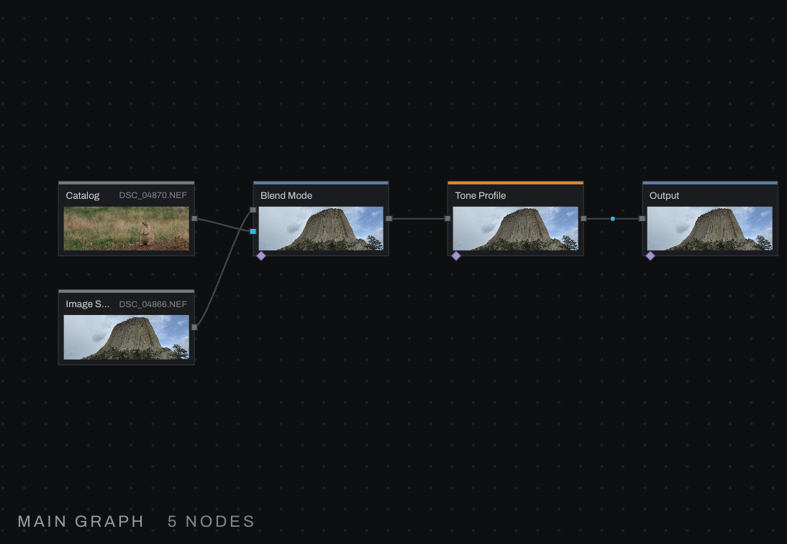

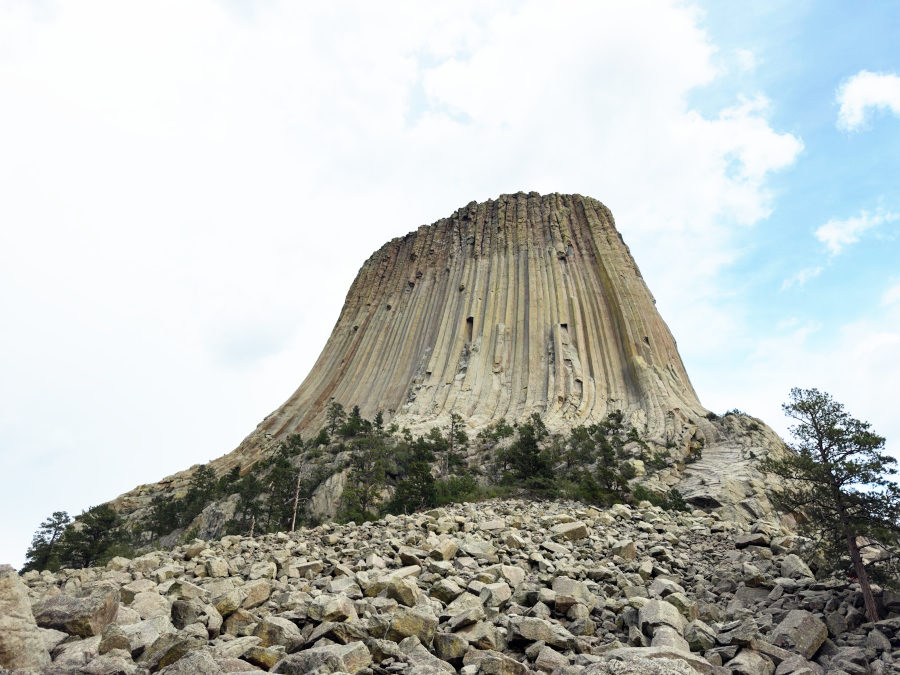

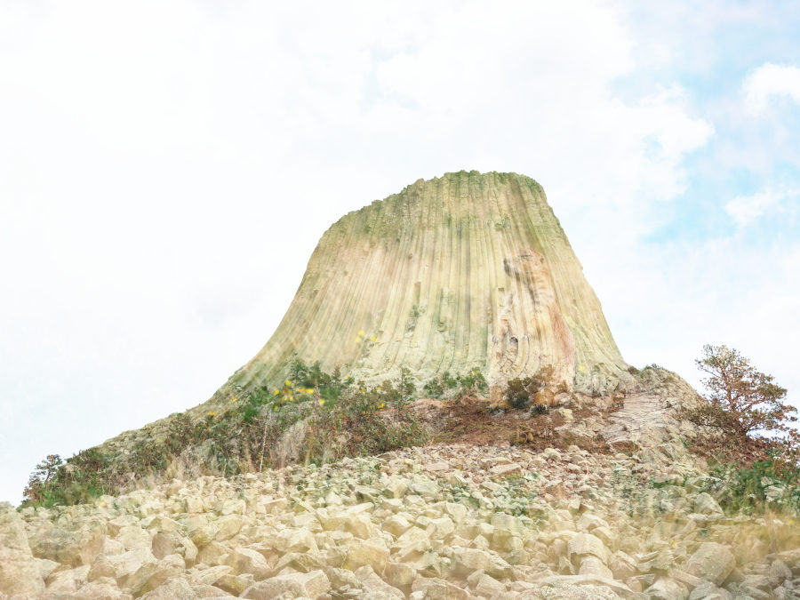

## Texture overlay

A file from disk, placed with Transform and laid over the photograph in Soft Light.

```
Image Source > Blend Mode.base
File > Transform (size 130, rotate 8, move X 6) > Blend Mode.top
Blend Mode (Soft Light, opacity 45, fit Fill) > Tone Profile > Output
```

Soft Light darkens where the texture is dark and lightens where it is light without blowing anything out. Transform makes the texture a little larger than the frame and turns it so its edges never show; what leaves the frame is gone and what enters is transparent, so no border appears.

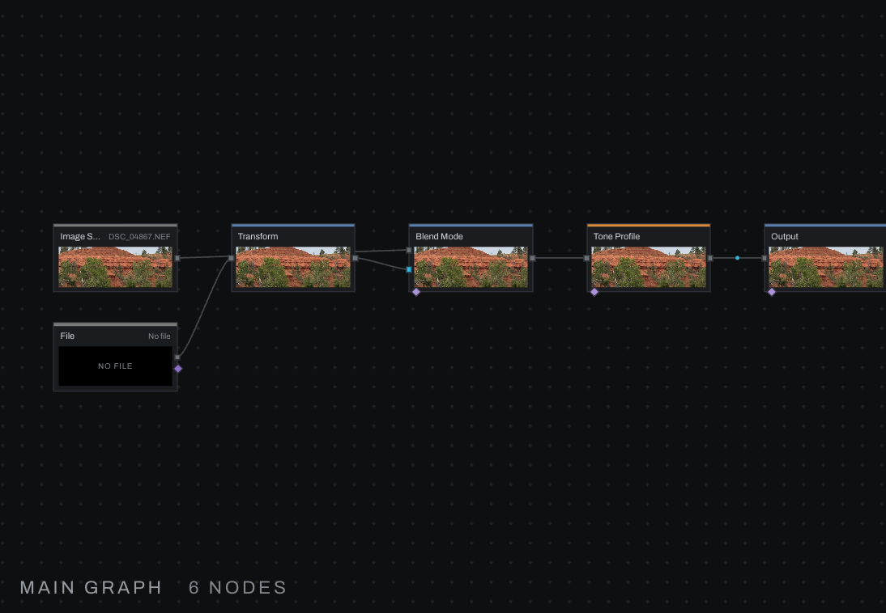

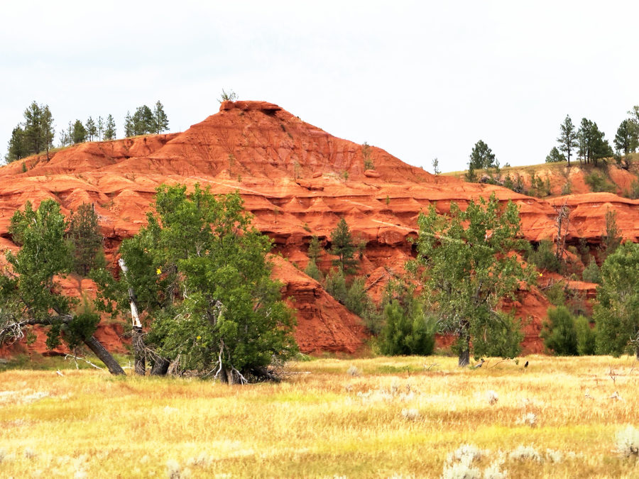

## False color from three measures

Three Measures of the same picture become a picture: luma as red, chroma as green, saturation as blue.

```
Image Source > Measure (luma)       > Channel Join.r
Image Source > Measure (chroma)     > Channel Join.g
Image Source > Measure (saturation) > Channel Join.b
Channel Join > Output
```

An analysis view rather than a look: bright areas go red, colorful areas go green and blue, neutral shadows go black. The same shape rebuilds a picture from three remapped channels; put a Remap or Math on any plane before the join.

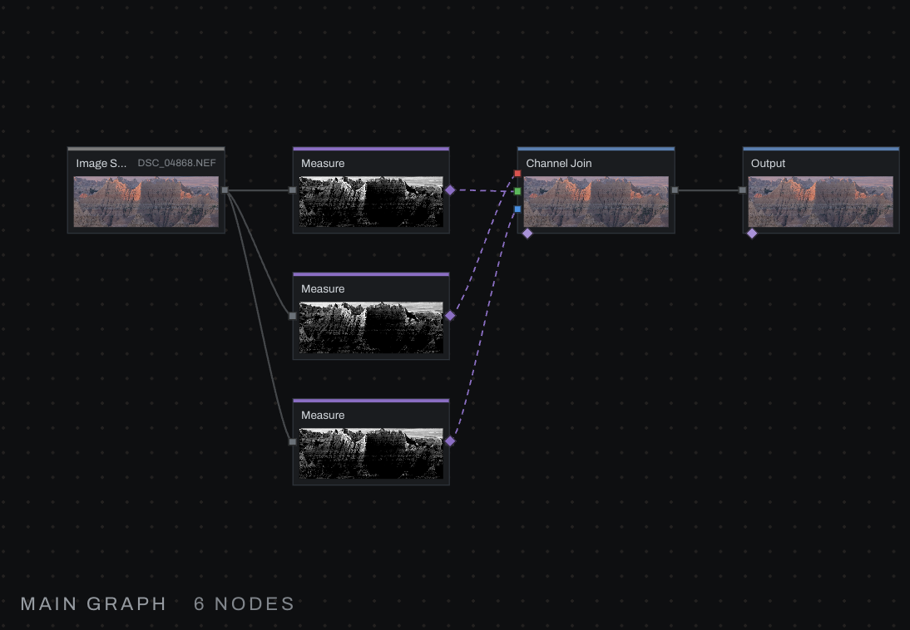

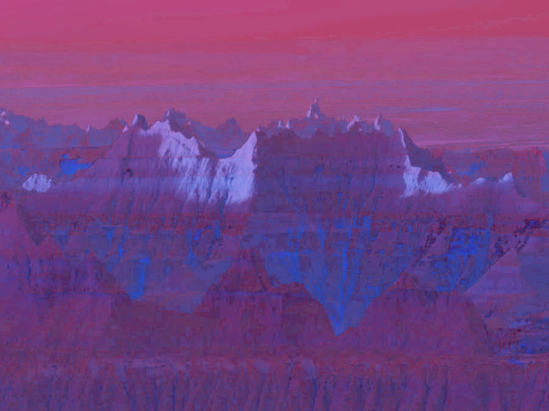

## Darken the bright tones only

A condition built from the picture chooses between two branches per pixel.

```
Image Source > Measure (luma) > Compare (gt, level 0.25, softness 0.1) > Conditional.condition
Image Source > Exposure (-1.5 stops) > Conditional.then
Image Source > Conditional.else
Conditional > Tone Profile > Output
```

Where luma passes the level the then branch shows, the darker one; elsewhere the picture is untouched; the softness crossfades the two. Measure reads scene-linear light, so 0.25 is already a bright tone, about 0.55 on screen. Swap the then branch for any other treatment: a Color Grade, a Blur, a second Catalog.

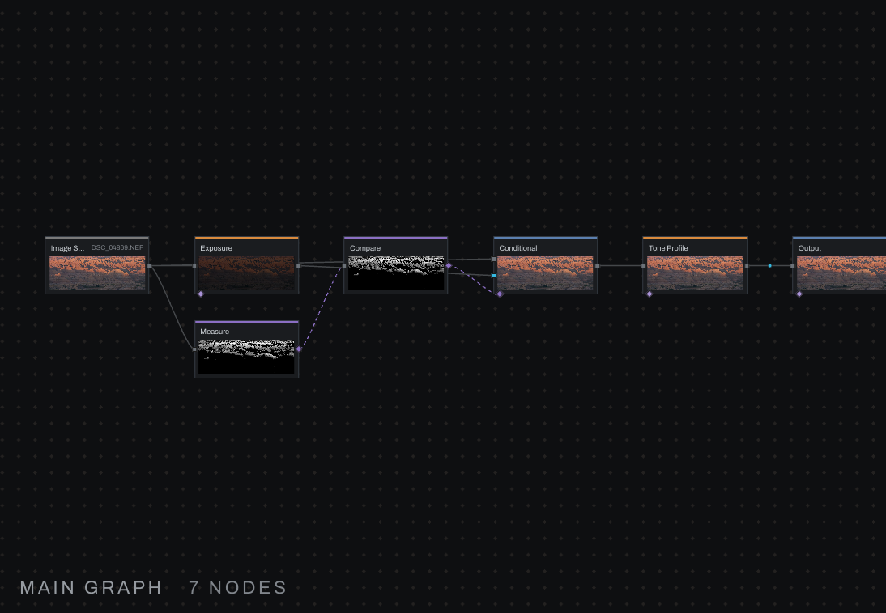

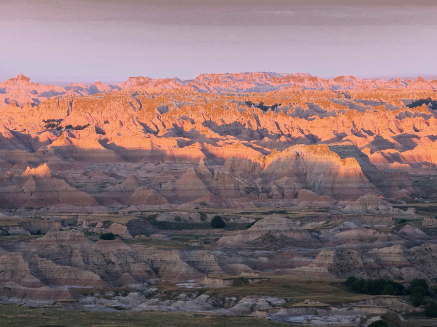

## Detail where the light is

Clarity and texture limited by a Luminance Mask, so the shadows keep their softness.

```
Image Source > Luminance Mask (low 0.35, high 1, feather 0.2) > Detail.mask
Image Source > Detail (clarity 45, texture 25) > Tone Profile > Output
```

The mask is a field on Detail's mask port: 1 where the picture is bright, 0 where it is dark, a ramp between. Any mask works here, a Radial for a face, a Smart Mask for the subject; this is what a Develop layer does with a mask of its own.

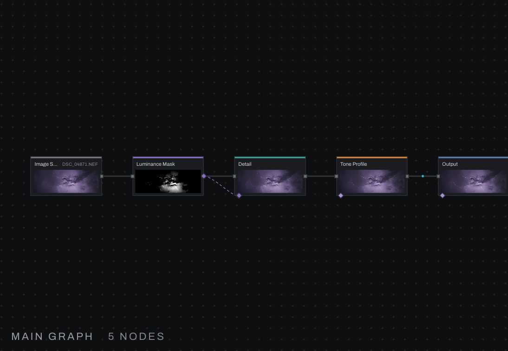

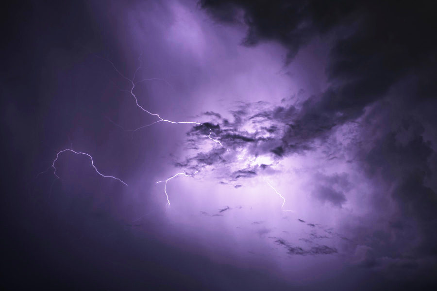

## Brightness and color smoothed apart

Noise reduction as a network: a light touch on luma, a heavy one on color.

```
Image Source > Luma / Color Split (luma)  > Denoise (15) > Luma / Color Join.brightness
Image Source > Luma / Color Split (color) > Denoise (70) > Luma / Color Join.color
Luma / Color Join > Tone Profile > Output
```

Color noise is blobby and forgivable, so it can be smoothed hard; luminance noise sits beside the detail and cannot. This is the Noise Reduction section, built by hand, and open to anything else between the split and the join.

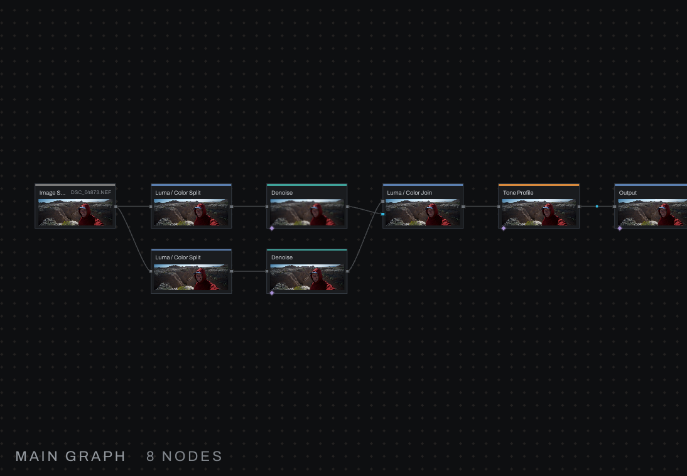

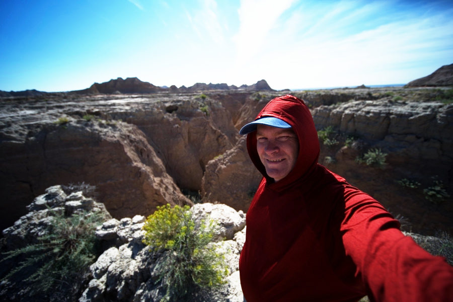

## Grade one family of color

A Hue Range Mask on the blues drives a Color Grade: sky and water shift and deepen, nothing else moves.

```
Image Source > Hue Range Mask (center 210, range 70, falloff 30) > Color Grade.mask
Image Source > Color Grade (hue shift -18, saturation 30, exposure -0.3) > Tone Profile > Output
```

This is a Color Set, which Adjustments builds for you as a pair; wired by hand you can put anything behind the mask, or feed the same mask to several nodes.

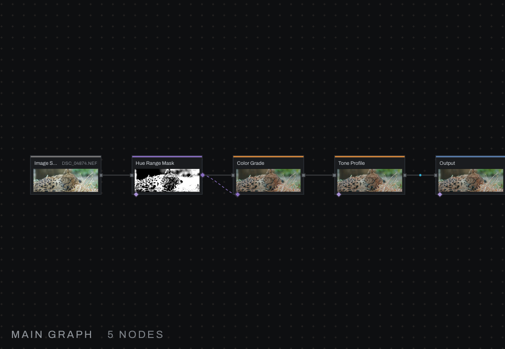


## A filmic rendering that stays in gamut

View Transform in place of the Tone Profile, then a Gamut Map.

```
Image Source > Color (saturation 45, vibrance 30) > View Transform (AgX, exposure 0.4) > Gamut Map > Output
```

The View Transform is the scene-to-display rendering, so the Tone Profile is left out rather than doubled. Strong saturation before a filmic curve pushes colors past the display; the Gamut Map eases them back with their hue held, which is what the viewport's gamut warning offers to insert for you.

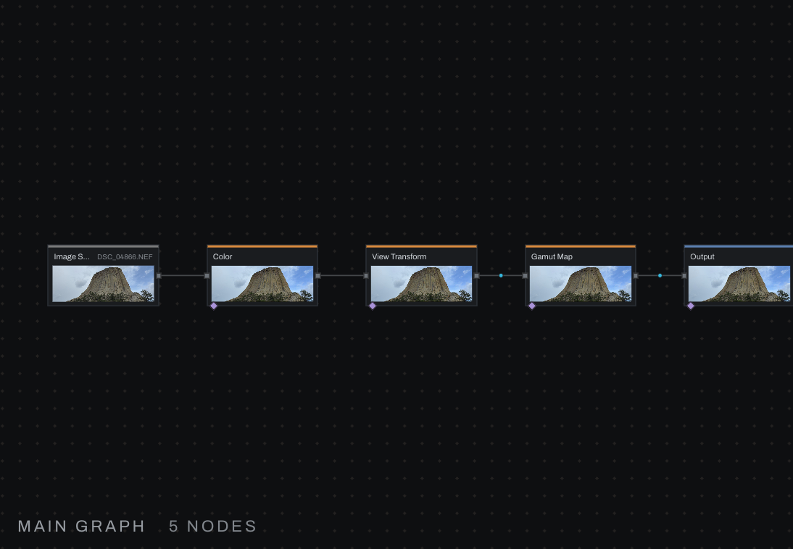

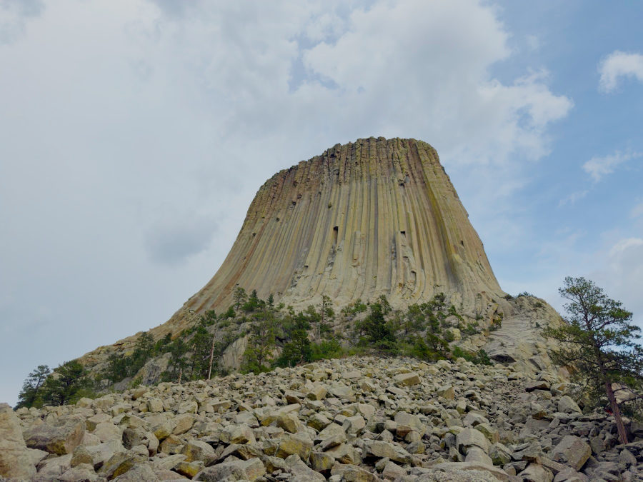

## Building your own

- Start from the photograph's chain and branch: drag from any output to a second node, then bring the branches back together with Merge, Blend Mode or Conditional.
- Keep linear work (Exposure, Color, Relight) before the Tone Profile and Curves after it.
- A field can feed any number of mask ports; make it once.
- Save a working branch as a group and publish the two or three controls that matter.
