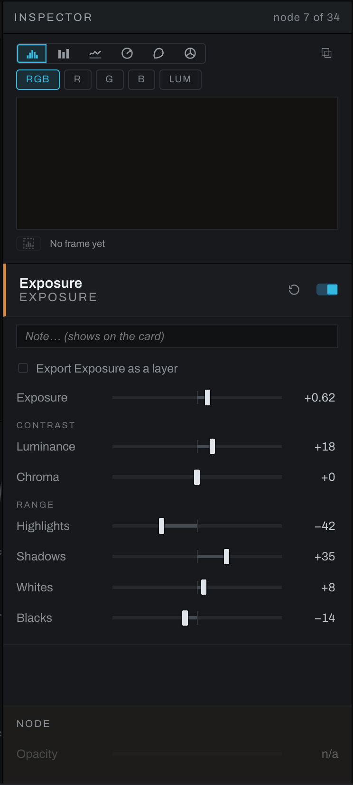

# Node inspector

The Inspector is the right panel in Graph. It edits selected nodes and presents actions that operate on the selection or graph.

## No selection and multiple selection

With no node selected, the Inspector provides graph-level context and actions where applicable. With multiple nodes selected, it reports the selection and offers actions that can apply to the set. Select one node to edit parameters.

## One selected node

The Inspector shows the node's name and, under it, what type of node it is in the palette's words (EXPORT LAYER, DISPLACEMENT MAP), so a renamed node still says what it is. Hold the pointer over that line and the status line at the bottom of the window says where the palette lists the type, as category, section and type (Masking / Range Masks / Hue Range Mask), with " · masked" when a mask feeds it; for a group it says Group, the tool or recipe it came from, and its member count. The type beside each node in a multiple selection does the same. Long parameter names in the generic rows end in an ellipsis rather than running into the slider; hover one for the whole name. A group reads GROUP, or GROUP / SHARPENING and GROUP / the recipe's name when it came from a tool or a recipe, followed by its member count. Then come the enabled state, mask status, and operation controls. Ordinary parameters appear as sliders, values, menus, color fields, files, curves, or purpose-built graphical editors. Graph can expose expert parameters that the simplified Adjustments section does not. A reset glyph sits beside the enable switch.

Every mask node carries the rows a Develop layer's mask block has: **Invert mask** at its foot and, on the masks that read depth, the **Depth mask** block (its switch, the Levels on the depth map, and Invert depth). Depth Lighting's node has its **Invert depth** switch, the Radial Mask its **Shape**, and the Smart Mask its own face (see [Masking nodes](nodes/masking.md#smart-mask-heelersmart_mask)).

A node with no dials, such as Conditional or Channel Join, shows a port guide instead: each port's name, what it is for in plain words, and what feeds it. A Color Set's card shows the set's mask eye and eyedropper above its controls, as in Develop. The Opacity row at the bottom belongs to nodes that have one; on the others it reads n/a.

Use the **Note** field to record why the node exists or how it should be used. The note also appears on the node card.

## Actions

- Rename the node.
- Enable or disable it.
- Reset it to its defaults.
- Probe its output in the image viewport. The scopes also read the probed output. Close the probe badge in the viewport to return to final output.
- Compare two branch endpoints A/B in the viewport and drag the divider.
- Bake a compatible color branch to a `.cube` LUT.
- Delete the selection with configured neighbor healing.
- Auto-arrange the graph.

## Published group controls

Publish a control by opening the group, selecting a member, and right-clicking its control in the Inspector. Give it a name, or join it to an existing published control. Close the group and choose **Edit controls** to change names, order, slider ranges, and Reset values. Each edit is one Undo step. See [Node recipes](recipes.md#publish-controls-to-the-group) for the complete workflow.

## Inspector location

Only one window owns the Inspector. If the graph is popped out, the Inspector can move with it and the main window shows an Inspector rail. Click the rail to bring it back.
