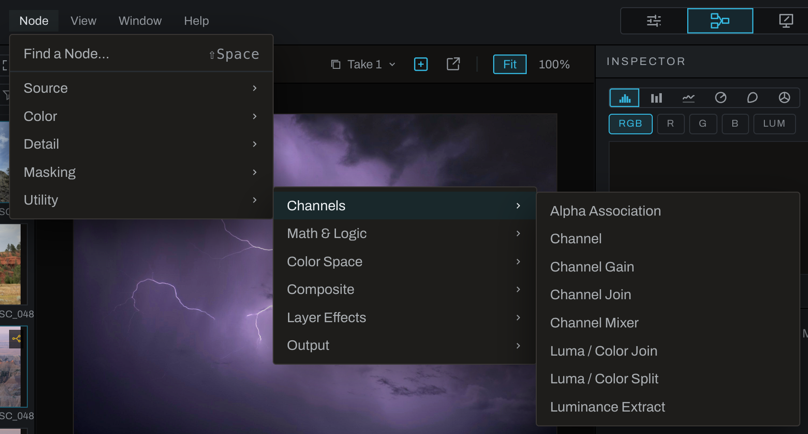

# Node reference

Every node Heeler can place, what it does, what its ports carry, and how it is used. Nodes are listed the way the graph's **Add** menu and the menubar's **Node** menu list them: by category, then by section, then by name. Each node's entry has a **Menu** line with its full path, category > section > node, such as **Masking > Mask Tools > Morphology**: choose **Node > Masking > Mask Tools > Morphology** in the menubar, or **Add > Masking > Mask Tools > Morphology** from the graph's right-click menu. The Inspector shows the node's type under its name, such as CHANNEL. Point to that line to see its category and section. The stripe a card wears is its own kind and does not change with the menus, so a few nodes are listed under a category whose color they do not wear; each chapter names them. Many operations also appear in Adjustments. Graph-only tools, such as Morphology and Displacement Map, are added here; they have no Develop section or Finish layer.

## Two kinds of data

Wires carry one of two things, and the engine never mixes them without a node in between:

- **rgb**, an image. Gray square ports on the left of a card take it; the gray square on the right gives it.
- **alpha**, a single-channel field. Every mask, Measure, Compare, Logic, Math and Remap gives one, from the purple diamond on the right. Every node that can be limited takes one on the purple diamond at its bottom left, and the logic-family nodes take fields as their inputs.

An image becomes a field through Luminance Extract, Channel or Measure. Fields become an image through Channel Join. Hover any port to read its name and what it carries.

## Categories and sections

- [Source nodes](source.md): [Source](source.md#source) (the photograph, other pictures, the color checker) and [Geometry](source.md#geometry) (crop, lens, perspective, warps, transform, displacement).
- [Color nodes](color.md): [Tone](color.md#tone), [Color](color.md#color) and [Looks](color.md#looks).
- [Detail nodes](detail.md): [Sharpen & Detail](detail.md#sharpen--detail), [Blur & Smooth](detail.md#blur--smooth), [Noise](detail.md#noise), [Film & Lens](detail.md#film--lens), [Depth](detail.md#depth) and [Retouch & Paint](detail.md#retouch--paint).
- [Masking nodes](masking.md): [Masks](masking.md#masks), [Range Masks](masking.md#range-masks) and [Mask Tools](masking.md#mask-tools).
- [Utility nodes](utility.md): [Channels](utility.md#channels), [Math & Logic](utility.md#math--logic), [Color Space](utility.md#color-space), [Composite](utility.md#composite), [Layer Effects](utility.md#layer-effects) and [Output](utility.md#output).

Searching the node palette (`Shift+Space`) for a category or section word lists its nodes after any name that matches: **utility** still finds everything the Utility menu held before the sections, and **channels** finds the Channels section.

See [Advanced graph tools](../advanced-nodes.md) for a task-based introduction to the graph-only additions.

## Shared behavior

- **Bypass.** Every card has a switch. Off passes the input through untouched; a source keeps giving its picture.
- **Mask.** A field on the mask port limits where a node applies: 1 is full effect, 0 is untouched, and a feathered field crossfades.
- **Starting values.** The Inspector shows the node's actual defaults. Some edits start neutral, but filters and generators can change the result as soon as they are connected.
- **Reset.** The reset glyph beside the switch, or Reset on the context menu, puts every dial and choice back to its defaults and leaves strokes and the switch alone.
- **Thumbnails.** Each card shows the engine's own picture at that node, so a change downstream never alters the cards before it.

See [Example networks](../examples.md) for complete graphs built from these nodes, each one rendered to prove it runs.

