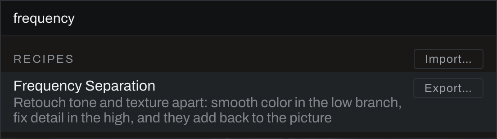
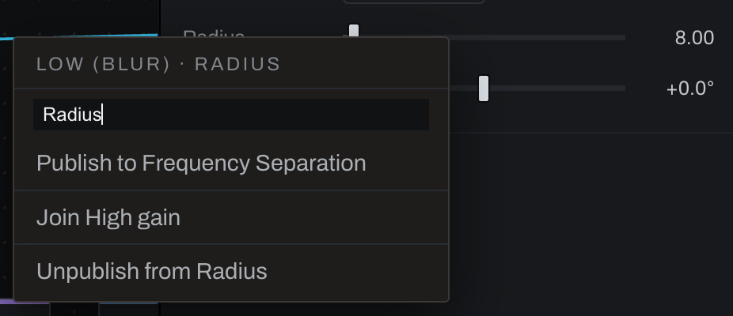
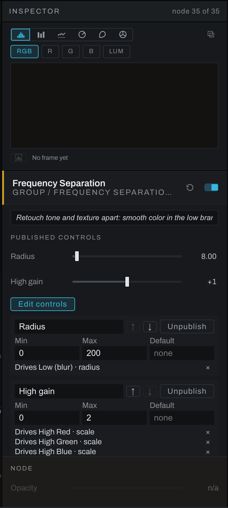

# Node recipes

A recipe is a ready-made group of nodes you drop into your graph. Where a preset replaces the whole graph, a recipe adds one group at the spot you choose and changes nothing else: every node, wire and setting already there stays as it was. Drop the same recipe twice and you get two groups that know nothing of each other.

A dropped recipe is an ordinary group. Its published controls are in the Inspector when the group is selected; double-click it to open it and work on the nodes inside, rewire them, or add your own.

## Drop a recipe

- **The node palette.** Press `Shift+Space` (or click the `+` above the color key) and look under **Recipes**, below the nodes. Typing searches recipes too: "subtract" finds Image Arithmetic, "clean plate" finds Difference Key. Click one, or move to it with the arrow keys and press `Enter`.
- **Right-click the graph.** **Add > Recipes** lists the same recipes.

The group lands where you pointed or right-clicked, or beside that spot when a card is already there. Wire it like any node: drag a picture onto its input (a two-input recipe takes its second picture on the lower input), and drag from its output. Recipes drop into the main graph; while a group is open, leave it first. Dropping a recipe is one undo step.



## The built-in recipes

### Frequency Separation

Retouch tone and texture apart. One picture in, one out. Inside, a Gaussian **Blur** makes the low frequencies (color and tone), the picture minus the blur makes the high frequencies (texture and detail), and the two add back to the picture. With nothing edited, the output is the input.

- **Radius**: the blur's size in pixels. Larger puts more of the picture's structure in the high branch.
- **High gain**: how much of the high branch adds back, from 0 to 2; at 1 you get the picture back. At 0 you see the low branch alone, which helps you judge the radius; above 1 the detail is stronger than in the picture.

Open the group to retouch. Splice tone and color edits (a Curves, a Color Wheels, a brush-masked Exposure) after the **Edit low here** node, and detail edits after **Edit high here**. The high branch is signed around zero, so an edit there works on the difference from the blur, not on a picture.

### Image Arithmetic

Two pictures combined by the numbers, channel by channel. **Operation** chooses **Add**, **Subtract**, **Multiply** or **Divide**. The results are not clipped: a subtract can go below zero and stays there, so a later add brings the picture back exactly. Divide is safe: where B is zero the result is zero, never a broken pixel. The transparency is A's.

### Difference Key

A mask of what changed between two pictures of the same scene: the foreground on the upper input, a clean plate (the scene without the subject) on the lower. The mask is white where any channel differs by more than **Threshold**, with **Softness** feathering the edge. **Cleanup** (0 to start, in the photograph's pixels) runs a **Morphology** Open on the mask: specks of noise narrower than about twice the radius go and the shapes stay where they were. Identical pictures give a mask of nothing.

### Depth and Color Matte

A mask by distance and by color at once. The picture goes to the input and the Depth Map's depth output to the group's depth diamond. **Near** and **Far** set the band of depth that is kept (0 is nearest, 1 farthest), each edge with its own feather; **Hue**, **Hue width** and **Hue feather** set the band of color. **Combine** chooses **Intersect** (only where both hold) or **Union** (where either does).

### Channel Shuffle

Rebuild a picture from channels: each of **Red from**, **Green from** and **Blue from** takes any channel of picture A (upper input) or picture B (lower input), or a constant **0** or **1**. Swap red and blue, copy one channel into all three, or take one channel from another photograph. The transparency is A's. Wire the same picture to both inputs to shuffle a single picture.

## Making your own

Make a group the usual way (select nodes, right-click, **Save selection as group…**), wire it inside as you want it, then give it controls on the outside and save it as a recipe.

### Publish controls to the group

A group can offer any control of the nodes inside it as a control of its own, under a name of your choosing, so whoever uses the group never has to open it. This is what the built-in recipes do: Frequency Separation's **Radius** is the blur's radius inside.

1. Double-click the group to open it, and select a node inside.
2. In the Inspector, right-click the control you want on the group (a slider, a menu such as a blur's **Kind**, or a switch).
3. Type the name it should have on the group (it starts as the control's own name) and press `Enter`, or click **Publish to** and the group's name.

Publish a second control under the **same name** and it joins the first: one slider on the group then moves both. That is how Frequency Separation's **High gain** sets the red, green and blue detail at once. The menu also lists **Join** and each control the group has of the same kind, so you need not retype a name. A slider can join a slider whose range fits inside the range of the setting you are publishing; a menu can join a menu when that setting offers every choice the menu has. When they do not fit, the status line says why and nothing changes. A menu or a switch publishes as a menu on the group (a switch reads **Off** and **On**).

Right-click a control that is already published and the menu offers **Unpublish from** that control.



### Edit the group's controls

Close the group, select it, and click **Edit controls** under its published controls. For each control:

- **Name**: type a new one and press `Enter`.
- **↑** and **↓**: move it up or down the group's list.
- **Min** and **Max**: the slider's range on the group, which can be narrower than the node's own.
- **Default**: what the group's **Reset** (the arrow beside its switch) sets this control to. Left at **none**, Reset leaves it alone.
- The lines under it say which node and setting each control drives; **×** on a line stops the control driving that one.
- **Unpublish**: the group stops offering the control.

Unpublishing never changes a value: the nodes inside keep the settings they have. Every change here, and every publish, is one undo step. Published controls are saved with the photograph and travel with the group through Takes, **Copy Edits** and **Paste Edits**, **Duplicate** (`Cmd+D`, `Ctrl+D` on Windows) and **Save as Recipe…**.



### Save as a recipe

Select the group, right-click, and choose **Save as Recipe…**. Type a name and press `Enter`. The group's description becomes the recipe's line in the palette.

The recipe is saved as a file in your recipes folder (see **Recipe files** below) and lists under **Recipes** with the built-ins, on every photograph and in every catalog. In the palette each of your recipes has **Export…**, **Rename** (which renames its file too) and **Remove**, which moves its file into the folder's `.trash`; nothing is erased, and groups you already dropped stay in their graphs.

A recipe is a copy of the group as it was when you saved it. Changing a dropped group later does not change the recipe, and saving again makes a second recipe.

Groups that belong to Develop (Sharpening, Skin Softening) and the Finish stack are not offered: their controls live in Develop and Finish. A group holding brush strokes or selections is not saved either: those belong to a photograph. Neither is a group with another group inside it, since a recipe holds one level of nodes; the status line says which node stopped it. The status line says **Saved** only once the file is written. A recipe whose file could not be written (one of the groups above, or a recipes folder Heeler cannot write to) stays in the palette grayed, with **Not saved** and the reason under its name, until you **Remove** it.

## Recipe files

Each of your recipes is a plain text file in YAML, a format made for people to read and edit by hand, so you can open a recipe in any text editor, change it, and share it as a file.

### Where they live

In your recipes folder, beside the presets folder, one folder per category:

- macOS: `~/Library/Application Support/com.vagabondburro.heeler/recipes/`
- Windows: `%APPDATA%\com.vagabondburro.heeler\recipes\`
- Linux: `~/.local/share/com.vagabondburro.heeler/recipes/`

A recipe you save from a group goes in `Personal`; an imported file goes in the folder its `category:` names, or `Personal`. Files end in `.heelerrecipe`. Heeler reads the folder each time you open the node palette, so a file you add or edit by hand lists the next time you open it. **Remove** moves the file into `recipes/.trash`; to bring it back, move it out again.

### Import and export

- **Import…**, beside the **Recipes** heading in the node palette (`Shift+Space`), adds one or more `.heelerrecipe` files. Each is checked first; a file that cannot be read is not added, and the status line says which and why. An imported file keeps its comments.
- **Export…** on any recipe, the built-ins included, saves it as a file wherever you choose. Exporting a built-in is a good way to start your own: it is a working example.

A file in the folder that Heeler cannot read is not hidden: it lists grayed under **Recipes**, with the reason and the line, until you fix it or remove it. The graph's right-click **Add > Recipes** lists the same recipes, read from the folder each time the menu opens, with such a file grayed there too (point at it and the status line gives the reason).

### The format

A recipe file is a list of fields. The order of the fields does not matter, indentation does (Heeler writes two spaces a level), and a `#` starts a comment. Anything Heeler does not know is an error with its line number rather than something quietly ignored, so a typing slip is caught.

```yaml
# Soft Glow: the picture blurred and laid back over itself in Screen.
heeler_recipe: 1            # the format's version; always 1 for now
name: Soft Glow             # the name in the palette
description: A dreamy glow over the highlights, its size and strength on the group
category: Looks             # the folder it imports into (optional)
keywords: glow bloom orton  # extra words the palette search finds (optional)

inputs:                     # the group's inputs and the node each one feeds
  in: picture.in            # input "in" lands on the Picture node's "in"
output: glow                # the node whose picture leaves the group

nodes:                      # each node by a short name of your choosing
  picture:
    type: heeler.merge      # a Merge with one input passes the picture through
    name: Picture           # the name on the card (optional)
    at: [0, 100]            # its place inside the group (optional)
  soften:
    type: heeler.blur
    name: Glow blur
    at: [170, 0]
    params:                 # only the settings that differ from the node's defaults
      radius: 25
      kind: gaussian
  glow:
    type: heeler.blend
    name: Glow
    at: [340, 100]
    note: Screen lays the blur over the picture
    params:
      mode: screen
      opacity: 60

wires:                      # node.port to node.port
  - { from: picture.out, to: soften.in }
  - { from: picture.out, to: glow.in }      # the base
  - { from: soften.out, to: glow.in2 }      # the layer on top

controls:                   # the group's published controls, in order
  - label: Size
    drives: [soften.radius] # one slider can drive several: [a.radius, b.radius]
    range: [0, 150]         # the slider's span on the group (optional)
    default: 25             # what the group's Reset sets (optional)
  - label: Strength
    drives: [glow.opacity]
    range: [0, 100]
  - label: Blend            # a menu: each choice sets one or more settings
    options:
      - label: Screen
        set: { glow.mode: screen }
      - label: Soft Light
        set: { glow.mode: soft_light }
```

The fields:

- `heeler_recipe` (required): the format version, `1`. A file from a newer Heeler says so rather than being half read.
- `name` (required), `description`, `category`, `keywords`: words. The description is the recipe's line in the palette and the group's note.
- `nodes` (required): each node under a short name (letters, digits and underscores, starting with a letter), which the rest of the file uses to point at it. In each node: `type` (required; the node's type as the [node reference](nodes/README.md) gives it beside each node's name, such as `heeler.blur`; exporting a recipe that uses the node shows it too), and optionally `name`, `at` (`[x, y]`), `enabled` (`false` to put it in switched off), `note`, `tint`, and `params`. `params` lists only what differs from the node's defaults, numbers as numbers and choices as their words (`kind: gaussian`); a choice the node does not offer is an error that lists the ones it does. A Curves node also carries its points under `curves`.
- `wires`: `from: node.port` and `to: node.port`. Outputs are `out` (every node), `depth` (Depth Map's farness plane) and `mask` (a File node's alpha). Inputs are `in`, `in2` and `in3` for pictures, `mask` for the mask diamond, `alpha` and `depth` where a node has them. `from: blur` alone means its `out`, and `to: glow` alone its `in`.
- `inputs`: the group's own inputs, `in`, `in2`, `in3`, `mask` and `depth`, each feeding a node's port; a list (`in: [a.in, b.in]`) feeds several. `output` (required): the node whose output leaves the group, or `node.depth` for a Depth Map's plane.
- `controls`: what the group offers from outside, in order. A slider has `label`, `drives` (one or more `node.setting`), and optionally `range` and `default`. A menu has `label` and `options`, each choice with a `label` and `set`, the settings it writes; a menu shows the choice whose settings all hold. See [Publish controls to the group](#publish-controls-to-the-group).

Words that look like something else are still words: `no`, `yes`, `on` and `off` are text (YAML 1.2), so `mode: no` would be the word "no". Put a value in quotes when you want to be sure: `name: "Glow: soft"`.

Heeler keeps a file's comments when it imports it, but writes a fresh file without them when it saves a recipe from a group or renames one, so keep lasting notes in `description` or a node's `note`. A file may be up to 1 MB with up to 500 nodes. A recipe file is only data: reading one never runs anything.

## Recipes and the rest of the graph

A dropped group travels with the photograph like any node: **Copy Edits** and **Paste Edits**, Takes, and saved graphs carry it. It renders the same at Fit, 1:1 and in the export.
