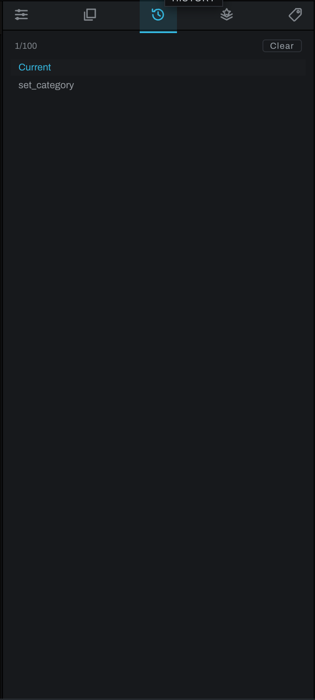

# History tab

History records edits for the active photograph and lets you return to an earlier state.

## Using History

The top of the list is **Current**. Earlier edits appear below in reverse order. Click a step to revert the photograph to the state before that step. Heeler updates the viewport and controls together.

History is photograph-specific. Opening another photograph shows that photograph's history. Up to 100 recent steps are displayed in the panel.

## Undo and redo

Use **Edit > Undo** to step backward and **Edit > Redo** to step forward. A history jump is useful when the desired point is several operations back. New editing after moving backward establishes a new current path, so verify the image before continuing.

History tracks editing operations, including graph and layer changes. File management and exported output files are not transformed into image-edit history entries.
