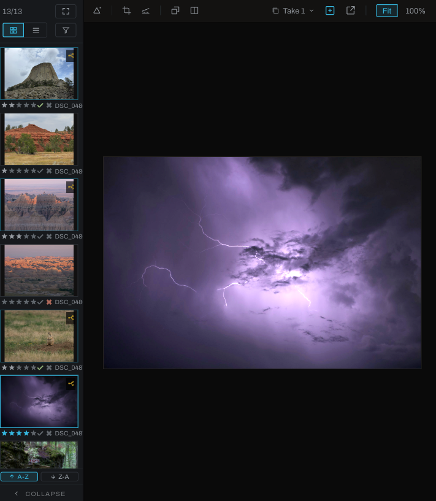

# Image viewport

The image viewport is the central canvas for viewing, comparing, cropping, selecting, and painting on the active photograph.

## Zoom, pan, and rotate the view

- Click **Fit** (or press `F` in Develop; `Cmd` (`Ctrl` on Windows)+`0` anywhere) to fit the photograph inside the available space. In Graph and Canvas, `F` frames the nodes instead, so F always fits the view to what matters.
- Click **100%** (or press `Cmd+1`, `Ctrl+1` on Windows) for one image pixel per display pixel: a pixel of the screen itself. On a display scaled to 125 or 150 percent, or a Retina Mac, the photograph at 100% is smaller than its size in points, and every one of its pixels reaches the screen without being resampled. Scrolling toward 100% from Fit lands on it exactly, and the view is kept on whole screen pixels however you pan or zoom there, so no pixel is blended with its neighbor on the way to the screen.
- Scroll or pinch to zoom around the pointer.
- Hold `Shift` or `Cmd` (`Ctrl` on Windows) while scrolling to pan. On a touchpad the two-finger scroll pans both axes at once; a mouse wheel pans sideways with `Shift` and vertically with `Cmd` (`Ctrl` on Windows).
- Hold `Option` (`Alt` on Windows) while scrolling for finer zoom.
- Middle-drag to pan, or hold `Space` and drag: the same pan for a touchpad, where there is no middle button.
- A drag that starts on the photograph carries on when the pointer leaves it, until you let go: a marquee or lasso, a crop handle, a gradient's handle, the straighten line, a layer's Transform or Warp handle or a brush stroke. Drag past the edge to be sure a selection or a crop reaches it. A rectangle, ellipse, freehand or magnetic selection can also begin on the gray around the photograph, which shows the selection cursor while one of them is armed, and its outline is drawn where the pointer is, out in the gray too; when you let go, the selection is the part of the shape inside the picture, so an ellipse past the edge is cut there rather than shrunk; a crop, gradient or straighten handle stops at the picture's edge, and a brush paints only what it covers inside.
- Hold `Shift+Option` (`Shift+Alt` on Windows) or `Cmd+Option` (`Ctrl+Alt` on Windows) while scrolling to rotate the view, one way or the other. `Shift+Option` (`Shift+Alt` on Windows) with a middle-click puts the rotation back.

View rotation is temporary navigation, not an edit. Straighten and crop are edit operations and are recorded in History.

## Before/after and split view

The toolbar's buttons are icons: a gamut triangle for the warning, crop corners, a horizon being leveled for Straighten, two frames for Before/After and a divided frame for Split. While the Finish layers are up, **Flip Horizontal** and **Flip Vertical** follow Straighten and mirror the selected layer (see [Flipping a layer](finish/README.md#flipping-a-layer)). Each names itself in the status bar when the pointer rests on it.

**Before/After** toggles between the developed result and the untouched source. **Split** overlays the result on one side and the source on the other; drag the divider to inspect transitions. In Graph, A/B comparison can show the outputs of two selected nodes using the same draggable divider.

Arming Crop or Split raises a floating bar over the top of the canvas with that tool's settings; it disappears when the tool is put away, and the photograph never moves for it. Before/After always compares the untouched original against the current take. In Split, once a photograph has more than one take, the bar's selector chooses what "before" means: the original, or another take's rendered result, with the labels following the matchup (for example `TAKE 2` against `CURRENT`).

While Split is on, its modes (Line, Grid, Radial) appear beside the button, followed by three controls every mode shares: **Reset** puts the current mode back to fresh (the centered bar, the 3x3 grid, or the centered slice at its starting angles), **Reverse** flips which pixels show the original, and **Bar** shows or hides the divider lines without touching the split, drawn in whatever color the swatch beside them holds. Every number field in the seat can be typed into or scrubbed by clicking and dragging sideways.

- **Line** is the classic divider, now rotatable: drag the round handle to turn the bar (hold `Shift` for 10 degree steps), drag anywhere else to move it, and double-click the handle to reset. The degrees field edits and scrubs; hold `Shift` while scrubbing for 5 degree steps.
- **A/B** shows the same part of the photograph twice, before beside after, split evenly down the middle; its toggle stacks the panes instead. Zoom to 1:1 on a detail and both halves frame it, and panning reframes them together.
- **Grid** divides the view into a checkerboard where alternate cells show the original. Set the counts with the X and Y fields, or drag a grid line: left and right on a vertical line changes the column count, up and down on a horizontal one changes the rows.
- **Radial** cuts a slice around a point. The point moves only by dragging its handle (its exact position is in the X and Y fields); drag either edge line to turn or resize the slice, holding `Shift` for 5 degree steps.

## Gamut and highlight warning

The warning display marks colors outside the display gamut in red and clipped highlights in white. Its badge can identify the operation responsible. When offered, **Fix** inserts a Gamut Map node immediately after the responsible node; one Undo removes it.

## Crop and straighten

Choose **Photo > Crop / Straighten > Straighten**, then drag along a line that should be level. Choose **Crop** and drag the frame handles. Select Free, a common aspect ratio, or enter a ratio of your own as width and height in the two fields beside the menu; Enter or clicking away applies it. Cropping is nondestructive: pixels outside the crop remain in the source and can be restored. A photograph carries no Crop & Rotate node until the first drag or the Geometry section builds one; `Esc` after a first drag takes it out again. Moving to another photograph puts the tool down, keeping what you dragged, and the next photograph starts back at Free.

The calculator button at the right end of the crop bar opens the **aspect ratio calculator**. Enter a resolution in pixels, width then height (or click **Photo** for the photograph's own size), and it shows the ratio in lowest terms with its decimal: 1920 by 1080 is 16:9, 1.778:1. **Apply to crop** holds the crop to it. **Save** keeps it under the name you type, or under the ratio itself if you leave the name empty; saving a name you already used replaces that ratio. Saved ratios are listed in the calculator, where a click applies one and × deletes it, and they also appear after the common ratios in the crop bar's menu and in **Photo > Crop / Straighten > Crop to Aspect Ratio**. They belong to you rather than to a photograph, so they are there for every photograph. `Esc` closes the calculator and leaves the crop tool up.

## Picks and on-image controls

Some adjustments arm an on-image picker, such as white balance, Curves, Relight, Color Tune, Recolor, and Color Sets. The active picker is shown in the viewport. Click or drag as instructed by the section; leave the picker to return to ordinary navigation.

While the Color Sets picker is armed, hovering the photograph draws a faint marker on the set's color bar at the hue under the cursor, so you can see where a click would land; a gray keeps the marker where it was. The picker changes the selection only while the left button is held: click to center the band on the sampled color, or press and drag to sweep across a subject and gather it in one stroke. Turn on the set's mask eye first to watch the selection follow the drag. The status line shows which set you are picking for and what the modifiers do; press `Esc` (or the set's picker button) to turn the picker off.

## Selections

The Select tool supports rectangle, ellipse, pen, freehand, magnetic, color brush, color pick, region, and smart methods where available. Hold `Shift` to add, `Option` (`Alt` on Windows) to subtract, both to intersect, and `Cmd` (`Ctrl` on Windows) to draw rectangles or ellipses from the center. The cursor badge shows the active combination mode.

A selection belongs to the photograph. It can restrict painting, become a layer mask, isolate pixels to a layer, be filled, or drive object removal. Selection edges remain visible when tools change. If **Auto Clear on Click** is enabled, a plain click outside clears the selection.

## Takes

Takes are alternate edits of one photograph. Open the Takes control, create a take, and switch among versions without duplicating the source file. `Shift`-click New Take to name it immediately. The active take is reported in Metadata.

The dropdown is the quick switcher. Each row shows the take's name, an ACTIVE label on the one in force, a Compare button, a rename glyph, and a delete mark. It shows no notes.

The **Takes window** (the pop-out button beside the dropdown) is for reviewing takes properly. It opens at the Preferences dialog's size and lists every take with its name, a five-star rating on the same scale as thumbnails, a Compare button, a Switch to button, Delete, and a notes field with room to read and write. Notes are written when you leave the field or press `Cmd` (`Ctrl` on Windows)+`Enter`. Ratings and notes are saved with the photograph's edits and travel with its takes. Drag the window to a second display for a side-by-side review with the viewer's compare grid.

## Tools in Finish

When Finish is active, a toolbar appears along the bottom of the viewport. Its tools paint or manipulate the active Finish layer. See [Finish toolbar](finish/toolbar.md).

## Rendering feedback

The status bar reports zoom, output resolution, processing status, and control hints. During navigation Heeler may show an available preview immediately and refine the visible region after movement stops. A probe badge appears when Graph is showing an intermediate node output; click its close control to return to the finished image.

A pending picker answer belongs to the photograph, take, and tool you clicked, so a late answer never lands on the wrong photograph. Changing photographs, takes, or presets, deleting the target, closing the picker, or adjusting the section it writes to cancels that answer, and a newer click replaces an older pending one. Adjustments elsewhere do not cancel a pick. Every armed picker, including Set focus and the light rig, closes when you change photographs, folders, takes, or presets.

For Color Sets, hold Shift while sweeping to add sampled colors. Overlapping reads are combined in sweep order, including reads that finish after release. The whole sweep is one Undo step. Starting a new gesture cancels any unfinished answers from the previous sweep.
