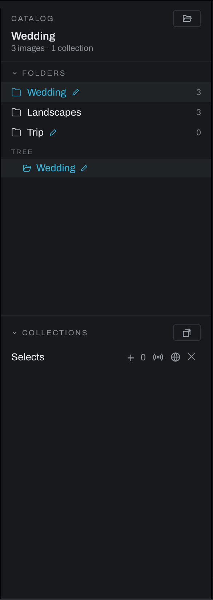

# Library view

The Library is the left panel. It organizes photographs by their actual folders and by catalog collections without moving source files.

## Open and resize the Library

Heeler reads the raw file every camera maker writes, including DNG, CR2, CR3, CRW, NEF, NRW, ARW, SR2, SRF, ARQ, RAF, ORF, ORI, RW2, PEF, SRW, IIQ, 3FR, FFF, ERF, RWL, MRW, KDC, DCR, MOS, MEF, STI, MDC, RAW and GoPro's GPR, alongside JPEG, PNG, TIFF, HEIC and OpenEXR. An OpenEXR's alpha is premultiplied by convention and is unpremultiplied on the way in, so a render on a transparent background reads at the colors the renderer composited. Monochrome sensors and grayscale scanner DNGs develop like any other. Sigma X3F is the one it does not open. The repository file `docs/raw-support-matrix.md` records the full per-camera results.

Open a folder with **File > Open folder…** or the folder icon in the Catalog header. The folder joins the current catalog and remains where it is on disk. Use the Library's collapse control to reduce it to a narrow rail; click the rail to restore it. Drag the right edge to resize the panel.

## Folders

The Folders section shows cataloged roots and, after a folder is opened, a navigable folder tree.

Right-click a folder for two ways to take it off the list. **Hide folder** removes the folder and its subfolders from the list and keeps every record: ratings, flags, keywords, collections and edits all stay, and opening the folder again brings it back. It asks once when there are photographs under the folder and not at all when there are none, since an empty folder opened by mistake is what it is for. **Flush folder…** forgets the catalog's records for the folder and its subfolders, which is why it asks twice: ratings, flags, keywords and collection membership cannot be brought back once flushed. Neither command touches a file on disk, and the edits are kept outside the catalog either way, so a folder added again after a flush returns with its edits and without its ratings.

- Click a folder to show its supported photographs in Thumbnails.
- Expand a tree row to browse subfolders.
- The count at the right is the number of photographs known in that folder.
- An edited badge marks folders containing edits.
- A trash badge marks folders with a Heeler `.trash` folder.
- Right-click a folder for folder-specific actions.

The divider under the tree changes how much height Folders receives; Collections uses the remainder and scrolls independently.

## Collections

Collections are catalog lists. A photograph can belong to multiple collections without being copied or moved.

- Click the new-collection icon (a stack of cards with a plus), type a name, and press Enter to create a collection.
- Click a collection name to show it; double-click to rename it.
- Use `+` to add the active photograph or `−` to remove it from the active collection.
- Use the delete button to remove the collection. Photographs and edits remain in the catalog and on disk.
- A **LOOK** badge indicates that the collection has an associated look.

The **Photo** menu can add or remove the current selection from the open collection and remove it from all collections.

## Sharing a collection

The broadcast button serves a view-only gallery on the local network. The sharing banner shows the URL and photograph count.

- **Copy** copies the URL.
- **Live** re-renders the share while you edit; adding `/live` to the address shows the active photograph as a proofing view.
- **Stop** ends the share and makes the link unavailable.
- The globe button exports the collection as a static web gallery folder suitable for uploading.

Only people who can reach your computer on the network and have the link can view a local share. Stop sharing when the review is finished.

## Catalogs and missing files

Use **File > Catalogs and recovery…** to create, open, copy, or merge the catalog that stores ratings, collections, and related workspace data, and to back it up or bundle your edits for [recovery](recovery.md). The catalog starts out in Heeler's own data folder, and a catalog you create or open elsewhere stays the one in use. **Move catalog…** in the same dialog copies the catalog where you choose, checks the copy, switches to it, and renames the old file beside itself with the date rather than deleting it; a folder that a cloud service syncs is not a good home for it, since the file is written while Heeler runs. Edits, previews and model caches are not in the catalog and stay in Heeler's data folder wherever the catalog lives. If a source file moved outside Heeler, select its missing entry and use **Photo > Relink…** to point the catalog to the new location.

When a newer Heeler first opens a catalog written by an older one, the catalog file itself must be updated, and that update cannot be undone. Heeler holds the catalog closed and asks first, whenever the catalog appears: at launch, through **Open catalog…**, or from the recent list. The dialog offers three answers: **Back Up and Update** (the default) writes a copy named `catalog.before-<version>.sqlite` beside the catalog first and says where it went, **Update Without Backup** updates in place, and **Quit** closes Heeler with nothing opened and nothing changed. If the backup cannot be written, nothing is updated and the choices come back with the reason. The **Update backup** preference in **Preferences > Backup** answers the dialog for you: with it on, the copy is written without asking and the dialog only confirms where it went. The command line and batch exports refuse an outdated catalog with the same advice: open it once in the app.

Moving a photograph to trash places it in a `.trash` folder beside the originals. Heeler does not empty that folder.

A trashed photograph whose file you removed from `.trash` yourself stays in the catalog until you say otherwise. **Edit > Forget Missing Trashed Photos…** finds those, lists every path in one confirmation, and removes them and their edits from the catalog. No file on disk is touched, recovery bundles made earlier still hold their edits, and there is no undo. A photograph on a drive that is not connected is not checked: the confirmation says how many were skipped and which drive. A photograph put back, or still in its `.trash`, is never offered. The item is grayed when there is nothing to forget.

The trash index can only restore a file named directly inside its `.trash` folder. An invalid file name in a hand-edited index is refused; the error names the index to inspect.

Each move is written into the trash index before the file moves, marked pending, and the mark is cleared once the file is in the trash. If the photograph moves but that second index write fails, Heeler reports both facts: the catalog marks the photograph as moved, the error names the index, and **Put Back** completes the pending entry from the file that is there. A pending entry whose file never moved settles itself on the next read. A returned photograph is likewise reported as back in its folder even if the index update fails.

A damaged or unreadable trash index stops further moves. Heeler preserves the damaged bytes beside a uniquely named `.broken` copy instead of replacing the index with an empty one. Use the folder's **Show Trash in system browser** action to inspect the files. A valid `manifest.json.good` holds the previous index. Repair `manifest.json` against the files actually present before trying again. Those copies stay in the folder; Heeler never deletes them.

## Recovering saved edits

A photograph with no saved edit starts normally. A saved edit that is unreadable or invalid shows **Saved edits need attention** and pauses automatic saving for that photograph. It does not become a new edit that silently replaces the saved file. The notice names the affected file and, when preservation succeeds, a `.broken` copy beside the original. If permissions prevent preservation, the error says so and saving stays blocked.

- **Try reading again** reads the file after you restore access or repair it.
- **Use previous saved edits** restores the previous complete save, including its takes. It is disabled when no valid previous copy exists.
- **Save current edit instead** explicitly saves the edit on screen while preserving the damaged bytes. Takes that cannot be read are not included in that new save; their original bytes remain available for repair.

If you change the edit or take while saved edits are still being read, Heeler asks which edit to keep before allowing an automatic save. A graph read that belongs to a photograph you have left cannot replace the photograph now on screen.

Graph, preset and project JSON files use complete temporary files beside their destinations, synchronized before replacement. The previous complete document stays in a `.good` file. An interrupted temporary file may remain for inspection. These local copies protect individual saves; they are not the **Catalog backup**, which backs up the catalog database.

**Reset all edits** archives the previous graph in a uniquely named `.reset` file. A delayed save from before the reset cannot restore the old edit over it. Reset refuses damaged saved edits until you resolve recovery.
